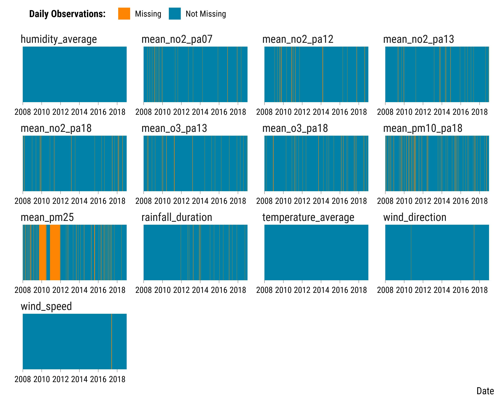
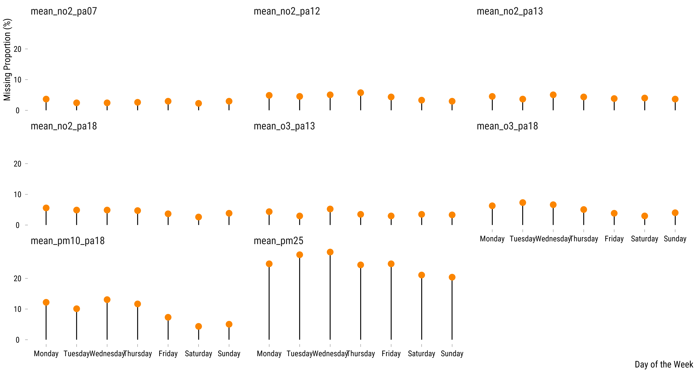

<style>
body {
text-align: justify}
</style>


# Required Packages

We load the required packages:

<div class="layout-chunk" data-layout="l-body-outset">
<div class="sourceCode"><pre class="sourceCode r"><code class="sourceCode r"><span class='co'># load required packages</span>
<span class='kw'><a href='https://rdrr.io/r/base/library.html'>library</a></span><span class='op'>(</span><span class='va'><a href='https://here.r-lib.org/'>here</a></span><span class='op'>)</span> <span class='co'># for files paths organization</span>
<span class='kw'><a href='https://rdrr.io/r/base/library.html'>library</a></span><span class='op'>(</span><span class='va'><a href='https://tidyverse.tidyverse.org'>tidyverse</a></span><span class='op'>)</span> <span class='co'># for data manipulation and visualization</span>
<span class='kw'><a href='https://rdrr.io/r/base/library.html'>library</a></span><span class='op'>(</span><span class='va'><a href='https://lubridate.tidyverse.org'>lubridate</a></span><span class='op'>)</span> <span class='co'># for manipulating date variables</span>
<span class='kw'><a href='https://rdrr.io/r/base/library.html'>library</a></span><span class='op'>(</span><span class='va'><a href='https://github.com/mayer79/missRanger'>missRanger</a></span><span class='op'>)</span> <span class='co'># for missing values imputation</span>
<span class='kw'><a href='https://rdrr.io/r/base/library.html'>library</a></span><span class='op'>(</span><span class='va'><a href='http://www.rforge.net/Cairo/'>Cairo</a></span><span class='op'>)</span> <span class='co'># for printing custom police of graphs</span>
</code></pre></div>

</div>


We also load our custom `ggplot2` theme for graphs:

<div class="layout-chunk" data-layout="l-body-outset">
<div class="sourceCode"><pre class="sourceCode r"><code class="sourceCode r"><span class='co'># load ggplot custom theme</span>
<span class='kw'><a href='https://rdrr.io/r/base/source.html'>source</a></span><span class='op'>(</span><span class='fu'>here</span><span class='fu'>::</span><span class='fu'><a href='https://here.r-lib.org//reference/here.html'>here</a></span><span class='op'>(</span>
  <span class='st'>"2.scripts"</span>,
  <span class='st'>"4.custom_ggplot2_theme"</span>,
  <span class='st'>"script_theme_tufte.R"</span>
<span class='op'>)</span><span class='op'>)</span>
<span class='co'># define nice colors</span>
<span class='va'>my_blue</span> <span class='op'>&lt;-</span> <span class='st'>"#0081a7"</span>
<span class='va'>my_orange</span> <span class='op'>&lt;-</span> <span class='st'>"#fb8500"</span>
</code></pre></div>

</div>


# Cleaning Air Pollution Data

We load and clean NO$_{2}$ data:

<div class="layout-chunk" data-layout="l-body-outset">
<div class="sourceCode"><pre class="sourceCode r"><code class="sourceCode r"><span class='co'># clean no2 data</span>
<span class='va'>data_no2</span> <span class='op'>&lt;-</span>
  <span class='fu'>data.table</span><span class='fu'>::</span><span class='fu'><a href='https://Rdatatable.gitlab.io/data.table/reference/fread.html'>fread</a></span><span class='op'>(</span>
    <span class='fu'>here</span><span class='fu'>::</span><span class='fu'><a href='https://here.r-lib.org//reference/here.html'>here</a></span><span class='op'>(</span>
      <span class='st'>"1.data"</span>,
      <span class='st'>"1.air_pollutants_data"</span>,
      <span class='st'>"20080101_20200901-NO2_auto.csv"</span>
    <span class='op'>)</span>,
    check.names <span class='op'>=</span> <span class='cn'>TRUE</span>
  <span class='op'>)</span> <span class='op'>%&gt;%</span>
  <span class='fu'>select</span><span class='op'>(</span><span class='va'>date</span>, <span class='va'>heure</span>, <span class='va'>PA01H</span>, <span class='va'>PA04C</span>, <span class='va'>PA06</span>, <span class='va'>PA07</span>, <span class='va'>PA12</span>, <span class='va'>PA13</span>, <span class='va'>PA15L</span>, <span class='va'>PA18</span><span class='op'>)</span> <span class='op'>%&gt;%</span>
  <span class='co'># drop first line</span>
  <span class='fu'>slice</span><span class='op'>(</span><span class='op'>-</span><span class='fl'>1</span><span class='op'>)</span> <span class='op'>%&gt;%</span>
  <span class='co'># paste the elements of date together</span>
  <span class='fu'>mutate</span><span class='op'>(</span>date <span class='op'>=</span> <span class='fu'><a href='https://rdrr.io/r/base/paste.html'>paste</a></span><span class='op'>(</span><span class='va'>date</span>, <span class='va'>heure</span>, sep <span class='op'>=</span> <span class='st'>"/"</span><span class='op'>)</span><span class='op'>)</span> <span class='op'>%&gt;%</span>
  <span class='co'># convert to date</span>
  <span class='fu'>mutate</span><span class='op'>(</span>date <span class='op'>=</span> <span class='fu'>lubridate</span><span class='fu'>::</span><span class='fu'><a href='https://lubridate.tidyverse.org/reference/ymd_hms.html'>dmy_h</a></span><span class='op'>(</span><span class='va'>date</span><span class='op'>)</span><span class='op'>)</span> <span class='op'>%&gt;%</span>
  <span class='fu'>select</span><span class='op'>(</span><span class='op'>-</span><span class='va'>heure</span><span class='op'>)</span> <span class='op'>%&gt;%</span>
  <span class='fu'>rename_all</span><span class='op'>(</span> <span class='op'>~</span> <span class='fu'><a href='https://rdrr.io/r/base/chartr.html'>tolower</a></span><span class='op'>(</span><span class='va'>.</span><span class='op'>)</span><span class='op'>)</span> <span class='op'>%&gt;%</span>
  <span class='fu'>mutate_at</span><span class='op'>(</span><span class='fu'>vars</span><span class='op'>(</span><span class='op'>-</span><span class='va'>date</span><span class='op'>)</span>, <span class='op'>~</span> <span class='fu'><a href='https://rdrr.io/r/base/numeric.html'>as.numeric</a></span><span class='op'>(</span><span class='va'>.</span><span class='op'>)</span><span class='op'>)</span> <span class='op'>%&gt;%</span>
  <span class='fu'><a href='https://rdrr.io/r/stats/filter.html'>filter</a></span><span class='op'>(</span><span class='va'>date</span> <span class='op'>&gt;</span> <span class='st'>"2008-01-01 00:00:00"</span> <span class='op'>&amp;</span>
           <span class='va'>date</span> <span class='op'>&lt;=</span> <span class='st'>"2019-01-01 00:00:00"</span><span class='op'>)</span>

<span class='co'># select relevant measuring stations</span>
<span class='va'>data_no2</span> <span class='op'>&lt;-</span> <span class='va'>data_no2</span> <span class='op'>%&gt;%</span>
  <span class='fu'>select</span><span class='op'>(</span><span class='va'>date</span>, <span class='va'>pa07</span>, <span class='va'>pa12</span>, <span class='va'>pa13</span>, <span class='va'>pa18</span><span class='op'>)</span> <span class='op'>%&gt;%</span>
  <span class='fu'>rename_at</span><span class='op'>(</span><span class='fu'>vars</span><span class='op'>(</span><span class='op'>-</span><span class='va'>date</span><span class='op'>)</span>, <span class='op'>~</span> <span class='fu'><a href='https://rdrr.io/r/base/paste.html'>paste</a></span><span class='op'>(</span><span class='st'>"mean_no2"</span>, <span class='va'>.</span>, sep <span class='op'>=</span> <span class='st'>"_"</span><span class='op'>)</span><span class='op'>)</span>
</code></pre></div>

</div>


We load and clean O$_{3}$ data:

<div class="layout-chunk" data-layout="l-body-outset">
<div class="sourceCode"><pre class="sourceCode r"><code class="sourceCode r"><span class='co'># clean o3 data</span>
<span class='va'>data_o3</span> <span class='op'>&lt;-</span>
  <span class='fu'>data.table</span><span class='fu'>::</span><span class='fu'><a href='https://Rdatatable.gitlab.io/data.table/reference/fread.html'>fread</a></span><span class='op'>(</span>
    <span class='fu'>here</span><span class='fu'>::</span><span class='fu'><a href='https://here.r-lib.org//reference/here.html'>here</a></span><span class='op'>(</span>
      <span class='st'>"1.data"</span>,
      <span class='st'>"1.air_pollutants_data"</span>,
      <span class='st'>"20080101_20200901-O3_auto.csv"</span>
    <span class='op'>)</span>,
    check.names <span class='op'>=</span> <span class='cn'>TRUE</span>
  <span class='op'>)</span> <span class='op'>%&gt;%</span>
  <span class='fu'>select</span><span class='op'>(</span><span class='va'>date</span>, <span class='va'>heure</span>, <span class='va'>PA01H</span>, <span class='va'>PA04C</span>, <span class='va'>PA06</span>, <span class='va'>PA13</span>, <span class='va'>PA18</span><span class='op'>)</span> <span class='op'>%&gt;%</span>
  <span class='co'># drop first line</span>
  <span class='fu'>slice</span><span class='op'>(</span><span class='op'>-</span><span class='fl'>1</span><span class='op'>)</span> <span class='op'>%&gt;%</span>
  <span class='co'># paste the elements of date together</span>
  <span class='fu'>mutate</span><span class='op'>(</span>date <span class='op'>=</span> <span class='fu'><a href='https://rdrr.io/r/base/paste.html'>paste</a></span><span class='op'>(</span><span class='va'>date</span>, <span class='va'>heure</span>, sep <span class='op'>=</span> <span class='st'>"/"</span><span class='op'>)</span><span class='op'>)</span> <span class='op'>%&gt;%</span>
  <span class='co'># convert to date</span>
  <span class='fu'>mutate</span><span class='op'>(</span>date <span class='op'>=</span> <span class='fu'>lubridate</span><span class='fu'>::</span><span class='fu'><a href='https://lubridate.tidyverse.org/reference/ymd_hms.html'>dmy_h</a></span><span class='op'>(</span><span class='va'>date</span><span class='op'>)</span><span class='op'>)</span> <span class='op'>%&gt;%</span>
  <span class='fu'>select</span><span class='op'>(</span><span class='op'>-</span><span class='va'>heure</span><span class='op'>)</span> <span class='op'>%&gt;%</span>
  <span class='fu'>rename_all</span><span class='op'>(</span> <span class='op'>~</span> <span class='fu'><a href='https://rdrr.io/r/base/chartr.html'>tolower</a></span><span class='op'>(</span><span class='va'>.</span><span class='op'>)</span><span class='op'>)</span> <span class='op'>%&gt;%</span>
  <span class='fu'>mutate_at</span><span class='op'>(</span><span class='fu'>vars</span><span class='op'>(</span><span class='op'>-</span><span class='va'>date</span><span class='op'>)</span>, <span class='op'>~</span> <span class='fu'><a href='https://rdrr.io/r/base/numeric.html'>as.numeric</a></span><span class='op'>(</span><span class='va'>.</span><span class='op'>)</span><span class='op'>)</span> <span class='op'>%&gt;%</span>
  <span class='fu'><a href='https://rdrr.io/r/stats/filter.html'>filter</a></span><span class='op'>(</span><span class='va'>date</span> <span class='op'>&gt;</span> <span class='st'>"2008-01-01 00:00:00"</span> <span class='op'>&amp;</span>
           <span class='va'>date</span> <span class='op'>&lt;=</span> <span class='st'>"2019-01-01 00:00:00"</span><span class='op'>)</span>

<span class='co'># select relevant measuring stations</span>
<span class='va'>data_o3</span> <span class='op'>&lt;-</span> <span class='va'>data_o3</span> <span class='op'>%&gt;%</span>
  <span class='fu'>select</span><span class='op'>(</span><span class='va'>date</span>, <span class='va'>pa13</span>, <span class='va'>pa18</span><span class='op'>)</span> <span class='op'>%&gt;%</span>
  <span class='fu'>rename_at</span><span class='op'>(</span><span class='fu'>vars</span><span class='op'>(</span><span class='op'>-</span><span class='va'>date</span><span class='op'>)</span>, <span class='op'>~</span> <span class='fu'><a href='https://rdrr.io/r/base/paste.html'>paste</a></span><span class='op'>(</span><span class='st'>"mean_o3"</span>, <span class='va'>.</span>, sep <span class='op'>=</span> <span class='st'>"_"</span><span class='op'>)</span><span class='op'>)</span>
</code></pre></div>

</div>


We load and clean PM$_{10}$ data:

<div class="layout-chunk" data-layout="l-body-outset">
<div class="sourceCode"><pre class="sourceCode r"><code class="sourceCode r"><span class='co'># clean pm10 data</span>
<span class='va'>data_pm10</span> <span class='op'>&lt;-</span>
  <span class='fu'>data.table</span><span class='fu'>::</span><span class='fu'><a href='https://Rdatatable.gitlab.io/data.table/reference/fread.html'>fread</a></span><span class='op'>(</span>
    <span class='fu'>here</span><span class='fu'>::</span><span class='fu'><a href='https://here.r-lib.org//reference/here.html'>here</a></span><span class='op'>(</span>
      <span class='st'>"1.data"</span>,
      <span class='st'>"1.air_pollutants_data"</span>,
      <span class='st'>"20080101_20200901-PM10_auto.csv"</span>
    <span class='op'>)</span>,
    check.names <span class='op'>=</span> <span class='cn'>TRUE</span>
  <span class='op'>)</span> <span class='op'>%&gt;%</span>
  <span class='fu'>select</span><span class='op'>(</span><span class='va'>date</span>, <span class='va'>heure</span>, <span class='va'>PA01H</span>, <span class='va'>PA04C</span>, <span class='va'>PA15L</span>, <span class='va'>PA18</span><span class='op'>)</span> <span class='op'>%&gt;%</span>
  <span class='co'># drop first line</span>
  <span class='fu'>slice</span><span class='op'>(</span><span class='op'>-</span><span class='fl'>1</span><span class='op'>)</span> <span class='op'>%&gt;%</span>
  <span class='co'># paste the elements of date together</span>
  <span class='fu'>mutate</span><span class='op'>(</span>date <span class='op'>=</span> <span class='fu'><a href='https://rdrr.io/r/base/paste.html'>paste</a></span><span class='op'>(</span><span class='va'>date</span>, <span class='va'>heure</span>, sep <span class='op'>=</span> <span class='st'>"/"</span><span class='op'>)</span><span class='op'>)</span> <span class='op'>%&gt;%</span>
  <span class='co'># convert to date</span>
  <span class='fu'>mutate</span><span class='op'>(</span>date <span class='op'>=</span> <span class='fu'>lubridate</span><span class='fu'>::</span><span class='fu'><a href='https://lubridate.tidyverse.org/reference/ymd_hms.html'>dmy_h</a></span><span class='op'>(</span><span class='va'>date</span><span class='op'>)</span><span class='op'>)</span> <span class='op'>%&gt;%</span>
  <span class='fu'>select</span><span class='op'>(</span><span class='op'>-</span><span class='va'>heure</span><span class='op'>)</span> <span class='op'>%&gt;%</span>
  <span class='fu'>rename_all</span><span class='op'>(</span> <span class='op'>~</span> <span class='fu'><a href='https://rdrr.io/r/base/chartr.html'>tolower</a></span><span class='op'>(</span><span class='va'>.</span><span class='op'>)</span><span class='op'>)</span> <span class='op'>%&gt;%</span>
  <span class='fu'>mutate_at</span><span class='op'>(</span><span class='fu'>vars</span><span class='op'>(</span><span class='op'>-</span><span class='va'>date</span><span class='op'>)</span>, <span class='op'>~</span> <span class='fu'><a href='https://rdrr.io/r/base/numeric.html'>as.numeric</a></span><span class='op'>(</span><span class='va'>.</span><span class='op'>)</span><span class='op'>)</span> <span class='op'>%&gt;%</span>
  <span class='fu'><a href='https://rdrr.io/r/stats/filter.html'>filter</a></span><span class='op'>(</span><span class='va'>date</span> <span class='op'>&gt;</span> <span class='st'>"2008-01-01 00:00:00"</span> <span class='op'>&amp;</span>
           <span class='va'>date</span> <span class='op'>&lt;=</span> <span class='st'>"2019-01-01 00:00:00"</span><span class='op'>)</span>

<span class='co'># select relevant measuring stations</span>
<span class='va'>data_pm10</span> <span class='op'>&lt;-</span> <span class='va'>data_pm10</span> <span class='op'>%&gt;%</span>
  <span class='fu'>select</span><span class='op'>(</span><span class='va'>date</span>, <span class='va'>pa18</span><span class='op'>)</span>  <span class='op'>%&gt;%</span>
  <span class='fu'>rename_at</span><span class='op'>(</span><span class='fu'>vars</span><span class='op'>(</span><span class='op'>-</span><span class='va'>date</span><span class='op'>)</span>, <span class='op'>~</span> <span class='fu'><a href='https://rdrr.io/r/base/paste.html'>paste</a></span><span class='op'>(</span><span class='st'>"mean_pm10"</span>, <span class='va'>.</span>, sep <span class='op'>=</span> <span class='st'>"_"</span><span class='op'>)</span><span class='op'>)</span>
</code></pre></div>

</div>


We load and clean PM$_{2.5}$ data:

<div class="layout-chunk" data-layout="l-body-outset">
<div class="sourceCode"><pre class="sourceCode r"><code class="sourceCode r"><span class='co'># clean pm2.5 data</span>
<span class='va'>data_pm25</span> <span class='op'>&lt;-</span>
  <span class='fu'>data.table</span><span class='fu'>::</span><span class='fu'><a href='https://Rdatatable.gitlab.io/data.table/reference/fread.html'>fread</a></span><span class='op'>(</span>
    <span class='fu'>here</span><span class='fu'>::</span><span class='fu'><a href='https://here.r-lib.org//reference/here.html'>here</a></span><span class='op'>(</span>
      <span class='st'>"1.data"</span>,
      <span class='st'>"1.air_pollutants_data"</span>,
      <span class='st'>"20080101_20200901-PM25_auto.csv"</span>
    <span class='op'>)</span>,
    check.names <span class='op'>=</span> <span class='cn'>TRUE</span>
  <span class='op'>)</span> <span class='op'>%&gt;%</span>
  <span class='fu'>select</span><span class='op'>(</span><span class='va'>date</span>, <span class='va'>heure</span>, <span class='va'>PA01H</span>, <span class='va'>PA04C</span><span class='op'>)</span> <span class='op'>%&gt;%</span>
  <span class='co'># drop first line</span>
  <span class='fu'>slice</span><span class='op'>(</span><span class='op'>-</span><span class='fl'>1</span><span class='op'>)</span> <span class='op'>%&gt;%</span>
  <span class='co'># paste the elements of date together</span>
  <span class='fu'>mutate</span><span class='op'>(</span>date <span class='op'>=</span> <span class='fu'><a href='https://rdrr.io/r/base/paste.html'>paste</a></span><span class='op'>(</span><span class='va'>date</span>, <span class='va'>heure</span>, sep <span class='op'>=</span> <span class='st'>"/"</span><span class='op'>)</span><span class='op'>)</span> <span class='op'>%&gt;%</span>
  <span class='co'># convert to date</span>
  <span class='fu'>mutate</span><span class='op'>(</span>date <span class='op'>=</span> <span class='fu'>lubridate</span><span class='fu'>::</span><span class='fu'><a href='https://lubridate.tidyverse.org/reference/ymd_hms.html'>dmy_h</a></span><span class='op'>(</span><span class='va'>date</span><span class='op'>)</span><span class='op'>)</span> <span class='op'>%&gt;%</span>
  <span class='fu'>select</span><span class='op'>(</span><span class='op'>-</span><span class='va'>heure</span><span class='op'>)</span> <span class='op'>%&gt;%</span>
  <span class='fu'>rename_all</span><span class='op'>(</span> <span class='op'>~</span> <span class='fu'><a href='https://rdrr.io/r/base/chartr.html'>tolower</a></span><span class='op'>(</span><span class='va'>.</span><span class='op'>)</span><span class='op'>)</span> <span class='op'>%&gt;%</span>
  <span class='fu'>mutate_at</span><span class='op'>(</span><span class='fu'>vars</span><span class='op'>(</span><span class='op'>-</span><span class='va'>date</span><span class='op'>)</span>, <span class='op'>~</span> <span class='fu'><a href='https://rdrr.io/r/base/numeric.html'>as.numeric</a></span><span class='op'>(</span><span class='va'>.</span><span class='op'>)</span><span class='op'>)</span> <span class='op'>%&gt;%</span>
  <span class='fu'><a href='https://rdrr.io/r/stats/filter.html'>filter</a></span><span class='op'>(</span><span class='va'>date</span> <span class='op'>&gt;</span> <span class='st'>"2008-01-01 00:00:00"</span> <span class='op'>&amp;</span>
           <span class='va'>date</span> <span class='op'>&lt;=</span> <span class='st'>"2019-01-01 00:00:00"</span><span class='op'>)</span> <span class='op'>%&gt;%</span>
  <span class='fu'>pivot_longer</span><span class='op'>(</span>cols <span class='op'>=</span> <span class='op'>-</span><span class='fu'><a href='https://rdrr.io/r/base/c.html'>c</a></span><span class='op'>(</span><span class='va'>date</span><span class='op'>)</span>,
               names_to <span class='op'>=</span> <span class='st'>"variable"</span>,
               values_to <span class='op'>=</span> <span class='st'>"concentration"</span><span class='op'>)</span> <span class='op'>%&gt;%</span>
  <span class='fu'>group_by</span><span class='op'>(</span><span class='va'>date</span><span class='op'>)</span> <span class='op'>%&gt;%</span>
  <span class='fu'>summarise</span><span class='op'>(</span>mean_pm25 <span class='op'>=</span> <span class='fu'><a href='https://rdrr.io/r/base/mean.html'>mean</a></span><span class='op'>(</span><span class='va'>concentration</span>, na.rm <span class='op'>=</span> <span class='cn'>TRUE</span><span class='op'>)</span><span class='op'>)</span>
</code></pre></div>

</div>


Merge all pollutants variables together:

<div class="layout-chunk" data-layout="l-body-outset">
<div class="sourceCode"><pre class="sourceCode r"><code class="sourceCode r"><span class='co'># merge pollutants</span>
<span class='va'>data_pollutants</span> <span class='op'>&lt;-</span> <span class='fu'>left_join</span><span class='op'>(</span><span class='va'>data_no2</span>, <span class='va'>data_o3</span>, by <span class='op'>=</span> <span class='st'>"date"</span><span class='op'>)</span> <span class='op'>%&gt;%</span>
  <span class='fu'>left_join</span><span class='op'>(</span><span class='va'>.</span>, <span class='va'>data_pm10</span>, by <span class='op'>=</span> <span class='st'>"date"</span><span class='op'>)</span> <span class='op'>%&gt;%</span>
  <span class='fu'>left_join</span><span class='op'>(</span><span class='va'>.</span>, <span class='va'>data_pm25</span>, by <span class='op'>=</span> <span class='st'>"date"</span><span class='op'>)</span>
</code></pre></div>

</div>


Compute the average concentration for each day by pollutant:

<div class="layout-chunk" data-layout="l-body-outset">
<div class="sourceCode"><pre class="sourceCode r"><code class="sourceCode r"><span class='va'>data_pollutants</span> <span class='op'>&lt;-</span> <span class='va'>data_pollutants</span> <span class='op'>%&gt;%</span>
  <span class='fu'>mutate</span><span class='op'>(</span>date <span class='op'>=</span> <span class='fu'>str_sub</span><span class='op'>(</span><span class='va'>date</span>, <span class='fl'>1</span>, <span class='fl'>10</span><span class='op'>)</span> <span class='op'>%&gt;%</span> <span class='fu'><a href='https://lubridate.tidyverse.org/reference/ymd.html'>ymd</a></span><span class='op'>(</span><span class='va'>.</span><span class='op'>)</span><span class='op'>)</span> <span class='op'>%&gt;%</span>
  <span class='fu'>group_by</span><span class='op'>(</span><span class='va'>date</span><span class='op'>)</span> <span class='op'>%&gt;%</span>
  <span class='fu'>summarise_at</span><span class='op'>(</span><span class='fu'>vars</span><span class='op'>(</span><span class='va'>mean_no2_pa07</span><span class='op'>:</span><span class='va'>mean_pm25</span><span class='op'>)</span>, <span class='op'>~</span> <span class='fu'><a href='https://rdrr.io/r/base/mean.html'>mean</a></span><span class='op'>(</span><span class='va'>.</span><span class='op'>)</span><span class='op'>)</span>
</code></pre></div>

</div>


# Cleaning Weather Data

We load and clean weather data:

<div class="layout-chunk" data-layout="l-body-outset">
<div class="sourceCode"><pre class="sourceCode r"><code class="sourceCode r"><span class='co'># read the data and rename the variables</span>
<span class='va'>weather_data</span> <span class='op'>&lt;-</span>
  <span class='fu'><a href='https://rdrr.io/r/utils/read.table.html'>read.csv</a></span><span class='op'>(</span>
    <span class='fu'>here</span><span class='fu'>::</span><span class='fu'><a href='https://here.r-lib.org//reference/here.html'>here</a></span><span class='op'>(</span>
      <span class='st'>"1.data"</span>,
      <span class='st'>"2.weather_data"</span>,
      <span class='st'>"daily_weather_data_paris_2008_2018.txt"</span>
    <span class='op'>)</span>,
    header <span class='op'>=</span> <span class='cn'>TRUE</span>,
    sep <span class='op'>=</span> <span class='st'>","</span>,
    stringsAsFactors <span class='op'>=</span> <span class='cn'>FALSE</span>,
    dec <span class='op'>=</span> <span class='st'>"."</span>
  <span class='op'>)</span> <span class='op'>%&gt;%</span>
  <span class='fu'>rename</span><span class='op'>(</span>
    <span class='st'>"date"</span> <span class='op'>=</span> <span class='st'>"DATE"</span>,
    <span class='st'>"rainfall_height"</span> <span class='op'>=</span> <span class='st'>"RR"</span>,
    <span class='st'>"rainfall_duration"</span> <span class='op'>=</span> <span class='st'>"DRR"</span>,
    <span class='st'>"temperature_average"</span> <span class='op'>=</span> <span class='st'>"TM"</span>,
    <span class='st'>"humidity_average"</span> <span class='op'>=</span> <span class='st'>"UM"</span>,
    <span class='st'>"wind_speed"</span> <span class='op'>=</span> <span class='st'>"FXY"</span>,
    <span class='st'>"wind_direction"</span> <span class='op'>=</span> <span class='st'>"DXY"</span>
  <span class='op'>)</span> <span class='op'>%&gt;%</span>
  <span class='fu'>select</span><span class='op'>(</span><span class='op'>-</span><span class='va'>POSTE</span><span class='op'>)</span>

<span class='co'># convert date variable in date format</span>
<span class='va'>weather_data</span> <span class='op'>&lt;-</span> <span class='va'>weather_data</span> <span class='op'>%&gt;%</span>
  <span class='fu'>mutate</span><span class='op'>(</span>date <span class='op'>=</span> <span class='fu'>lubridate</span><span class='fu'>::</span><span class='fu'><a href='https://lubridate.tidyverse.org/reference/ymd.html'>ymd</a></span><span class='op'>(</span><span class='va'>weather_data</span><span class='op'>$</span><span class='va'>date</span><span class='op'>)</span><span class='op'>)</span> <span class='op'>%&gt;%</span>
  <span class='fu'><a href='https://rdrr.io/r/stats/filter.html'>filter</a></span><span class='op'>(</span><span class='va'>date</span> <span class='op'>&lt;=</span> <span class='st'>"2018-12-31"</span><span class='op'>)</span>

<span class='co'># select relevant variables</span>
<span class='va'>weather_data</span> <span class='op'>&lt;-</span> <span class='va'>weather_data</span> <span class='op'>%&gt;%</span>
  <span class='fu'>select</span><span class='op'>(</span>
    <span class='va'>date</span>,
    <span class='va'>temperature_average</span>,
    <span class='va'>rainfall_duration</span>,
    <span class='va'>humidity_average</span>,
    <span class='va'>wind_speed</span>,
    <span class='va'>wind_direction</span>
  <span class='op'>)</span>
</code></pre></div>

</div>


# Cleaning Calendar Data

First, we create a dataframe with the date variable, the year, the month, and the day of the week:

<div class="layout-chunk" data-layout="l-body-outset">
<div class="sourceCode"><pre class="sourceCode r"><code class="sourceCode r"><span class='co'># create a dataframe with the date variable</span>
<span class='va'>dates_data</span> <span class='op'>&lt;-</span>
  <span class='fu'>tibble</span><span class='op'>(</span>date <span class='op'>=</span> <span class='fu'><a href='https://rdrr.io/r/base/seq.Date.html'>seq.Date</a></span><span class='op'>(</span>
    from <span class='op'>=</span> <span class='fu'><a href='https://rdrr.io/r/base/as.Date.html'>as.Date</a></span><span class='op'>(</span><span class='st'>"2008-01-01"</span><span class='op'>)</span>,
    to <span class='op'>=</span> <span class='fu'><a href='https://rdrr.io/r/base/as.Date.html'>as.Date</a></span><span class='op'>(</span><span class='st'>"2018-12-31"</span><span class='op'>)</span>,
    by <span class='op'>=</span> <span class='st'>"day"</span>
  <span class='op'>)</span><span class='op'>)</span>

<span class='co'># create julian data: the starting date is 2008-01-01</span>
<span class='va'>dates_data</span> <span class='op'>&lt;-</span> <span class='va'>dates_data</span> <span class='op'>%&gt;%</span>
  <span class='fu'>mutate</span><span class='op'>(</span>julian_date <span class='op'>=</span> <span class='fl'>1</span><span class='op'>:</span><span class='fu'>n</span><span class='op'>(</span><span class='op'>)</span><span class='op'>)</span>

<span class='co'># create year, month and day of the week indicators</span>
<span class='va'>dates_data</span> <span class='op'>&lt;-</span> <span class='va'>dates_data</span> <span class='op'>%&gt;%</span>
  <span class='fu'>mutate</span><span class='op'>(</span>
    year <span class='op'>=</span> <span class='fu'>lubridate</span><span class='fu'>::</span><span class='fu'><a href='https://lubridate.tidyverse.org/reference/year.html'>year</a></span><span class='op'>(</span><span class='va'>date</span><span class='op'>)</span>,
    month <span class='op'>=</span> <span class='fu'>lubridate</span><span class='fu'>::</span><span class='fu'><a href='https://lubridate.tidyverse.org/reference/month.html'>month</a></span><span class='op'>(</span><span class='va'>date</span>, label <span class='op'>=</span> <span class='cn'>TRUE</span>, abbr <span class='op'>=</span> <span class='cn'>FALSE</span><span class='op'>)</span>,
    weekday <span class='op'>=</span> <span class='fu'>lubridate</span><span class='fu'>::</span><span class='fu'><a href='https://lubridate.tidyverse.org/reference/day.html'>wday</a></span><span class='op'>(</span><span class='va'>date</span>, label <span class='op'>=</span> <span class='cn'>TRUE</span>, abbr <span class='op'>=</span> <span class='cn'>FALSE</span><span class='op'>)</span>
  <span class='op'>)</span>

<span class='co'># reorder day of the week levels</span>
<span class='va'>dates_data</span> <span class='op'>&lt;-</span> <span class='va'>dates_data</span> <span class='op'>%&gt;%</span>
  <span class='fu'>mutate</span><span class='op'>(</span>weekday <span class='op'>=</span> <span class='fu'><a href='https://rdrr.io/r/base/factor.html'>ordered</a></span><span class='op'>(</span>
    <span class='va'>weekday</span>,
    levels <span class='op'>=</span> <span class='fu'><a href='https://rdrr.io/r/base/c.html'>c</a></span><span class='op'>(</span>
      <span class='st'>"Monday"</span>,
      <span class='st'>"Tuesday"</span>,
      <span class='st'>"Wednesday"</span>,
      <span class='st'>"Thursday"</span>,
      <span class='st'>"Friday"</span>,
      <span class='st'>"Saturday"</span>,
      <span class='st'>"Sunday"</span>
    <span class='op'>)</span>
  <span class='op'>)</span><span class='op'>)</span>

<span class='co'># create weekend dummy</span>
<span class='va'>dates_data</span> <span class='op'>&lt;-</span> <span class='va'>dates_data</span> <span class='op'>%&gt;%</span>
  <span class='fu'>mutate</span><span class='op'>(</span>weekend <span class='op'>=</span> <span class='fu'><a href='https://rdrr.io/r/base/ifelse.html'>ifelse</a></span><span class='op'>(</span><span class='va'>weekday</span> <span class='op'>%in%</span> <span class='fu'><a href='https://rdrr.io/r/base/c.html'>c</a></span><span class='op'>(</span><span class='st'>"Saturday"</span>, <span class='st'>"Sunday"</span><span class='op'>)</span>, <span class='st'>"Weekend"</span>, <span class='st'>"Work Days"</span><span class='op'>)</span> <span class='op'>%&gt;%</span> <span class='fu'>as_factor</span><span class='op'>(</span><span class='va'>.</span><span class='op'>)</span><span class='op'>)</span>
</code></pre></div>

</div>


Then, we load two datasets on holidays and bank days indicators:

<div class="layout-chunk" data-layout="l-body-outset">
<div class="sourceCode"><pre class="sourceCode r"><code class="sourceCode r"><span class='co'># cleaning holidays data</span>
<span class='va'>data_holidays</span> <span class='op'>&lt;-</span>
  <span class='fu'><a href='https://rdrr.io/r/utils/read.table.html'>read.csv</a></span><span class='op'>(</span>
    <span class='fu'>here</span><span class='fu'>::</span><span class='fu'><a href='https://here.r-lib.org//reference/here.html'>here</a></span><span class='op'>(</span><span class='st'>"1.data"</span>, <span class='st'>"3.calendar_data"</span>, <span class='st'>"data_holidays.csv"</span><span class='op'>)</span>,
    stringsAsFactors <span class='op'>=</span> <span class='cn'>FALSE</span>,
    encoding <span class='op'>=</span> <span class='st'>"UTF-8"</span>
  <span class='op'>)</span> <span class='op'>%&gt;%</span>
  <span class='fu'>select</span><span class='op'>(</span><span class='va'>date</span>, <span class='va'>vacances_zone_c</span>, <span class='va'>nom_vacances</span><span class='op'>)</span> <span class='op'>%&gt;%</span>
  <span class='fu'>rename</span><span class='op'>(</span>holidays_dummy <span class='op'>=</span> <span class='va'>vacances_zone_c</span>, holidays_name <span class='op'>=</span> <span class='va'>nom_vacances</span><span class='op'>)</span> <span class='op'>%&gt;%</span>
  <span class='fu'>mutate</span><span class='op'>(</span>holidays_dummy <span class='op'>=</span> <span class='fu'><a href='https://rdrr.io/r/base/ifelse.html'>ifelse</a></span><span class='op'>(</span><span class='va'>holidays_dummy</span> <span class='op'>==</span> <span class='st'>"True"</span>, <span class='fl'>1</span>, <span class='fl'>0</span><span class='op'>)</span><span class='op'>)</span> <span class='op'>%&gt;%</span>
  <span class='fu'>mutate</span><span class='op'>(</span>date <span class='op'>=</span> <span class='fu'>lubridate</span><span class='fu'>::</span><span class='fu'><a href='https://lubridate.tidyverse.org/reference/ymd.html'>ymd</a></span><span class='op'>(</span><span class='va'>date</span><span class='op'>)</span><span class='op'>)</span> <span class='op'>%&gt;%</span>
  <span class='fu'><a href='https://rdrr.io/r/stats/filter.html'>filter</a></span><span class='op'>(</span><span class='va'>date</span> <span class='op'>&gt;=</span> <span class='st'>"2008-01-01"</span> <span class='op'>&amp;</span> <span class='va'>date</span> <span class='op'>&lt;=</span> <span class='st'>"2018-12-31"</span><span class='op'>)</span>

<span class='co'># cleaning bank days data</span>
<span class='va'>data_bank_days</span> <span class='op'>&lt;-</span>
  <span class='fu'><a href='https://rdrr.io/r/utils/read.table.html'>read.csv</a></span><span class='op'>(</span>
    <span class='fu'>here</span><span class='fu'>::</span><span class='fu'><a href='https://here.r-lib.org//reference/here.html'>here</a></span><span class='op'>(</span><span class='st'>"1.data"</span>, <span class='st'>"3.calendar_data"</span>, <span class='st'>"data_bank_days.csv"</span><span class='op'>)</span>,
    stringsAsFactors <span class='op'>=</span> <span class='cn'>FALSE</span>,
    encoding <span class='op'>=</span> <span class='st'>"UTF-8"</span>
  <span class='op'>)</span> <span class='op'>%&gt;%</span>
  <span class='fu'>rename</span><span class='op'>(</span>bank_day_dummy <span class='op'>=</span> <span class='va'>est_jour_ferie</span>, name_bank_day <span class='op'>=</span> <span class='va'>nom_jour_ferie</span><span class='op'>)</span> <span class='op'>%&gt;%</span>
  <span class='fu'>mutate</span><span class='op'>(</span>bank_day_dummy <span class='op'>=</span> <span class='fu'><a href='https://rdrr.io/r/base/ifelse.html'>ifelse</a></span><span class='op'>(</span><span class='va'>bank_day_dummy</span> <span class='op'>==</span> <span class='st'>"True"</span>, <span class='fl'>1</span>, <span class='fl'>0</span><span class='op'>)</span><span class='op'>)</span> <span class='op'>%&gt;%</span>
  <span class='fu'>mutate</span><span class='op'>(</span>date <span class='op'>=</span> <span class='fu'>lubridate</span><span class='fu'>::</span><span class='fu'><a href='https://lubridate.tidyverse.org/reference/ymd.html'>ymd</a></span><span class='op'>(</span><span class='va'>date</span><span class='op'>)</span><span class='op'>)</span> <span class='op'>%&gt;%</span>
  <span class='fu'><a href='https://rdrr.io/r/stats/filter.html'>filter</a></span><span class='op'>(</span><span class='va'>date</span> <span class='op'>&gt;=</span> <span class='st'>"2008-01-01"</span> <span class='op'>&amp;</span> <span class='va'>date</span> <span class='op'>&lt;=</span> <span class='st'>"2018-12-31"</span><span class='op'>)</span>
</code></pre></div>

</div>

  
We merge the three datasets together:

<div class="layout-chunk" data-layout="l-body-outset">
<div class="sourceCode"><pre class="sourceCode r"><code class="sourceCode r"><span class='co'># merge the three datasets together</span>
<span class='va'>data_calendar</span> <span class='op'>&lt;-</span>
  <span class='fu'>left_join</span><span class='op'>(</span><span class='va'>dates_data</span>, <span class='va'>data_holidays</span>, by <span class='op'>=</span> <span class='st'>"date"</span><span class='op'>)</span> <span class='op'>%&gt;%</span>
  <span class='fu'>left_join</span><span class='op'>(</span><span class='va'>.</span>, <span class='va'>data_bank_days</span>, by <span class='op'>=</span> <span class='st'>"date"</span><span class='op'>)</span>
</code></pre></div>

</div>


# Merging All Datasets

We merge all datasets together:

<div class="layout-chunk" data-layout="l-body-outset">
<div class="sourceCode"><pre class="sourceCode r"><code class="sourceCode r"><span class='va'>data</span> <span class='op'>&lt;-</span> <span class='fu'>left_join</span><span class='op'>(</span><span class='va'>data_calendar</span>, <span class='va'>data_pollutants</span>, by <span class='op'>=</span> <span class='st'>"date"</span><span class='op'>)</span> <span class='op'>%&gt;%</span>
  <span class='fu'>left_join</span><span class='op'>(</span><span class='va'>.</span>, <span class='va'>weather_data</span>, by <span class='op'>=</span> <span class='st'>"date"</span><span class='op'>)</span>
</code></pre></div>

</div>


# Imputing Missing Values

## EDA of Missing Values

We first display below the proportion (%) of missing values for each variable:

<div class="layout-chunk" data-layout="l-body-outset">
<div class="sourceCode"><pre class="sourceCode r"><code class="sourceCode r"><span class='co'># compute proportion of missing observations</span>
<span class='va'>data</span> <span class='op'>%&gt;%</span>
  <span class='fu'>pivot_longer</span><span class='op'>(</span>
    cols <span class='op'>=</span> <span class='fu'><a href='https://rdrr.io/r/base/c.html'>c</a></span><span class='op'>(</span><span class='va'>mean_no2_pa07</span><span class='op'>:</span><span class='va'>wind_direction</span><span class='op'>)</span>,
    names_to <span class='op'>=</span> <span class='st'>"Variable"</span>,
    values_to <span class='op'>=</span> <span class='st'>"value"</span>
  <span class='op'>)</span> <span class='op'>%&gt;%</span>
  <span class='fu'>group_by</span><span class='op'>(</span><span class='va'>Variable</span><span class='op'>)</span> <span class='op'>%&gt;%</span>
  <span class='fu'>summarise</span><span class='op'>(</span><span class='st'>"Proportion Missing (%)"</span> <span class='op'>=</span> <span class='fu'><a href='https://rdrr.io/r/base/Round.html'>round</a></span><span class='op'>(</span><span class='fu'><a href='https://rdrr.io/r/base/sum.html'>sum</a></span><span class='op'>(</span><span class='fu'><a href='https://rdrr.io/r/base/NA.html'>is.na</a></span><span class='op'>(</span><span class='va'>value</span><span class='op'>)</span><span class='op'>)</span> <span class='op'>/</span> <span class='fu'>n</span><span class='op'>(</span><span class='op'>)</span> <span class='op'>*</span> <span class='fl'>100</span>, <span class='fl'>1</span><span class='op'>)</span><span class='op'>)</span> <span class='op'>%&gt;%</span>
  <span class='fu'>arrange</span><span class='op'>(</span><span class='op'>-</span><span class='va'>`Proportion Missing (%)`</span><span class='op'>)</span> <span class='op'>%&gt;%</span>
  <span class='fu'>knitr</span><span class='fu'>::</span><span class='fu'><a href='https://rdrr.io/pkg/knitr/man/kable.html'>kable</a></span><span class='op'>(</span><span class='va'>.</span>, align <span class='op'>=</span> <span class='fu'><a href='https://rdrr.io/r/base/c.html'>c</a></span><span class='op'>(</span><span class='st'>"l"</span>, <span class='st'>"c"</span><span class='op'>)</span><span class='op'>)</span>
</code></pre></div>


|Variable            | Proportion Missing (%) |
|:-------------------|:----------------------:|
|mean_pm25           |          31.1          |
|mean_pm10_pa18      |          16.9          |
|mean_o3_pa18        |          16.6          |
|mean_o3_pa13        |          14.4          |
|mean_no2_pa13       |          11.9          |
|mean_no2_pa07       |          11.7          |
|mean_no2_pa18       |          11.6          |
|mean_no2_pa12       |          11.4          |
|rainfall_duration   |          2.5           |
|wind_direction      |          0.6           |
|wind_speed          |          0.6           |
|humidity_average    |          0.1           |
|temperature_average |          0.0           |

</div>


We see that all air pollutants have at least 10% of their observations missing. To better understand when values are missing, we plot below the distribution of the missing dummy for each variable over time:

<div class="layout-chunk" data-layout="l-body-outset">
<div class="sourceCode"><pre class="sourceCode r"><code class="sourceCode r"><span class='co'># make stripes graph</span>
<span class='va'>graph_stripes_missing</span> <span class='op'>&lt;-</span> <span class='va'>data</span> <span class='op'>%&gt;%</span>
    <span class='fu'>pivot_longer</span><span class='op'>(</span>
    cols <span class='op'>=</span> <span class='fu'><a href='https://rdrr.io/r/base/c.html'>c</a></span><span class='op'>(</span><span class='va'>mean_no2_pa07</span><span class='op'>:</span><span class='va'>wind_direction</span><span class='op'>)</span>,
    names_to <span class='op'>=</span> <span class='st'>"variable"</span>,
    values_to <span class='op'>=</span> <span class='st'>"value"</span>
  <span class='op'>)</span> <span class='op'>%&gt;%</span>
  <span class='fu'>mutate</span><span class='op'>(</span>is_missing <span class='op'>=</span> <span class='fu'><a href='https://rdrr.io/r/base/ifelse.html'>ifelse</a></span><span class='op'>(</span><span class='fu'><a href='https://rdrr.io/r/base/NA.html'>is.na</a></span><span class='op'>(</span><span class='va'>value</span><span class='op'>)</span>, <span class='st'>"Missing"</span>, <span class='st'>"Not Missing"</span><span class='op'>)</span><span class='op'>)</span> <span class='op'>%&gt;%</span>
  <span class='fu'>ggplot</span><span class='op'>(</span><span class='va'>.</span>, <span class='fu'>aes</span><span class='op'>(</span>x <span class='op'>=</span> <span class='va'>date</span>, y <span class='op'>=</span> <span class='fl'>1</span>, fill <span class='op'>=</span> <span class='va'>is_missing</span><span class='op'>)</span><span class='op'>)</span> <span class='op'>+</span>
  <span class='fu'>geom_tile</span><span class='op'>(</span><span class='op'>)</span> <span class='op'>+</span>
  <span class='fu'>scale_y_continuous</span><span class='op'>(</span>expand <span class='op'>=</span> <span class='fu'><a href='https://rdrr.io/r/base/c.html'>c</a></span><span class='op'>(</span><span class='fl'>0</span>, <span class='fl'>0</span><span class='op'>)</span><span class='op'>)</span> <span class='op'>+</span>
  <span class='fu'>facet_wrap</span><span class='op'>(</span> <span class='op'>~</span> <span class='va'>variable</span>, scales <span class='op'>=</span> <span class='st'>"free"</span><span class='op'>)</span> <span class='op'>+</span>
  <span class='fu'>scale_fill_manual</span><span class='op'>(</span>name <span class='op'>=</span> <span class='st'>"Daily Observations:"</span>, values <span class='op'>=</span> <span class='fu'><a href='https://rdrr.io/r/base/c.html'>c</a></span><span class='op'>(</span><span class='va'>my_orange</span>, <span class='va'>my_blue</span><span class='op'>)</span><span class='op'>)</span> <span class='op'>+</span>
  <span class='fu'>xlab</span><span class='op'>(</span><span class='st'>"Date"</span><span class='op'>)</span> <span class='op'>+</span> <span class='fu'>ylab</span><span class='op'>(</span><span class='st'>""</span><span class='op'>)</span> <span class='op'>+</span>
  <span class='fu'>theme_tufte</span><span class='op'>(</span><span class='op'>)</span> <span class='op'>+</span>
  <span class='fu'>theme</span><span class='op'>(</span>axis.ticks.y <span class='op'>=</span> <span class='fu'>element_blank</span><span class='op'>(</span><span class='op'>)</span>,
        axis.text.y <span class='op'>=</span> <span class='fu'>element_blank</span><span class='op'>(</span><span class='op'>)</span><span class='op'>)</span>

<span class='co'># display the graph</span>
<span class='va'>graph_stripes_missing</span>
</code></pre></div>
<!-- --><div class="sourceCode"><pre class="sourceCode r"><code class="sourceCode r"><span class='co'># save the graph</span>
<span class='fu'>ggsave</span><span class='op'>(</span>
  <span class='va'>graph_stripes_missing</span>,
  filename <span class='op'>=</span> <span class='fu'>here</span><span class='fu'>::</span><span class='fu'><a href='https://here.r-lib.org//reference/here.html'>here</a></span><span class='op'>(</span><span class='st'>"3.outputs"</span>, <span class='st'>"1.eda"</span>, <span class='st'>"graph_stripes_missing.pdf"</span><span class='op'>)</span>,
  width <span class='op'>=</span> <span class='fl'>30</span>,
  height <span class='op'>=</span> <span class='fl'>15</span>,
  units <span class='op'>=</span> <span class='st'>"cm"</span>,
  device <span class='op'>=</span> <span class='va'>cairo_pdf</span>
<span class='op'>)</span>
</code></pre></div>

</div>


We can see that the station measuring PM$_{2.5}$ stopped twice recording concentrations over a long period of time. For the other pollutants, the stations stopped recording concentrations over much shorter periods. We will therefore not impute the missing values of PM$_{2.5}$ because they are missing over too long consecutive periods of days. 

We can also explore how missing values are distributed by weekday:

<div class="layout-chunk" data-layout="l-body-outset">
<div class="sourceCode"><pre class="sourceCode r"><code class="sourceCode r"><span class='co'># make graph missing weekday</span>
<span class='va'>graph_weekday_missing</span> <span class='op'>&lt;-</span> <span class='va'>data</span> <span class='op'>%&gt;%</span>
  <span class='fu'>pivot_longer</span><span class='op'>(</span>
    cols <span class='op'>=</span> <span class='fu'><a href='https://rdrr.io/r/base/c.html'>c</a></span><span class='op'>(</span><span class='va'>mean_no2_pa07</span><span class='op'>:</span><span class='va'>mean_pm25</span><span class='op'>)</span>,
    names_to <span class='op'>=</span> <span class='st'>"pollutant"</span>,
    values_to <span class='op'>=</span> <span class='st'>"concentration"</span>
  <span class='op'>)</span> <span class='op'>%&gt;%</span>
  <span class='fu'>group_by</span><span class='op'>(</span><span class='va'>pollutant</span>, <span class='va'>weekday</span><span class='op'>)</span> <span class='op'>%&gt;%</span>
  <span class='fu'>summarise</span><span class='op'>(</span>proportion_missing <span class='op'>=</span> <span class='fu'><a href='https://rdrr.io/r/base/sum.html'>sum</a></span><span class='op'>(</span><span class='fu'><a href='https://rdrr.io/r/base/NA.html'>is.na</a></span><span class='op'>(</span><span class='va'>concentration</span><span class='op'>)</span><span class='op'>)</span> <span class='op'>/</span> <span class='fu'>n</span><span class='op'>(</span><span class='op'>)</span> <span class='op'>*</span> <span class='fl'>100</span><span class='op'>)</span> <span class='op'>%&gt;%</span>
  <span class='fu'>ggplot</span><span class='op'>(</span><span class='va'>.</span>, <span class='fu'>aes</span><span class='op'>(</span>x <span class='op'>=</span> <span class='va'>weekday</span>, y <span class='op'>=</span> <span class='va'>proportion_missing</span><span class='op'>)</span><span class='op'>)</span> <span class='op'>+</span>
  <span class='fu'>geom_segment</span><span class='op'>(</span><span class='fu'>aes</span><span class='op'>(</span>x <span class='op'>=</span> <span class='va'>weekday</span>, xend <span class='op'>=</span> <span class='va'>weekday</span>, y <span class='op'>=</span> <span class='fl'>0</span>, yend <span class='op'>=</span> <span class='va'>proportion_missing</span><span class='op'>)</span>, size <span class='op'>=</span> <span class='fl'>0.5</span><span class='op'>)</span> <span class='op'>+</span>
  <span class='fu'>geom_point</span><span class='op'>(</span>colour <span class='op'>=</span> <span class='va'>my_orange</span>, size <span class='op'>=</span> <span class='fl'>4</span><span class='op'>)</span> <span class='op'>+</span>
  <span class='fu'>facet_wrap</span><span class='op'>(</span><span class='op'>~</span> <span class='va'>pollutant</span><span class='op'>)</span> <span class='op'>+</span>
  <span class='fu'>xlab</span><span class='op'>(</span><span class='st'>"Day of the Week"</span><span class='op'>)</span> <span class='op'>+</span> <span class='fu'>ylab</span><span class='op'>(</span><span class='st'>"Missing Proportion (%)"</span><span class='op'>)</span> <span class='op'>+</span>
  <span class='fu'>theme_tufte</span><span class='op'>(</span><span class='op'>)</span>
  
  
<span class='co'># display the graph</span>
<span class='va'>graph_weekday_missing</span>
</code></pre></div>
<!-- --><div class="sourceCode"><pre class="sourceCode r"><code class="sourceCode r"><span class='co'># save the graph</span>
<span class='fu'>ggsave</span><span class='op'>(</span>
  <span class='va'>graph_weekday_missing</span>,
  filename <span class='op'>=</span> <span class='fu'>here</span><span class='fu'>::</span><span class='fu'><a href='https://here.r-lib.org//reference/here.html'>here</a></span><span class='op'>(</span><span class='st'>"3.outputs"</span>, <span class='st'>"1.eda"</span>, <span class='st'>"graph_weekday_missing.pdf"</span><span class='op'>)</span>,
  width <span class='op'>=</span> <span class='fl'>40</span>,
  height <span class='op'>=</span> <span class='fl'>20</span>,
  units <span class='op'>=</span> <span class='st'>"cm"</span>,
  device <span class='op'>=</span> <span class='va'>cairo_pdf</span>
<span class='op'>)</span>  
</code></pre></div>

</div>


We see that missing concentrations occur less on weekends. We make the same plot but by month:

<div class="layout-chunk" data-layout="l-body-outset">
<div class="sourceCode"><pre class="sourceCode r"><code class="sourceCode r"><span class='co'># make graph missing month</span>
<span class='va'>graph_month_missing</span> <span class='op'>&lt;-</span> <span class='va'>data</span> <span class='op'>%&gt;%</span>
  <span class='fu'>pivot_longer</span><span class='op'>(</span>
    cols <span class='op'>=</span> <span class='fu'><a href='https://rdrr.io/r/base/c.html'>c</a></span><span class='op'>(</span><span class='va'>mean_no2_pa07</span><span class='op'>:</span><span class='va'>mean_pm25</span><span class='op'>)</span>,
    names_to <span class='op'>=</span> <span class='st'>"pollutant"</span>,
    values_to <span class='op'>=</span> <span class='st'>"concentration"</span>
  <span class='op'>)</span> <span class='op'>%&gt;%</span>
  <span class='fu'>group_by</span><span class='op'>(</span><span class='va'>pollutant</span>, <span class='va'>month</span><span class='op'>)</span> <span class='op'>%&gt;%</span>
  <span class='fu'>summarise</span><span class='op'>(</span>proportion_missing <span class='op'>=</span> <span class='fu'><a href='https://rdrr.io/r/base/sum.html'>sum</a></span><span class='op'>(</span><span class='fu'><a href='https://rdrr.io/r/base/NA.html'>is.na</a></span><span class='op'>(</span><span class='va'>concentration</span><span class='op'>)</span><span class='op'>)</span> <span class='op'>/</span> <span class='fu'>n</span><span class='op'>(</span><span class='op'>)</span> <span class='op'>*</span> <span class='fl'>100</span><span class='op'>)</span> <span class='op'>%&gt;%</span>
  <span class='fu'>ggplot</span><span class='op'>(</span><span class='va'>.</span>, <span class='fu'>aes</span><span class='op'>(</span>x <span class='op'>=</span> <span class='va'>month</span>, y <span class='op'>=</span> <span class='va'>proportion_missing</span>, group <span class='op'>=</span> <span class='st'>"l"</span><span class='op'>)</span><span class='op'>)</span> <span class='op'>+</span>
  <span class='fu'>geom_line</span><span class='op'>(</span>colour <span class='op'>=</span> <span class='st'>"gray80"</span><span class='op'>)</span> <span class='op'>+</span>
  <span class='fu'>geom_point</span><span class='op'>(</span>colour <span class='op'>=</span> <span class='va'>my_orange</span>, size <span class='op'>=</span> <span class='fl'>4</span><span class='op'>)</span> <span class='op'>+</span>
  <span class='fu'>facet_wrap</span><span class='op'>(</span><span class='op'>~</span> <span class='va'>pollutant</span>, ncol <span class='op'>=</span> <span class='fl'>1</span><span class='op'>)</span> <span class='op'>+</span>
  <span class='fu'>xlab</span><span class='op'>(</span><span class='st'>"Month"</span><span class='op'>)</span> <span class='op'>+</span> <span class='fu'>ylab</span><span class='op'>(</span><span class='st'>"Missing Proportion (%)"</span><span class='op'>)</span> <span class='op'>+</span>
  <span class='fu'>theme_tufte</span><span class='op'>(</span><span class='op'>)</span>
  
<span class='co'># display the graph</span>
<span class='va'>graph_month_missing</span>
</code></pre></div>
<!-- --><div class="sourceCode"><pre class="sourceCode r"><code class="sourceCode r"><span class='co'># save the graph</span>
<span class='fu'>ggsave</span><span class='op'>(</span>
  <span class='va'>graph_month_missing</span>,
  filename <span class='op'>=</span> <span class='fu'>here</span><span class='fu'>::</span><span class='fu'><a href='https://here.r-lib.org//reference/here.html'>here</a></span><span class='op'>(</span><span class='st'>"3.outputs"</span>, <span class='st'>"1.eda"</span>, <span class='st'>"graph_month_missing.pdf"</span><span class='op'>)</span>,
  width <span class='op'>=</span> <span class='fl'>28</span>,
  height <span class='op'>=</span> <span class='fl'>40</span>,
  units <span class='op'>=</span> <span class='st'>"cm"</span>,
  device <span class='op'>=</span> <span class='va'>cairo_pdf</span>
<span class='op'>)</span>  
</code></pre></div>

</div>


We do not see a clear pattern of missingness depending on the month of year. Overall, missing values are not missing completely are random but we can use values from past and future periods and those coming from other stations to impute them.

Last but not least, before imputing the missing values, we save a dataset with the observed concentrations aggregated at the city-level. This dataset will be used as a robutness check to see if our results depend on our imputation procedure.

<div class="layout-chunk" data-layout="l-body-outset">
<div class="sourceCode"><pre class="sourceCode r"><code class="sourceCode r"><span class='co'># aggregation of each pollutant's concentrations at the city level</span>
<span class='co'># when concentrations are not imputed</span>
<span class='va'>data_not_imputed</span> <span class='op'>&lt;-</span> <span class='va'>data</span> <span class='op'>%&gt;%</span>
  <span class='fu'>select</span><span class='op'>(</span><span class='va'>date</span>,<span class='va'>mean_no2_pa07</span><span class='op'>:</span><span class='va'>mean_pm25</span><span class='op'>)</span> <span class='op'>%&gt;%</span>
  <span class='fu'>rowwise</span><span class='op'>(</span><span class='op'>)</span> <span class='op'>%&gt;%</span>
  <span class='fu'>mutate</span><span class='op'>(</span>mean_no2 <span class='op'>=</span> <span class='fu'><a href='https://rdrr.io/r/base/mean.html'>mean</a></span><span class='op'>(</span><span class='fu'><a href='https://rdrr.io/r/base/c.html'>c</a></span><span class='op'>(</span>
    <span class='va'>mean_no2_pa07</span>, <span class='va'>mean_no2_pa12</span>, <span class='va'>mean_no2_pa13</span>, <span class='va'>mean_no2_pa18</span>
  <span class='op'>)</span><span class='op'>)</span>,
  mean_o3 <span class='op'>=</span> <span class='fu'><a href='https://rdrr.io/r/base/mean.html'>mean</a></span><span class='op'>(</span><span class='fu'><a href='https://rdrr.io/r/base/c.html'>c</a></span><span class='op'>(</span><span class='va'>mean_o3_pa13</span>, <span class='va'>mean_o3_pa18</span><span class='op'>)</span><span class='op'>)</span>,
  mean_pm10 <span class='op'>=</span> <span class='va'>mean_pm10_pa18</span><span class='op'>)</span> <span class='op'>%&gt;%</span>
  <span class='fu'>select</span><span class='op'>(</span><span class='va'>date</span>, <span class='va'>mean_no2</span><span class='op'>:</span><span class='va'>mean_pm25</span><span class='op'>)</span> <span class='op'>%&gt;%</span>
  <span class='fu'>rename_at</span><span class='op'>(</span><span class='fu'>vars</span><span class='op'>(</span><span class='va'>mean_no2</span><span class='op'>:</span><span class='va'>mean_pm25</span><span class='op'>)</span>, <span class='op'>~</span> <span class='fu'><a href='https://rdrr.io/r/base/paste.html'>paste</a></span><span class='op'>(</span><span class='st'>"not_imputed"</span>, <span class='va'>.</span>, sep <span class='op'>=</span> <span class='st'>"_"</span><span class='op'>)</span><span class='op'>)</span> <span class='op'>%&gt;%</span>
  <span class='fu'>ungroup</span><span class='op'>(</span><span class='op'>)</span>

<span class='co'># save the dataset</span>
<span class='fu'><a href='https://rdrr.io/r/base/readRDS.html'>saveRDS</a></span><span class='op'>(</span><span class='va'>data_not_imputed</span>, <span class='fu'>here</span><span class='fu'>::</span><span class='fu'><a href='https://here.r-lib.org//reference/here.html'>here</a></span><span class='op'>(</span><span class='st'>"1.data"</span>, <span class='st'>"4.data_for_analysis"</span>, <span class='st'>"data_pollutants_not_imputed.RDS"</span><span class='op'>)</span><span class='op'>)</span>
</code></pre></div>

</div>


## Using Chained Random Forest for Imputation

We impute missing values using the `missRanger` package:

<div class="layout-chunk" data-layout="l-body-outset">
<div class="sourceCode"><pre class="sourceCode r"><code class="sourceCode r"><span class='co'># set the seed</span>
<span class='fu'><a href='https://rdrr.io/r/base/Random.html'>set.seed</a></span><span class='op'>(</span><span class='fl'>42</span><span class='op'>)</span>

<span class='co'># imputation of missing values</span>
<span class='va'>data</span> <span class='op'>&lt;-</span> <span class='fu'>missRanger</span><span class='fu'>::</span><span class='fu'><a href='https://rdrr.io/pkg/missRanger/man/missRanger.html'>missRanger</a></span><span class='op'>(</span>
  <span class='va'>data</span>,
  <span class='co'># variables to impute</span>
  <span class='va'>mean_no2_pa07</span> <span class='op'>+</span>
    <span class='va'>mean_no2_pa12</span> <span class='op'>+</span>
    <span class='va'>mean_no2_pa13</span> <span class='op'>+</span>
    <span class='va'>mean_no2_pa18</span> <span class='op'>+</span>
    <span class='va'>mean_o3_pa13</span> <span class='op'>+</span>
    <span class='va'>mean_o3_pa18</span> <span class='op'>+</span>
    <span class='va'>mean_pm10_pa18</span> <span class='op'>+</span>
    <span class='va'>rainfall_duration</span> <span class='op'>+</span>
    <span class='va'>humidity_average</span> <span class='op'>+</span>
    <span class='va'>wind_speed</span> <span class='op'>+</span>
    <span class='va'>wind_direction</span> <span class='op'>-</span>
    <span class='va'>mean_pm25</span> <span class='op'>~</span>
    <span class='co'># variables used for the imputation</span>
    <span class='va'>.</span> <span class='op'>-</span> <span class='va'>date</span> <span class='op'>-</span> <span class='va'>julian_date</span> <span class='op'>-</span> <span class='va'>weekend</span> <span class='op'>-</span> <span class='va'>holidays_name</span> <span class='op'>-</span> <span class='va'>name_bank_day</span>,
  pmm.k <span class='op'>=</span> <span class='fl'>10</span>,
  num.trees <span class='op'>=</span> <span class='fl'>100</span>
<span class='op'>)</span>
</code></pre></div>

```

Missing value imputation by random forests

  Variables to impute:		mean_no2_pa07, mean_no2_pa12, mean_no2_pa13, mean_no2_pa18, mean_o3_pa13, mean_o3_pa18, mean_pm10_pa18, rainfall_duration, humidity_average, wind_speed, wind_direction
  Variables used to impute:	year, month, weekday, holidays_dummy, bank_day_dummy, mean_no2_pa07, mean_no2_pa12, mean_no2_pa13, mean_no2_pa18, mean_o3_pa13, mean_o3_pa18, mean_pm10_pa18, temperature_average, rainfall_duration, humidity_average, wind_speed, wind_direction
iter 1:	...........
iter 2:	...........
iter 3:	...........
iter 4:	...........
iter 5:	...........
```

<div class="sourceCode"><pre class="sourceCode r"><code class="sourceCode r"><span class='co'># dirty fix for wind_direction imputed values equal to 370 </span>
<span class='va'>data</span> <span class='op'>&lt;-</span> <span class='va'>data</span> <span class='op'>%&gt;%</span>
  <span class='fu'>mutate</span><span class='op'>(</span>wind_direction <span class='op'>=</span> <span class='fu'><a href='https://rdrr.io/r/base/ifelse.html'>ifelse</a></span><span class='op'>(</span><span class='va'>wind_direction</span> <span class='op'>==</span> <span class='fl'>370</span>, <span class='fl'>10</span>, <span class='va'>wind_direction</span><span class='op'>)</span><span class='op'>)</span>
</code></pre></div>

</div>


# Last Cleaning Steps

We cut the rainfall duration into quartiles and wind direction into the main four directions:

<div class="layout-chunk" data-layout="l-body-outset">
<div class="sourceCode"><pre class="sourceCode r"><code class="sourceCode r"><span class='co'># add rainfall duration quartiles</span>
<span class='va'>data</span> <span class='op'>&lt;-</span> <span class='va'>data</span> <span class='op'>%&gt;%</span>
  <span class='fu'>mutate</span><span class='op'>(</span>rainfall_duration <span class='op'>=</span> <span class='fu'>Hmisc</span><span class='fu'>::</span><span class='fu'><a href='https://rdrr.io/pkg/Hmisc/man/cut2.html'>cut2</a></span><span class='op'>(</span><span class='va'>rainfall_duration</span>, g <span class='op'>=</span> <span class='fl'>4</span><span class='op'>)</span><span class='op'>)</span> <span class='op'>%&gt;%</span>
  <span class='co'># create wind direction categories</span>
  <span class='fu'>mutate</span><span class='op'>(</span>
    wind_direction_categories <span class='op'>=</span> <span class='fu'><a href='https://rdrr.io/r/base/cut.html'>cut</a></span><span class='op'>(</span>
      <span class='va'>wind_direction</span>,
      breaks <span class='op'>=</span> <span class='fu'><a href='https://rdrr.io/r/base/seq.html'>seq</a></span><span class='op'>(</span><span class='fl'>0</span>, <span class='fl'>360</span>, by  <span class='op'>=</span> <span class='fl'>90</span><span class='op'>)</span>,
      include.lowest <span class='op'>=</span> <span class='cn'>TRUE</span>
    <span class='op'>)</span> <span class='op'>%&gt;%</span>
      <span class='fu'>recode</span><span class='op'>(</span>
        <span class='va'>.</span>,
        <span class='st'>"[0,90]"</span> <span class='op'>=</span> <span class='st'>"North-East"</span>,
        <span class='st'>"(90,180]"</span> <span class='op'>=</span> <span class='st'>"South-East"</span>,
        <span class='st'>"(180,270]"</span> <span class='op'>=</span> <span class='st'>"South-West"</span>,
        <span class='st'>"(270,360]"</span> <span class='op'>=</span> <span class='st'>"North-West"</span>
      <span class='op'>)</span>
  <span class='op'>)</span> 
</code></pre></div>

</div>


We finally aggregate air pollutant concentrations at the city level:

<div class="layout-chunk" data-layout="l-body-outset">
<div class="sourceCode"><pre class="sourceCode r"><code class="sourceCode r"><span class='co'># aggregation of each pollutant's concentrations at the city level</span>
<span class='va'>data</span> <span class='op'>&lt;-</span> <span class='va'>data</span> <span class='op'>%&gt;%</span>
  <span class='fu'>rowwise</span><span class='op'>(</span><span class='op'>)</span> <span class='op'>%&gt;%</span>
  <span class='fu'>mutate</span><span class='op'>(</span>mean_no2 <span class='op'>=</span> <span class='fu'><a href='https://rdrr.io/r/base/mean.html'>mean</a></span><span class='op'>(</span><span class='fu'><a href='https://rdrr.io/r/base/c.html'>c</a></span><span class='op'>(</span>
    <span class='va'>mean_no2_pa07</span>, <span class='va'>mean_no2_pa12</span>, <span class='va'>mean_no2_pa13</span>, <span class='va'>mean_no2_pa18</span>
  <span class='op'>)</span><span class='op'>)</span>,
  mean_o3 <span class='op'>=</span> <span class='fu'><a href='https://rdrr.io/r/base/mean.html'>mean</a></span><span class='op'>(</span><span class='fu'><a href='https://rdrr.io/r/base/c.html'>c</a></span><span class='op'>(</span><span class='va'>mean_o3_pa13</span>, <span class='va'>mean_o3_pa18</span><span class='op'>)</span><span class='op'>)</span>,
  mean_pm10 <span class='op'>=</span> <span class='va'>mean_pm10_pa18</span><span class='op'>)</span> <span class='op'>%&gt;%</span>
  <span class='fu'>ungroup</span><span class='op'>(</span><span class='op'>)</span>
</code></pre></div>

</div>


We finally select relevant variables and save the data:

<div class="layout-chunk" data-layout="l-body-outset">
<div class="sourceCode"><pre class="sourceCode r"><code class="sourceCode r"><span class='va'>data</span> <span class='op'>%&gt;%</span>
  <span class='fu'>select</span><span class='op'>(</span>
    <span class='va'>date</span><span class='op'>:</span><span class='va'>holidays_dummy</span>,
    <span class='va'>bank_day_dummy</span>,
    <span class='va'>mean_no2</span>,
    <span class='va'>mean_o3</span>,
    <span class='va'>mean_pm10</span>,
    <span class='va'>mean_pm25</span>,
    <span class='va'>mean_no2_pa07</span>,
    <span class='va'>mean_no2_pa12</span>,
    <span class='va'>mean_no2_pa13</span>,
    <span class='va'>mean_no2_pa18</span>,
    <span class='va'>mean_o3_pa13</span>,
    <span class='va'>mean_o3_pa18</span>,
    <span class='va'>mean_pm10_pa18</span>,
    <span class='va'>mean_pm25</span>,
    <span class='va'>temperature_average</span><span class='op'>:</span><span class='va'>wind_speed</span>,
    <span class='va'>wind_direction</span>,
    <span class='va'>wind_direction_categories</span>
  <span class='op'>)</span> <span class='op'>%&gt;%</span>
  <span class='fu'><a href='https://rdrr.io/r/base/readRDS.html'>saveRDS</a></span><span class='op'>(</span><span class='va'>.</span>,
          <span class='fu'>here</span><span class='fu'>::</span><span class='fu'><a href='https://here.r-lib.org//reference/here.html'>here</a></span><span class='op'>(</span><span class='st'>"1.data"</span>, <span class='st'>"4.data_for_analysis"</span>, <span class='st'>"data_for_analysis.RDS"</span><span class='op'>)</span><span class='op'>)</span>
</code></pre></div>

</div>


```{.r .distill-force-highlighting-css}
```
