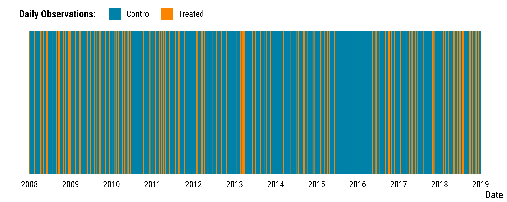

<style>
body {
text-align: justify}
</style>


In this document, we provide all steps required to reproduce our matching procedure. We compare days where:

* treated units are days where winds blow from the North-East in *t*.
* control units are day winds blow from other directions in *t*.

We adjust for calendar indicators and weather confouding factors.

**Should you have any questions, need help to reproduce the analysis or find coding errors, please do not hesitate to contact me at leo.zabrocki@psemail.eu**

# Required Packages

To reproduce exactly the `script_matching_procedure.html` document, we first need to have installed:

* the [R](https://www.r-project.org/) programming language on your computer 
* [RStudio](https://rstudio.com/), an integrated development environment for R, which will allow you to knit the `script_matching_procedure.Rmd` file and interact with the R code chunks
* the [R Markdown](https://rmarkdown.rstudio.com/) package
* and the [Distill](https://rstudio.github.io/distill/) package which provides the template of this document. 

Once everything is set up, we have to load the following packages:

<div class="layout-chunk" data-layout="l-body-outset">
<div class="sourceCode"><pre class="sourceCode r"><code class="sourceCode r"><span class='co'># load required packages</span>
<span class='kw'><a href='https://rdrr.io/r/base/library.html'>library</a></span><span class='op'>(</span><span class='va'><a href='https://yihui.org/knitr/'>knitr</a></span><span class='op'>)</span> <span class='co'># for creating the R Markdown document</span>
<span class='kw'><a href='https://rdrr.io/r/base/library.html'>library</a></span><span class='op'>(</span><span class='va'><a href='https://here.r-lib.org/'>here</a></span><span class='op'>)</span> <span class='co'># for files paths organization</span>
<span class='kw'><a href='https://rdrr.io/r/base/library.html'>library</a></span><span class='op'>(</span><span class='va'><a href='https://tidyverse.tidyverse.org'>tidyverse</a></span><span class='op'>)</span> <span class='co'># for data manipulation and visualization</span>
<span class='kw'><a href='https://rdrr.io/r/base/library.html'>library</a></span><span class='op'>(</span><span class='va'><a href='http://www.rcpp.org'>Rcpp</a></span><span class='op'>)</span> <span class='co'># for running the matching algorithm</span>
<span class='kw'><a href='https://rdrr.io/r/base/library.html'>library</a></span><span class='op'>(</span><span class='va'><a href='https://github.com/markmfredrickson/optmatch'>optmatch</a></span><span class='op'>)</span> <span class='co'># for matching pairs</span>
<span class='kw'><a href='https://rdrr.io/r/base/library.html'>library</a></span><span class='op'>(</span><span class='va'><a href='https://igraph.org'>igraph</a></span><span class='op'>)</span> <span class='co'># for pair matching via bipartite maximal weighted matching</span>
</code></pre></div>

</div>


We load our custom `ggplot2` theme for graphs:

<div class="layout-chunk" data-layout="l-body-outset">
<div class="sourceCode"><pre class="sourceCode r"><code class="sourceCode r"><span class='co'># load ggplot custom theme</span>
<span class='kw'><a href='https://rdrr.io/r/base/source.html'>source</a></span><span class='op'>(</span><span class='fu'>here</span><span class='fu'>::</span><span class='fu'><a href='https://here.r-lib.org//reference/here.html'>here</a></span><span class='op'>(</span>
  <span class='st'>"2.scripts"</span>,
  <span class='st'>"4.custom_ggplot2_theme"</span>,
  <span class='st'>"script_theme_tufte.R"</span>
<span class='op'>)</span><span class='op'>)</span>
<span class='co'># define nice colors</span>
<span class='va'>my_blue</span> <span class='op'>&lt;-</span> <span class='st'>"#0081a7"</span>
<span class='va'>my_orange</span> <span class='op'>&lt;-</span> <span class='st'>"#fb8500"</span>
</code></pre></div>

</div>


We also have to load the `script_time_series_matching_function.R` located in the **0.script_matching_algorithm** folder and which provides the functions used for matching time series:

<div class="layout-chunk" data-layout="l-body-outset">
<div class="sourceCode"><pre class="sourceCode r"><code class="sourceCode r"><span class='co'># load matching functions</span>
<span class='kw'><a href='https://rdrr.io/r/base/source.html'>source</a></span><span class='op'>(</span>
  <span class='fu'>here</span><span class='fu'>::</span><span class='fu'><a href='https://here.r-lib.org//reference/here.html'>here</a></span><span class='op'>(</span>
    <span class='st'>"2.scripts"</span>,
    <span class='st'>"3.matching_analysis"</span>,
    <span class='st'>"0.script_matching_algorithm"</span>,
    <span class='st'>"script_time_series_matching_function.R"</span>
  <span class='op'>)</span>
<span class='op'>)</span>
</code></pre></div>

</div>


# Preparing the Data for Matching
 
### Selecting and Creating Relevant Variables

First, we load the data:

<div class="layout-chunk" data-layout="l-body-outset">
<div class="sourceCode"><pre class="sourceCode r"><code class="sourceCode r"><span class='co'># load data</span>
<span class='va'>data</span> <span class='op'>&lt;-</span>
  <span class='fu'><a href='https://rdrr.io/r/base/readRDS.html'>readRDS</a></span><span class='op'>(</span><span class='fu'>here</span><span class='fu'>::</span><span class='fu'><a href='https://here.r-lib.org//reference/here.html'>here</a></span><span class='op'>(</span><span class='st'>"1.data"</span>, <span class='st'>"4.data_for_analysis"</span>, <span class='st'>"data_for_analysis.RDS"</span><span class='op'>)</span><span class='op'>)</span> <span class='op'>%&gt;%</span>
  <span class='co'># drop wind direction variable as we use instead wind direction categories</span>
  <span class='fu'>select</span><span class='op'>(</span><span class='op'>-</span><span class='va'>wind_direction</span><span class='op'>)</span>
</code></pre></div>

</div>


For each covariate, we create the first daily lags and leads and create a new dataframe called `processed_data`:

<div class="layout-chunk" data-layout="l-body-outset">
<div class="sourceCode"><pre class="sourceCode r"><code class="sourceCode r"><span class='co'># create first daily lead for each variable</span>
<span class='va'>data_leads</span> <span class='op'>&lt;-</span> <span class='va'>data</span> <span class='op'>%&gt;%</span>
  <span class='fu'>select</span><span class='op'>(</span><span class='va'>date</span>, <span class='va'>mean_no2</span><span class='op'>:</span><span class='va'>wind_direction_categories</span><span class='op'>)</span> <span class='op'>%&gt;%</span>
  <span class='fu'>mutate_at</span><span class='op'>(</span><span class='fu'>vars</span><span class='op'>(</span><span class='op'>-</span><span class='va'>date</span><span class='op'>)</span>, <span class='op'>~</span>  <span class='fu'>lead</span><span class='op'>(</span><span class='va'>.</span>, n <span class='op'>=</span> <span class='fl'>1</span>, order_by <span class='op'>=</span> <span class='va'>date</span><span class='op'>)</span><span class='op'>)</span> <span class='op'>%&gt;%</span>
  <span class='fu'>rename_at</span><span class='op'>(</span><span class='fu'>vars</span><span class='op'>(</span><span class='op'>-</span><span class='va'>date</span><span class='op'>)</span>, <span class='kw'>function</span><span class='op'>(</span><span class='va'>x</span><span class='op'>)</span>
    <span class='fu'><a href='https://rdrr.io/r/base/paste.html'>paste0</a></span><span class='op'>(</span><span class='va'>x</span>, <span class='st'>"_lead_"</span>, <span class='fl'>1</span><span class='op'>)</span><span class='op'>)</span>

<span class='co'># create first daily lag for each variable</span>
<span class='va'>data_lags</span> <span class='op'>&lt;-</span> <span class='va'>data</span> <span class='op'>%&gt;%</span>
  <span class='fu'>select</span><span class='op'>(</span><span class='va'>date</span>, <span class='va'>mean_no2</span><span class='op'>:</span><span class='va'>wind_direction_categories</span><span class='op'>)</span> <span class='op'>%&gt;%</span>
  <span class='fu'>mutate_at</span><span class='op'>(</span><span class='fu'>vars</span><span class='op'>(</span><span class='op'>-</span><span class='va'>date</span><span class='op'>)</span>, <span class='op'>~</span>  <span class='fu'><a href='https://rdrr.io/r/stats/lag.html'>lag</a></span><span class='op'>(</span><span class='va'>.</span>, n <span class='op'>=</span> <span class='fl'>1</span>, order_by <span class='op'>=</span> <span class='va'>date</span><span class='op'>)</span><span class='op'>)</span> <span class='op'>%&gt;%</span>
  <span class='fu'>rename_at</span><span class='op'>(</span><span class='fu'>vars</span><span class='op'>(</span><span class='op'>-</span><span class='va'>date</span><span class='op'>)</span>, <span class='kw'>function</span><span class='op'>(</span><span class='va'>x</span><span class='op'>)</span>
    <span class='fu'><a href='https://rdrr.io/r/base/paste.html'>paste0</a></span><span class='op'>(</span><span class='va'>x</span>, <span class='st'>"_lag_"</span>, <span class='fl'>1</span><span class='op'>)</span><span class='op'>)</span>

<span class='co'># create processed_data</span>
<span class='va'>processed_data</span> <span class='op'>&lt;-</span> <span class='fu'>left_join</span><span class='op'>(</span><span class='va'>data</span>, <span class='va'>data_lags</span>, by <span class='op'>=</span> <span class='st'>"date"</span><span class='op'>)</span> <span class='op'>%&gt;%</span>
  <span class='fu'>left_join</span><span class='op'>(</span><span class='va'>.</span>, <span class='va'>data_leads</span>, by <span class='op'>=</span> <span class='st'>"date"</span><span class='op'>)</span>
</code></pre></div>

</div>


We can now define the hypothetical experiment that we would like to investigate.

### Creating Potential Experiments

We defined our potential experiments such that:

* treated units are days where winds blow from the North-East in *t*.
* control units are day winds blow from other directions in *t*.

Below are the required steps to select the corresponding treated and control units whose observations are stored in the matching_data:

<div class="layout-chunk" data-layout="l-body-outset">
<div class="sourceCode"><pre class="sourceCode r"><code class="sourceCode r"><span class='co'># construct treatment assignment variable</span>
<span class='va'>processed_data</span> <span class='op'>&lt;-</span> <span class='va'>processed_data</span> <span class='op'>%&gt;%</span>
  <span class='fu'>mutate</span><span class='op'>(</span>is_treated <span class='op'>=</span> <span class='fu'><a href='https://rdrr.io/r/base/ifelse.html'>ifelse</a></span><span class='op'>(</span><span class='va'>wind_direction_categories</span> <span class='op'>==</span> <span class='st'>"North-East"</span>, <span class='cn'>TRUE</span>, <span class='cn'>FALSE</span><span class='op'>)</span><span class='op'>)</span>

<span class='co'># remove the days for which assignment is undefined</span>
<span class='va'>matching_data</span> <span class='op'>=</span> <span class='va'>processed_data</span><span class='op'>[</span><span class='op'>!</span><span class='fu'><a href='https://rdrr.io/r/base/NA.html'>is.na</a></span><span class='op'>(</span><span class='va'>processed_data</span><span class='op'>$</span><span class='va'>is_treated</span><span class='op'>)</span>,<span class='op'>]</span>

<span class='co'># susbet treated and control units</span>
<span class='va'>treated_units</span> <span class='op'>=</span> <span class='fu'><a href='https://rdrr.io/r/base/subset.html'>subset</a></span><span class='op'>(</span><span class='va'>matching_data</span>, <span class='va'>is_treated</span><span class='op'>)</span>
<span class='va'>control_units</span> <span class='op'>=</span> <span class='fu'><a href='https://rdrr.io/r/base/subset.html'>subset</a></span><span class='op'>(</span><span class='va'>matching_data</span>,<span class='op'>!</span><span class='va'>is_treated</span><span class='op'>)</span>
<span class='va'>N_treated</span> <span class='op'>=</span> <span class='fu'><a href='https://rdrr.io/r/base/nrow.html'>nrow</a></span><span class='op'>(</span><span class='va'>treated_units</span><span class='op'>)</span>
<span class='va'>N_control</span> <span class='op'>=</span> <span class='fu'><a href='https://rdrr.io/r/base/nrow.html'>nrow</a></span><span class='op'>(</span><span class='va'>control_units</span><span class='op'>)</span>
</code></pre></div>

</div>


There are 912 treated units and  3106 control units. We display the distribution of treated and control units through time:

<div class="layout-chunk" data-layout="l-body-outset">
<div class="sourceCode"><pre class="sourceCode r"><code class="sourceCode r"><span class='co'># make stripes graph</span>
<span class='va'>graph_stripes_wd_experiment</span> <span class='op'>&lt;-</span> <span class='va'>matching_data</span> <span class='op'>%&gt;%</span>
  <span class='fu'>mutate</span><span class='op'>(</span>is_treated <span class='op'>=</span> <span class='fu'><a href='https://rdrr.io/r/base/ifelse.html'>ifelse</a></span><span class='op'>(</span><span class='va'>is_treated</span> <span class='op'>==</span> <span class='st'>"TRUE"</span>, <span class='st'>"Treated"</span>, <span class='st'>"Control"</span><span class='op'>)</span><span class='op'>)</span> <span class='op'>%&gt;%</span>
  <span class='fu'>ggplot</span><span class='op'>(</span><span class='va'>.</span>, <span class='fu'>aes</span><span class='op'>(</span>x <span class='op'>=</span> <span class='va'>date</span>, y <span class='op'>=</span> <span class='fl'>1</span>, fill <span class='op'>=</span> <span class='va'>is_treated</span><span class='op'>)</span><span class='op'>)</span> <span class='op'>+</span>
  <span class='fu'>geom_tile</span><span class='op'>(</span><span class='op'>)</span> <span class='op'>+</span>
  <span class='fu'>scale_x_date</span><span class='op'>(</span>breaks <span class='op'>=</span> <span class='fu'>scales</span><span class='fu'>::</span><span class='fu'><a href='https://scales.r-lib.org/reference/breaks_pretty.html'>pretty_breaks</a></span><span class='op'>(</span>n <span class='op'>=</span> <span class='fl'>10</span><span class='op'>)</span><span class='op'>)</span> <span class='op'>+</span>
  <span class='fu'>scale_y_continuous</span><span class='op'>(</span>expand <span class='op'>=</span> <span class='fu'><a href='https://rdrr.io/r/base/c.html'>c</a></span><span class='op'>(</span><span class='fl'>0</span>, <span class='fl'>0</span><span class='op'>)</span><span class='op'>)</span> <span class='op'>+</span>
  <span class='fu'>scale_fill_manual</span><span class='op'>(</span>name <span class='op'>=</span> <span class='st'>"Daily Observations:"</span>, values <span class='op'>=</span> <span class='fu'><a href='https://rdrr.io/r/base/c.html'>c</a></span><span class='op'>(</span><span class='va'>my_blue</span>, <span class='va'>my_orange</span><span class='op'>)</span><span class='op'>)</span> <span class='op'>+</span>
  <span class='fu'>xlab</span><span class='op'>(</span><span class='st'>"Date"</span><span class='op'>)</span> <span class='op'>+</span>
  <span class='fu'>theme_tufte</span><span class='op'>(</span><span class='op'>)</span> <span class='op'>+</span>
  <span class='fu'>theme</span><span class='op'>(</span>
    panel.grid.major.y <span class='op'>=</span> <span class='fu'>element_blank</span><span class='op'>(</span><span class='op'>)</span>,
    axis.ticks.x <span class='op'>=</span> <span class='fu'>element_blank</span><span class='op'>(</span><span class='op'>)</span>,
    axis.ticks.y <span class='op'>=</span> <span class='fu'>element_blank</span><span class='op'>(</span><span class='op'>)</span>,
    axis.title.y <span class='op'>=</span> <span class='fu'>element_blank</span><span class='op'>(</span><span class='op'>)</span>,
    axis.text.y <span class='op'>=</span> <span class='fu'>element_blank</span><span class='op'>(</span><span class='op'>)</span>
  <span class='op'>)</span>

<span class='co'># display the graph</span>
<span class='va'>graph_stripes_wd_experiment</span>
</code></pre></div>
<!-- --><div class="sourceCode"><pre class="sourceCode r"><code class="sourceCode r"><span class='co'># save the graph</span>
<span class='fu'>ggsave</span><span class='op'>(</span>
  <span class='va'>graph_stripes_wd_experiment</span>,
  filename <span class='op'>=</span> <span class='fu'>here</span><span class='fu'>::</span><span class='fu'><a href='https://here.r-lib.org//reference/here.html'>here</a></span><span class='op'>(</span>
    <span class='st'>"3.outputs"</span>,
    <span class='st'>"2.matching_analysis"</span>,
    <span class='st'>"graph_stripes_wd_experiment.pdf"</span>
  <span class='op'>)</span>,
  width <span class='op'>=</span> <span class='fl'>30</span>,
  height <span class='op'>=</span> <span class='fl'>10</span>,
  units <span class='op'>=</span> <span class='st'>"cm"</span>,
  device <span class='op'>=</span> <span class='va'>cairo_pdf</span>
<span class='op'>)</span>
</code></pre></div>

</div>


We save the `matching_data` :

<div class="layout-chunk" data-layout="l-body-outset">
<div class="sourceCode"><pre class="sourceCode r"><code class="sourceCode r"><span class='co'># save the matching data</span>
<span class='fu'><a href='https://rdrr.io/r/base/readRDS.html'>saveRDS</a></span><span class='op'>(</span><span class='va'>matching_data</span>,
        <span class='fu'>here</span><span class='fu'>::</span><span class='fu'><a href='https://here.r-lib.org//reference/here.html'>here</a></span><span class='op'>(</span><span class='st'>"1.data"</span>, <span class='st'>"5.matched_data"</span>, <span class='st'>"matching_data.Rds"</span><span class='op'>)</span><span class='op'>)</span>
</code></pre></div>

</div>


# Matching Procedure

### Defining Thresholds for Matching Covariates

Below is the code to define the relevant thresholds:

<div class="layout-chunk" data-layout="l-body-outset">
<div class="sourceCode"><pre class="sourceCode r"><code class="sourceCode r"><span class='co'># we create the scaling list as it is needed for running the algorithm</span>
<span class='co'># but we do not use it</span>

<span class='va'>scaling</span> <span class='op'>=</span>  <span class='fu'><a href='https://rdrr.io/r/base/rep.html'>rep</a></span><span class='op'>(</span><span class='fu'><a href='https://rdrr.io/r/base/list.html'>list</a></span><span class='op'>(</span><span class='fl'>1</span><span class='op'>)</span>, <span class='fu'><a href='https://rdrr.io/r/base/nrow.html'>ncol</a></span><span class='op'>(</span><span class='va'>matching_data</span><span class='op'>)</span><span class='op'>)</span>
<span class='fu'><a href='https://rdrr.io/r/base/names.html'>names</a></span><span class='op'>(</span><span class='va'>scaling</span><span class='op'>)</span> <span class='op'>=</span> <span class='fu'><a href='https://rdrr.io/r/base/colnames.html'>colnames</a></span><span class='op'>(</span><span class='va'>matching_data</span><span class='op'>)</span>

<span class='co'># instead, we manually defined the threshold for each covariate</span>
<span class='va'>thresholds</span> <span class='op'>=</span> <span class='fu'><a href='https://rdrr.io/r/base/rep.html'>rep</a></span><span class='op'>(</span><span class='fu'><a href='https://rdrr.io/r/base/list.html'>list</a></span><span class='op'>(</span><span class='cn'>Inf</span><span class='op'>)</span>, <span class='fu'><a href='https://rdrr.io/r/base/nrow.html'>ncol</a></span><span class='op'>(</span><span class='va'>matching_data</span><span class='op'>)</span><span class='op'>)</span>
<span class='fu'><a href='https://rdrr.io/r/base/names.html'>names</a></span><span class='op'>(</span><span class='va'>thresholds</span><span class='op'>)</span> <span class='op'>=</span> <span class='fu'><a href='https://rdrr.io/r/base/colnames.html'>colnames</a></span><span class='op'>(</span><span class='va'>matching_data</span><span class='op'>)</span>

<span class='co'># threshold for julian date</span>
<span class='va'>thresholds</span><span class='op'>$</span><span class='va'>julian_date</span> <span class='op'>=</span> <span class='fl'>60</span>

<span class='co'># threshold for weekend</span>
<span class='va'>thresholds</span><span class='op'>$</span><span class='va'>weekend</span> <span class='op'>=</span> <span class='fl'>0</span>

<span class='co'># threshold for holidays</span>
<span class='va'>thresholds</span><span class='op'>$</span><span class='va'>holidays_dummy</span> <span class='op'>=</span> <span class='fl'>0</span>

<span class='co'># threshold for bank days</span>
<span class='va'>thresholds</span><span class='op'>$</span><span class='va'>bank_day_dummy</span> <span class='op'>=</span> <span class='fl'>0</span>

<span class='co'># thresholds for average temperature</span>
<span class='va'>thresholds</span><span class='op'>$</span><span class='va'>temperature_average</span> <span class='op'>=</span> <span class='fl'>5</span>

<span class='co'># thresholds for average humidity</span>
<span class='va'>thresholds</span><span class='op'>$</span><span class='va'>humidity_average</span> <span class='op'>=</span> <span class='fl'>12</span>

<span class='co'># threshold for wind speed</span>
<span class='va'>thresholds</span><span class='op'>$</span><span class='va'>wind_speed</span> <span class='op'>=</span> <span class='fl'>0.5</span>

<span class='co'># threshold for rainfall duration</span>
<span class='va'>thresholds</span><span class='op'>$</span><span class='va'>rainfall_duration</span> <span class='op'>=</span> <span class='fl'>0</span>

<span class='co'># thresholds for pm10 in t-1</span>
<span class='va'>thresholds</span><span class='op'>$</span><span class='va'>mean_pm10_lag_1</span> <span class='op'>=</span> <span class='fl'>8</span>
</code></pre></div>

</div>


### Running the Matching Procedure

We compute discrepancy matrix and run the matching algorithm:

<div class="layout-chunk" data-layout="l-body-outset">
<div class="sourceCode"><pre class="sourceCode r"><code class="sourceCode r"><span class='co'># first we compute the discrepancy matrix</span>
<span class='va'>discrepancies</span> <span class='op'>=</span> <span class='fu'>discrepancyMatrix</span><span class='op'>(</span><span class='va'>treated_units</span>, <span class='va'>control_units</span>, <span class='va'>thresholds</span>, <span class='va'>scaling</span><span class='op'>)</span>

<span class='co'># convert matching data to data.frame</span>
<span class='va'>matching_data</span> <span class='op'>&lt;-</span> <span class='fu'><a href='https://rdrr.io/r/base/as.data.frame.html'>as.data.frame</a></span><span class='op'>(</span><span class='va'>matching_data</span><span class='op'>)</span>

<span class='fu'><a href='https://rdrr.io/r/base/colnames.html'>rownames</a></span><span class='op'>(</span><span class='va'>discrepancies</span><span class='op'>)</span> <span class='op'>=</span> <span class='fu'><a href='https://rdrr.io/r/base/format.html'>format</a></span><span class='op'>(</span><span class='va'>matching_data</span><span class='op'>$</span><span class='va'>date</span><span class='op'>[</span><span class='fu'><a href='https://rdrr.io/r/base/which.html'>which</a></span><span class='op'>(</span><span class='va'>matching_data</span><span class='op'>$</span><span class='va'>is_treated</span><span class='op'>)</span><span class='op'>]</span>, <span class='st'>"%Y-%m-%d"</span><span class='op'>)</span>
<span class='fu'><a href='https://rdrr.io/r/base/colnames.html'>colnames</a></span><span class='op'>(</span><span class='va'>discrepancies</span><span class='op'>)</span> <span class='op'>=</span> <span class='fu'><a href='https://rdrr.io/r/base/format.html'>format</a></span><span class='op'>(</span><span class='va'>matching_data</span><span class='op'>$</span><span class='va'>date</span><span class='op'>[</span><span class='fu'><a href='https://rdrr.io/r/base/which.html'>which</a></span><span class='op'>(</span><span class='op'>!</span><span class='va'>matching_data</span><span class='op'>$</span><span class='va'>is_treated</span><span class='op'>)</span><span class='op'>]</span>, <span class='st'>"%Y-%m-%d"</span><span class='op'>)</span>
<span class='fu'><a href='https://rdrr.io/r/base/colnames.html'>rownames</a></span><span class='op'>(</span><span class='va'>matching_data</span><span class='op'>)</span> <span class='op'>=</span> <span class='va'>matching_data</span><span class='op'>$</span><span class='va'>date</span>

<span class='co'># run the fullmatch algorithm</span>
<span class='va'>matched_groups</span> <span class='op'>=</span> <span class='fu'><a href='https://rdrr.io/pkg/optmatch/man/fullmatch.html'>fullmatch</a></span><span class='op'>(</span>
  <span class='va'>discrepancies</span>,
  data <span class='op'>=</span> <span class='va'>matching_data</span>,
  remove.unmatchables <span class='op'>=</span> <span class='cn'>TRUE</span>,
  max.controls <span class='op'>=</span> <span class='fl'>1</span>
<span class='op'>)</span>

<span class='co'># get list of matched  treated-control groups</span>
<span class='va'>groups_labels</span> <span class='op'>=</span> <span class='fu'><a href='https://rdrr.io/r/base/unique.html'>unique</a></span><span class='op'>(</span><span class='va'>matched_groups</span><span class='op'>[</span><span class='op'>!</span><span class='fu'><a href='https://rdrr.io/r/base/NA.html'>is.na</a></span><span class='op'>(</span><span class='va'>matched_groups</span><span class='op'>)</span><span class='op'>]</span><span class='op'>)</span>
<span class='va'>groups_list</span> <span class='op'>=</span> <span class='fu'><a href='https://rdrr.io/r/base/list.html'>list</a></span><span class='op'>(</span><span class='op'>)</span>
<span class='kw'>for</span> <span class='op'>(</span><span class='va'>i</span> <span class='kw'>in</span> <span class='fl'>1</span><span class='op'>:</span><span class='fu'><a href='https://rdrr.io/r/base/length.html'>length</a></span><span class='op'>(</span><span class='va'>groups_labels</span><span class='op'>)</span><span class='op'>)</span> <span class='op'>{</span>
  <span class='va'>IDs</span> <span class='op'>=</span> <span class='fu'><a href='https://rdrr.io/r/base/names.html'>names</a></span><span class='op'>(</span><span class='va'>matched_groups</span><span class='op'>)</span><span class='op'>[</span><span class='op'>(</span><span class='va'>matched_groups</span> <span class='op'>==</span> <span class='va'>groups_labels</span><span class='op'>[</span><span class='va'>i</span><span class='op'>]</span><span class='op'>)</span><span class='op'>]</span>
  <span class='va'>groups_list</span><span class='op'>[[</span><span class='va'>i</span><span class='op'>]</span><span class='op'>]</span> <span class='op'>=</span> <span class='fu'><a href='https://rdrr.io/r/base/as.Date.html'>as.Date</a></span><span class='op'>(</span><span class='va'>IDs</span><span class='op'>[</span><span class='op'>!</span><span class='fu'><a href='https://rdrr.io/r/base/NA.html'>is.na</a></span><span class='op'>(</span><span class='va'>IDs</span><span class='op'>)</span><span class='op'>]</span><span class='op'>)</span>
<span class='op'>}</span>
</code></pre></div>

</div>


For somes cases, several controls units were matched to a treatment unit. We use the `igraph` package to force pair matching via bipartite maximal weighted matching. Below is the required code:

<div class="layout-chunk" data-layout="l-body-outset">
<div class="sourceCode"><pre class="sourceCode r"><code class="sourceCode r"><span class='co'># we build a bipartite graph with one layer of treated nodes, and another layer of control nodes.</span>
<span class='co'># the nodes are labeled by integers from 1 to (N_treated + N_control)</span>
<span class='co'># by convention, the first N_treated nodes correspond to the treated units, and the remaining N_control</span>
<span class='co'># nodes correspond to the control units.</span>

<span class='co'># build pseudo-adjacency matrix: edge if and only if match is admissible</span>
<span class='co'># NB: this matrix is rectangular so it is not per say the adjacendy matrix of the graph</span>
<span class='co'># (for this bipartite graph, the adjacency matrix had four blocks: the upper-left block of size</span>
<span class='co'># N_treated by N_treated filled with 0's, bottom-right block of size N_control by N_control filled with 0's,</span>
<span class='co'># top-right block of size N_treated by N_control corresponding to adj defined below, and bottom-left block</span>
<span class='co'># of size N_control by N_treated corresponding to the transpose of adj)</span>
<span class='va'>adj</span> <span class='op'>=</span> <span class='op'>(</span><span class='va'>discrepancies</span> <span class='op'>&lt;</span> <span class='cn'>Inf</span><span class='op'>)</span>

<span class='co'># extract endpoints of edges</span>
<span class='va'>edges_mat</span> <span class='op'>=</span> <span class='fu'><a href='https://rdrr.io/r/base/which.html'>which</a></span><span class='op'>(</span><span class='va'>adj</span>, arr.ind <span class='op'>=</span> <span class='cn'>TRUE</span><span class='op'>)</span>

<span class='co'># build weights, listed in the same order as the edges (we use a decreasing function x --&gt; 1/(1+x) to</span>
<span class='co'># have weights inversely proportional to the discrepancies, since maximum.bipartite.matching</span>
<span class='co'># maximizes the total weight and we want to minimize the discrepancy)</span>
<span class='va'>weights</span> <span class='op'>=</span> <span class='fl'>1</span> <span class='op'>/</span> <span class='op'>(</span><span class='fl'>1</span> <span class='op'>+</span> <span class='fu'><a href='https://rdrr.io/r/base/lapply.html'>sapply</a></span><span class='op'>(</span><span class='fl'>1</span><span class='op'>:</span><span class='fu'><a href='https://rdrr.io/r/base/nrow.html'>nrow</a></span><span class='op'>(</span><span class='va'>edges_mat</span><span class='op'>)</span>, <span class='kw'>function</span><span class='op'>(</span><span class='va'>i</span><span class='op'>)</span>
  <span class='va'>discrepancies</span><span class='op'>[</span><span class='va'>edges_mat</span><span class='op'>[</span><span class='va'>i</span>, <span class='fl'>1</span><span class='op'>]</span>, <span class='va'>edges_mat</span><span class='op'>[</span><span class='va'>i</span>, <span class='fl'>2</span><span class='op'>]</span><span class='op'>]</span><span class='op'>)</span><span class='op'>)</span>

<span class='co'># format list of edges (encoded as a vector resulting from concatenating the end points of each edge)</span>
<span class='co'># i.e c(edge1_endpoint1, edge1_endpoint2, edge2_endpoint1, edge2_endpoint1, edge3_endpoint1, etc...)</span>
<span class='va'>edges_mat</span><span class='op'>[</span>, <span class='st'>"col"</span><span class='op'>]</span> <span class='op'>=</span> <span class='va'>edges_mat</span><span class='op'>[</span>, <span class='st'>"col"</span><span class='op'>]</span> <span class='op'>+</span> <span class='va'>N_treated</span>
<span class='va'>edges_vector</span> <span class='op'>=</span> <span class='fu'><a href='https://rdrr.io/r/base/c.html'>c</a></span><span class='op'>(</span><span class='fu'><a href='https://rdrr.io/r/base/t.html'>t</a></span><span class='op'>(</span><span class='va'>edges_mat</span><span class='op'>)</span><span class='op'>)</span>

<span class='co'># NB: by convention, the first N_treated nodes correspond to the treated units, and the remaining N_control</span>
<span class='co'># nodes correspond to the control units (hence the "+ N_treated" to shift the labels of the control nodes)</span>

<span class='co'># build the graph from the list of edges</span>
<span class='va'>BG</span> <span class='op'>=</span> <span class='fu'><a href='https://rdrr.io/pkg/igraph/man/make_bipartite_graph.html'>make_bipartite_graph</a></span><span class='op'>(</span><span class='fu'><a href='https://rdrr.io/r/base/c.html'>c</a></span><span class='op'>(</span><span class='fu'><a href='https://rdrr.io/r/base/rep.html'>rep</a></span><span class='op'>(</span><span class='cn'>TRUE</span>, <span class='va'>N_treated</span><span class='op'>)</span>, <span class='fu'><a href='https://rdrr.io/r/base/rep.html'>rep</a></span><span class='op'>(</span><span class='cn'>FALSE</span>, <span class='va'>N_control</span><span class='op'>)</span><span class='op'>)</span>, edges <span class='op'>=</span> <span class='va'>edges_vector</span><span class='op'>)</span>

<span class='co'># find the maximal weighted matching</span>
<span class='va'>MBM</span> <span class='op'>=</span> <span class='fu'><a href='https://rdrr.io/pkg/igraph/man/matching.html'>maximum.bipartite.matching</a></span><span class='op'>(</span><span class='va'>BG</span>, weights <span class='op'>=</span> <span class='va'>weights</span><span class='op'>)</span>

<span class='co'># list the dates of the matched pairs</span>
<span class='va'>pairs_list</span> <span class='op'>=</span> <span class='fu'><a href='https://rdrr.io/r/base/list.html'>list</a></span><span class='op'>(</span><span class='op'>)</span>
<span class='va'>N_matched</span> <span class='op'>=</span> <span class='fl'>0</span>
<span class='kw'>for</span> <span class='op'>(</span><span class='va'>i</span> <span class='kw'>in</span> <span class='fl'>1</span><span class='op'>:</span><span class='va'>N_treated</span><span class='op'>)</span> <span class='op'>{</span>
  <span class='kw'>if</span> <span class='op'>(</span><span class='op'>!</span><span class='fu'><a href='https://rdrr.io/r/base/NA.html'>is.na</a></span><span class='op'>(</span><span class='va'>MBM</span><span class='op'>$</span><span class='va'>matching</span><span class='op'>[</span><span class='va'>i</span><span class='op'>]</span><span class='op'>)</span><span class='op'>)</span> <span class='op'>{</span>
    <span class='va'>N_matched</span> <span class='op'>=</span> <span class='va'>N_matched</span> <span class='op'>+</span> <span class='fl'>1</span>
    <span class='va'>pairs_list</span><span class='op'>[[</span><span class='va'>N_matched</span><span class='op'>]</span><span class='op'>]</span> <span class='op'>=</span> <span class='fu'><a href='https://rdrr.io/r/base/c.html'>c</a></span><span class='op'>(</span><span class='va'>treated_units</span><span class='op'>$</span><span class='va'>date</span><span class='op'>[</span><span class='va'>i</span><span class='op'>]</span>, <span class='va'>control_units</span><span class='op'>$</span><span class='va'>date</span><span class='op'>[</span><span class='va'>MBM</span><span class='op'>$</span><span class='va'>matching</span><span class='op'>[</span><span class='va'>i</span><span class='op'>]</span> <span class='op'>-</span>
                                                                            <span class='va'>N_treated</span><span class='op'>]</span><span class='op'>)</span>
  <span class='op'>}</span>
<span class='op'>}</span>

<span class='co'># transform the list of matched pairs to a dataframe</span>
<span class='va'>matched_pairs</span> <span class='op'>&lt;-</span> <span class='fu'>enframe</span><span class='op'>(</span><span class='va'>pairs_list</span><span class='op'>)</span> <span class='op'>%&gt;%</span>
  <span class='fu'>unnest</span><span class='op'>(</span>cols <span class='op'>=</span> <span class='st'>"value"</span><span class='op'>)</span> <span class='op'>%&gt;%</span>
  <span class='fu'>rename</span><span class='op'>(</span>pair_number <span class='op'>=</span> <span class='va'>name</span>,
         date <span class='op'>=</span> <span class='va'>value</span><span class='op'>)</span>
</code></pre></div>

</div>


The hypothetical experiment we set up had 912 treated units and 3106 control units. The matching procedure results in 270 matched treated units.

We finally merge the `matched_pairs` with the `matching_matching_data` to retrieve covariates values for the matched pairs and save the data:

<div class="layout-chunk" data-layout="l-body-outset">
<div class="sourceCode"><pre class="sourceCode r"><code class="sourceCode r"><span class='co'># select the matched data for the analysis</span>
<span class='va'>final_data</span> <span class='op'>&lt;-</span> <span class='fu'>left_join</span><span class='op'>(</span><span class='va'>matched_pairs</span>, <span class='va'>matching_data</span>, by <span class='op'>=</span> <span class='st'>"date"</span><span class='op'>)</span>

<span class='co'># save the matched data</span>
<span class='fu'><a href='https://rdrr.io/r/base/readRDS.html'>saveRDS</a></span><span class='op'>(</span><span class='va'>final_data</span>,
        <span class='fu'>here</span><span class='fu'>::</span><span class='fu'><a href='https://here.r-lib.org//reference/here.html'>here</a></span><span class='op'>(</span><span class='st'>"1.data"</span>, <span class='st'>"5.matched_data"</span>, <span class='st'>"matched_data.Rds"</span><span class='op'>)</span><span class='op'>)</span>
</code></pre></div>

</div>


```{.r .distill-force-highlighting-css}
```
