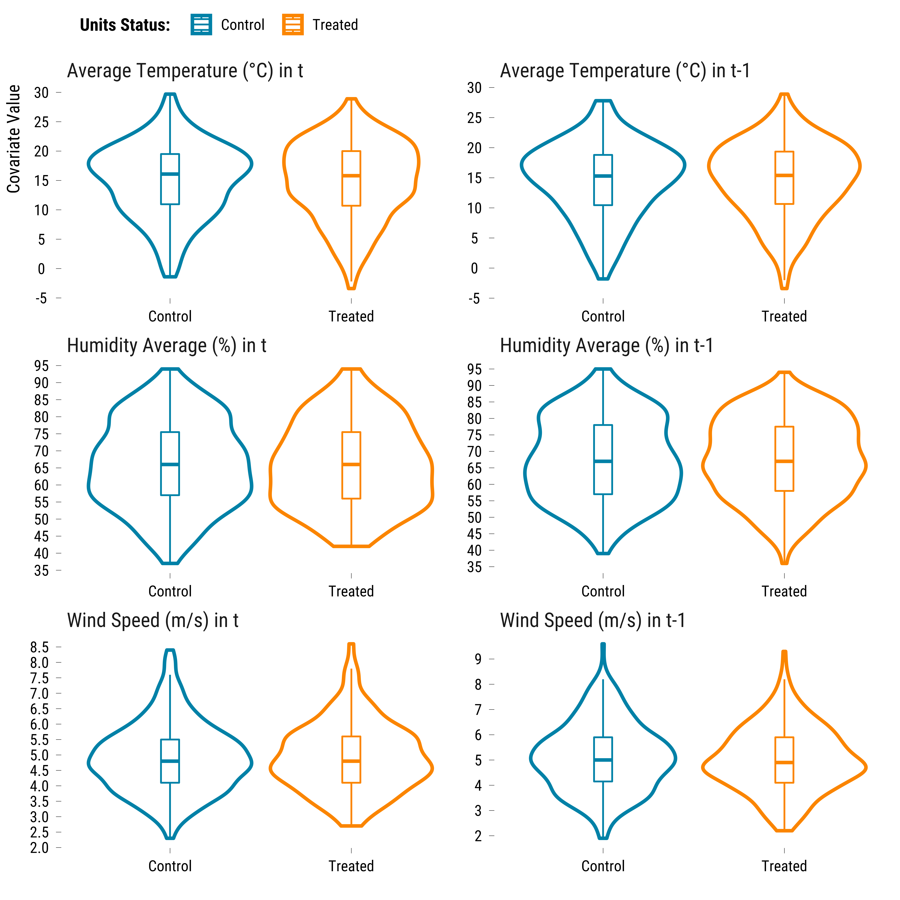
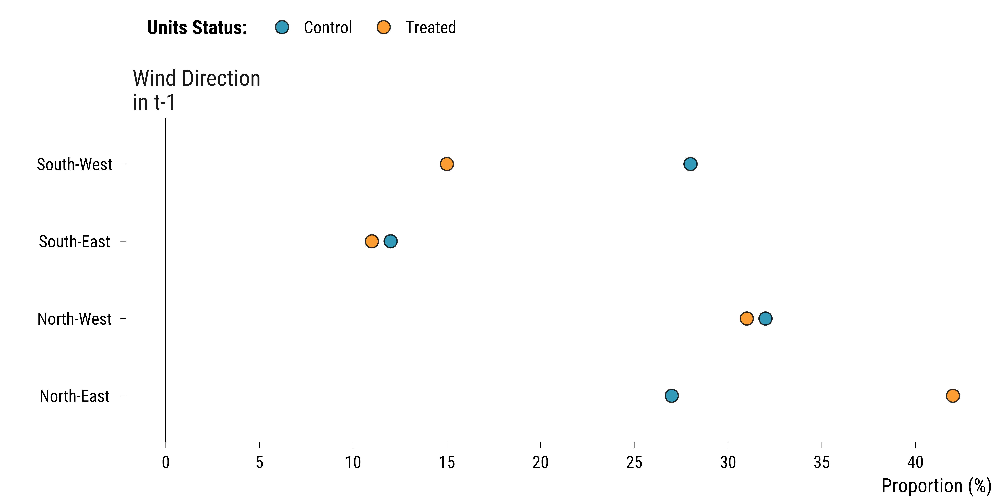
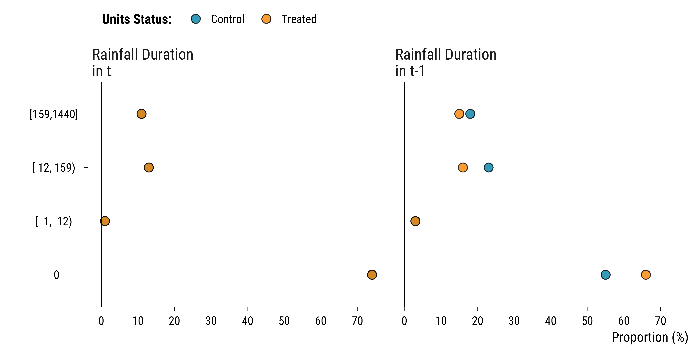
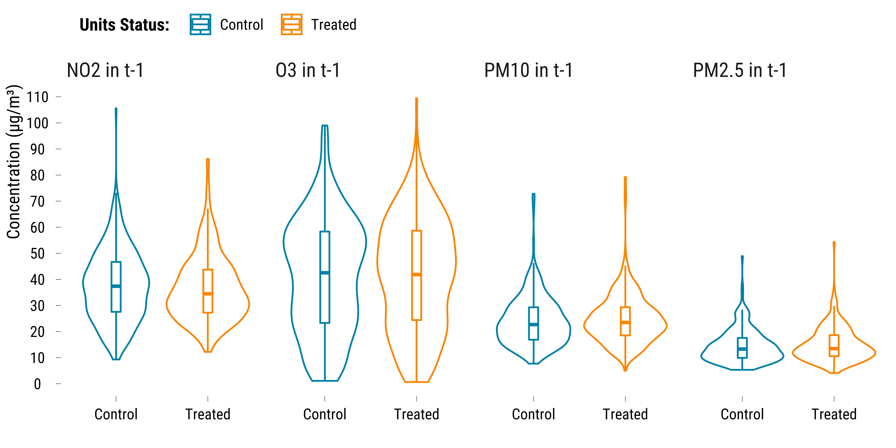
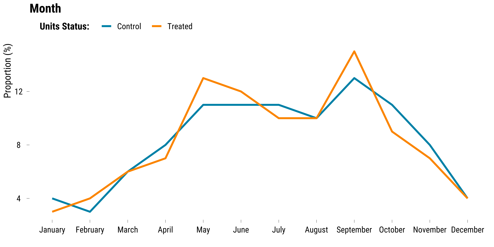
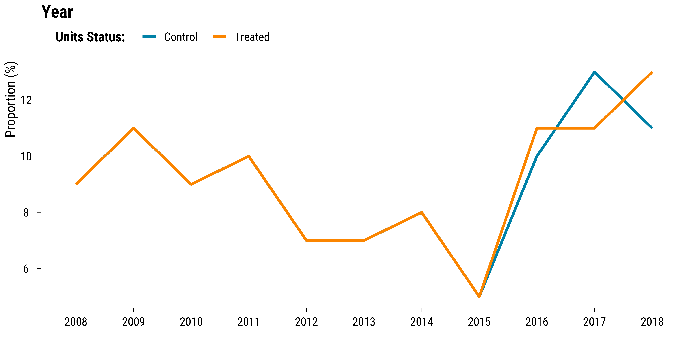

<style>
body {
text-align: justify}
</style>


In this document, we take great care providing all steps and R codes required to check whether our matching procedure achieved balance. We compare days where:

* treated units are days where winds blow from the North-East in *t*.
* control units are day winds blow from other directions in *t*.

We adjust for calendar indicators and weather confouding factors.

**Should you have any questions, need help to reproduce the analysis or find coding errors, please do not hesitate to contact me at leo.zabrocki@psemail.eu**

# Required Packages

To reproduce exactly the `3_script_checking_balance_figures.html` document, we first need to have installed:

* the [R](https://www.r-project.org/) programming language 
* [RStudio](https://rstudio.com/), an integrated development environment for R, which will allow you to knit the `3_script_checking_balance_figures.Rmd` file and interact with the R code chunks
* the [R Markdown](https://rmarkdown.rstudio.com/) package
* and the [Distill](https://rstudio.github.io/distill/) package which provides the template for this document. 

Once everything is set up, we have to load the following packages:

<div class="layout-chunk" data-layout="l-body-outset">
<div class="sourceCode"><pre class="sourceCode r"><code class="sourceCode r"><span class='co'># load required packages</span>
<span class='kw'><a href='https://rdrr.io/r/base/library.html'>library</a></span><span class='op'>(</span><span class='va'><a href='https://yihui.org/knitr/'>knitr</a></span><span class='op'>)</span> <span class='co'># for creating the R Markdown document</span>
<span class='kw'><a href='https://rdrr.io/r/base/library.html'>library</a></span><span class='op'>(</span><span class='va'><a href='https://here.r-lib.org/'>here</a></span><span class='op'>)</span> <span class='co'># for files paths organization</span>
<span class='kw'><a href='https://rdrr.io/r/base/library.html'>library</a></span><span class='op'>(</span><span class='va'><a href='https://tidyverse.tidyverse.org'>tidyverse</a></span><span class='op'>)</span> <span class='co'># for data manipulation and visualization</span>
<span class='kw'><a href='https://rdrr.io/r/base/library.html'>library</a></span><span class='op'>(</span><span class='va'><a href='https://wilkelab.org/ggridges/'>ggridges</a></span><span class='op'>)</span> <span class='co'># for ridge density plots</span>
<span class='kw'><a href='https://rdrr.io/r/base/library.html'>library</a></span><span class='op'>(</span><span class='va'><a href='http://www.rforge.net/Cairo/'>Cairo</a></span><span class='op'>)</span> <span class='co'># for printing customed police of graphs</span>
<span class='kw'><a href='https://rdrr.io/r/base/library.html'>library</a></span><span class='op'>(</span><span class='va'><a href='https://patchwork.data-imaginist.com'>patchwork</a></span><span class='op'>)</span> <span class='co'># combining plots</span>
</code></pre></div>

</div>


We finally load our custom `ggplot2` theme for graphs:

<div class="layout-chunk" data-layout="l-body-outset">
<div class="sourceCode"><pre class="sourceCode r"><code class="sourceCode r"><span class='co'># load ggplot custom theme</span>
<span class='kw'><a href='https://rdrr.io/r/base/source.html'>source</a></span><span class='op'>(</span><span class='fu'>here</span><span class='fu'>::</span><span class='fu'><a href='https://here.r-lib.org//reference/here.html'>here</a></span><span class='op'>(</span>
  <span class='st'>"2.scripts"</span>,
  <span class='st'>"4.custom_ggplot2_theme"</span>,
  <span class='st'>"script_theme_tufte.R"</span>
<span class='op'>)</span><span class='op'>)</span>
<span class='co'># define nice colors</span>
<span class='va'>my_blue</span> <span class='op'>&lt;-</span> <span class='st'>"#0081a7"</span>
<span class='va'>my_orange</span> <span class='op'>&lt;-</span> <span class='st'>"#fb8500"</span>
</code></pre></div>

</div>


The theme is based on the fantastic [hrbrthemes](https://hrbrmstr.github.io/hrbrthemes/index.html) package. If you do not want to use this theme or are unable to install it because of fonts issues, you can use the `theme_bw()` already included in the `ggplot2` package.

# Preparing the Data

We load the matched data:

<div class="layout-chunk" data-layout="l-body-outset">
<div class="sourceCode"><pre class="sourceCode r"><code class="sourceCode r"><span class='co'># load matched data</span>
<span class='va'>data_matched</span> <span class='op'>&lt;-</span>
  <span class='fu'><a href='https://rdrr.io/r/base/readRDS.html'>readRDS</a></span><span class='op'>(</span><span class='fu'>here</span><span class='fu'>::</span><span class='fu'><a href='https://here.r-lib.org//reference/here.html'>here</a></span><span class='op'>(</span><span class='st'>"1.data"</span>, <span class='st'>"6.matched_data"</span>, <span class='st'>"matched_data.Rds"</span><span class='op'>)</span><span class='op'>)</span>
</code></pre></div>

</div>


# Figures for Covariates Distribution for Treated and Control Units

We check whether coviariates balance was achieved with the thresholds we defined for our matching procedure. We plot distributions of weather and calendar variables (Lags 0-1) and pollutants (Lag 1) for treated and control groups.

### Weather Covariates

For continuous weather covariates, we draw boxplots for treated and control groups:

<div class="layout-chunk" data-layout="l-body-outset">
<div class="sourceCode"><pre class="sourceCode r"><code class="sourceCode r"><span class='co'># we select control variables and store them in a long dataframe</span>
<span class='va'>data_weather_continuous_variables</span> <span class='op'>&lt;-</span> <span class='va'>data_matched</span> <span class='op'>%&gt;%</span>
  <span class='fu'>select</span><span class='op'>(</span>
    <span class='va'>temperature_average</span>,
    <span class='va'>temperature_average_lag_1</span>,
    <span class='va'>humidity_average</span>,
    <span class='va'>humidity_average_lag_1</span>,
    <span class='va'>wind_speed</span>,
    <span class='va'>wind_speed_lag_1</span>,
    <span class='va'>is_treated</span>
  <span class='op'>)</span> <span class='op'>%&gt;%</span>
  <span class='fu'>pivot_longer</span><span class='op'>(</span>
    cols <span class='op'>=</span> <span class='op'>-</span><span class='fu'><a href='https://rdrr.io/r/base/c.html'>c</a></span><span class='op'>(</span><span class='va'>is_treated</span><span class='op'>)</span>,
    names_to <span class='op'>=</span> <span class='st'>"variable"</span>,
    values_to <span class='op'>=</span> <span class='st'>"values"</span>
  <span class='op'>)</span> <span class='op'>%&gt;%</span>
  <span class='fu'>mutate</span><span class='op'>(</span>
    new_variable <span class='op'>=</span> <span class='cn'>NA</span> <span class='op'>%&gt;%</span>
      <span class='fu'><a href='https://rdrr.io/r/base/ifelse.html'>ifelse</a></span><span class='op'>(</span>
        <span class='fu'>str_detect</span><span class='op'>(</span><span class='va'>variable</span>, <span class='st'>"temperature_average"</span><span class='op'>)</span>,
        <span class='st'>"Average Temperature (°C)"</span>,
        <span class='va'>.</span>
      <span class='op'>)</span> <span class='op'>%&gt;%</span>
      <span class='fu'><a href='https://rdrr.io/r/base/ifelse.html'>ifelse</a></span><span class='op'>(</span>
        <span class='fu'>str_detect</span><span class='op'>(</span><span class='va'>variable</span>, <span class='st'>"humidity_average"</span><span class='op'>)</span>,
        <span class='st'>"Humidity Average (%)"</span>,
        <span class='va'>.</span>
      <span class='op'>)</span> <span class='op'>%&gt;%</span>
      <span class='fu'><a href='https://rdrr.io/r/base/ifelse.html'>ifelse</a></span><span class='op'>(</span><span class='fu'>str_detect</span><span class='op'>(</span><span class='va'>variable</span>, <span class='st'>"wind_speed"</span><span class='op'>)</span>, <span class='st'>"Wind Speed (m/s)"</span>, <span class='va'>.</span><span class='op'>)</span>
  <span class='op'>)</span> <span class='op'>%&gt;%</span>
  <span class='fu'>mutate</span><span class='op'>(</span>time <span class='op'>=</span> <span class='st'>"in t"</span> <span class='op'>%&gt;%</span>
           <span class='fu'><a href='https://rdrr.io/r/base/ifelse.html'>ifelse</a></span><span class='op'>(</span><span class='fu'>str_detect</span><span class='op'>(</span><span class='va'>variable</span>, <span class='st'>"lag_1"</span><span class='op'>)</span>, <span class='st'>"in t-1"</span>, <span class='va'>.</span><span class='op'>)</span><span class='op'>)</span> <span class='op'>%&gt;%</span>
  <span class='fu'>mutate</span><span class='op'>(</span>variable <span class='op'>=</span> <span class='fu'><a href='https://rdrr.io/r/base/paste.html'>paste</a></span><span class='op'>(</span><span class='va'>new_variable</span>, <span class='va'>time</span>, sep <span class='op'>=</span> <span class='st'>" "</span><span class='op'>)</span><span class='op'>)</span> <span class='op'>%&gt;%</span>
  <span class='fu'>mutate</span><span class='op'>(</span>is_treated <span class='op'>=</span> <span class='fu'>if_else</span><span class='op'>(</span><span class='va'>is_treated</span> <span class='op'>==</span> <span class='cn'>TRUE</span>, <span class='st'>"Treated"</span>, <span class='st'>"Control"</span><span class='op'>)</span><span class='op'>)</span>

<span class='va'>graph_boxplot_continuous_weather</span> <span class='op'>&lt;-</span>
  <span class='fu'>ggplot</span><span class='op'>(</span><span class='va'>data_weather_continuous_variables</span>,
         <span class='fu'>aes</span><span class='op'>(</span>x <span class='op'>=</span> <span class='va'>is_treated</span>, y <span class='op'>=</span> <span class='va'>values</span>, colour <span class='op'>=</span> <span class='va'>is_treated</span><span class='op'>)</span><span class='op'>)</span> <span class='op'>+</span>
  <span class='fu'>geom_violin</span><span class='op'>(</span>size <span class='op'>=</span> <span class='fl'>1</span><span class='op'>)</span> <span class='op'>+</span>
  <span class='fu'>geom_boxplot</span><span class='op'>(</span>width <span class='op'>=</span> <span class='fl'>0.1</span>, outlier.shape <span class='op'>=</span> <span class='cn'>NA</span><span class='op'>)</span> <span class='op'>+</span>
  <span class='fu'>scale_color_manual</span><span class='op'>(</span>values <span class='op'>=</span> <span class='fu'><a href='https://rdrr.io/r/base/c.html'>c</a></span><span class='op'>(</span><span class='va'>my_blue</span>, <span class='va'>my_orange</span><span class='op'>)</span><span class='op'>)</span> <span class='op'>+</span>
  <span class='fu'>scale_y_continuous</span><span class='op'>(</span>breaks <span class='op'>=</span> <span class='fu'>scales</span><span class='fu'>::</span><span class='fu'><a href='https://scales.r-lib.org/reference/breaks_pretty.html'>pretty_breaks</a></span><span class='op'>(</span>n <span class='op'>=</span> <span class='fl'>10</span><span class='op'>)</span><span class='op'>)</span> <span class='op'>+</span>
  <span class='fu'>ylab</span><span class='op'>(</span><span class='st'>"Covariate Value"</span><span class='op'>)</span> <span class='op'>+</span>
  <span class='fu'>xlab</span><span class='op'>(</span><span class='st'>""</span><span class='op'>)</span> <span class='op'>+</span>
  <span class='fu'>labs</span><span class='op'>(</span>colour <span class='op'>=</span> <span class='st'>"Units Status:"</span><span class='op'>)</span> <span class='op'>+</span>
  <span class='fu'>facet_wrap</span><span class='op'>(</span> <span class='op'>~</span> <span class='va'>variable</span>, scale <span class='op'>=</span> <span class='st'>"free"</span>, ncol <span class='op'>=</span> <span class='fl'>2</span><span class='op'>)</span> <span class='op'>+</span>
  <span class='fu'>theme_tufte</span><span class='op'>(</span><span class='op'>)</span> <span class='op'>+</span>
  <span class='fu'>theme</span><span class='op'>(</span>
    legend.position <span class='op'>=</span> <span class='st'>"top"</span>,
    legend.justification <span class='op'>=</span> <span class='st'>"left"</span>,
    legend.direction <span class='op'>=</span> <span class='st'>"horizontal"</span>
  <span class='op'>)</span>

<span class='co'># we print the graph</span>
<span class='va'>graph_boxplot_continuous_weather</span>
</code></pre></div>
<!-- --><div class="sourceCode"><pre class="sourceCode r"><code class="sourceCode r"><span class='co'># save the graph</span>
<span class='fu'>ggsave</span><span class='op'>(</span>
  <span class='va'>graph_boxplot_continuous_weather</span>,
  filename <span class='op'>=</span> <span class='fu'>here</span><span class='fu'>::</span><span class='fu'><a href='https://here.r-lib.org//reference/here.html'>here</a></span><span class='op'>(</span>
    <span class='st'>"3.outputs"</span>,
    <span class='st'>"2.matching_analysis"</span>,
    <span class='st'>"graph_boxplot_continuous_weather.pdf"</span>
  <span class='op'>)</span>,
  width <span class='op'>=</span> <span class='fl'>20</span>,
  height <span class='op'>=</span> <span class='fl'>20</span>,
  units <span class='op'>=</span> <span class='st'>"cm"</span>,
  device <span class='op'>=</span> <span class='va'>cairo_pdf</span>
<span class='op'>)</span>
</code></pre></div>

</div>


For the rainfall duration and the wind direction categories, we plot the proportions:

<div class="layout-chunk" data-layout="l-body-outset">
<div class="sourceCode"><pre class="sourceCode r"><code class="sourceCode r"><span class='co'># we select the rainfall variables</span>
<span class='va'>data_weather_categorical</span> <span class='op'>&lt;-</span> <span class='va'>data_matched</span> <span class='op'>%&gt;%</span>
  <span class='fu'>select</span><span class='op'>(</span>
    <span class='va'>rainfall_duration</span>,
    <span class='va'>rainfall_duration_lag_1</span>,
    <span class='va'>wind_direction_categories_lag_1</span>,
    <span class='va'>is_treated</span>
  <span class='op'>)</span> <span class='op'>%&gt;%</span>
  <span class='fu'>mutate_all</span><span class='op'>(</span> <span class='op'>~</span> <span class='fu'><a href='https://rdrr.io/r/base/character.html'>as.character</a></span><span class='op'>(</span><span class='va'>.</span><span class='op'>)</span><span class='op'>)</span> <span class='op'>%&gt;%</span>
  <span class='fu'>pivot_longer</span><span class='op'>(</span>
    cols <span class='op'>=</span> <span class='op'>-</span><span class='fu'><a href='https://rdrr.io/r/base/c.html'>c</a></span><span class='op'>(</span><span class='va'>is_treated</span><span class='op'>)</span>,
    names_to <span class='op'>=</span> <span class='st'>"variable"</span>,
    values_to <span class='op'>=</span> <span class='st'>"values"</span>
  <span class='op'>)</span> <span class='op'>%&gt;%</span>
  <span class='co'># group by is_treated, variable and values</span>
  <span class='fu'>group_by</span><span class='op'>(</span><span class='va'>is_treated</span>, <span class='va'>variable</span>, <span class='va'>values</span><span class='op'>)</span> <span class='op'>%&gt;%</span>
  <span class='co'># compute the number of observations</span>
  <span class='fu'>summarise</span><span class='op'>(</span>n <span class='op'>=</span> <span class='fu'>n</span><span class='op'>(</span><span class='op'>)</span><span class='op'>)</span> <span class='op'>%&gt;%</span>
  <span class='co'># compute the proportion</span>
  <span class='fu'>mutate</span><span class='op'>(</span>freq <span class='op'>=</span> <span class='fu'><a href='https://rdrr.io/r/base/Round.html'>round</a></span><span class='op'>(</span><span class='va'>n</span> <span class='op'>/</span> <span class='fu'><a href='https://rdrr.io/r/base/sum.html'>sum</a></span><span class='op'>(</span><span class='va'>n</span><span class='op'>)</span> <span class='op'>*</span> <span class='fl'>100</span>, <span class='fl'>0</span><span class='op'>)</span><span class='op'>)</span> <span class='op'>%&gt;%</span>
  <span class='fu'>ungroup</span><span class='op'>(</span><span class='op'>)</span> <span class='op'>%&gt;%</span>
  <span class='fu'><a href='https://rdrr.io/r/stats/filter.html'>filter</a></span><span class='op'>(</span><span class='op'>!</span><span class='op'>(</span>
    <span class='va'>variable</span> <span class='op'>%in%</span> <span class='fu'><a href='https://rdrr.io/r/base/c.html'>c</a></span><span class='op'>(</span><span class='st'>"rainfall_duration"</span>, <span class='st'>"rainfall_duration_lag_1"</span><span class='op'>)</span> <span class='op'>&amp;</span>
      <span class='va'>values</span> <span class='op'>==</span> <span class='st'>"False"</span>
  <span class='op'>)</span><span class='op'>)</span> <span class='op'>%&gt;%</span>
  <span class='fu'>mutate</span><span class='op'>(</span>
    new_variable <span class='op'>=</span> <span class='cn'>NA</span> <span class='op'>%&gt;%</span>
      <span class='fu'><a href='https://rdrr.io/r/base/ifelse.html'>ifelse</a></span><span class='op'>(</span><span class='fu'>str_detect</span><span class='op'>(</span><span class='va'>variable</span>, <span class='st'>"wind"</span><span class='op'>)</span>, <span class='st'>"Wind Direction"</span>, <span class='va'>.</span><span class='op'>)</span> <span class='op'>%&gt;%</span>
      <span class='fu'><a href='https://rdrr.io/r/base/ifelse.html'>ifelse</a></span><span class='op'>(</span><span class='fu'>str_detect</span><span class='op'>(</span><span class='va'>variable</span>, <span class='st'>"rainfall"</span><span class='op'>)</span>, <span class='st'>"Rainfall Duration"</span>, <span class='va'>.</span><span class='op'>)</span>
  <span class='op'>)</span> <span class='op'>%&gt;%</span>
  <span class='fu'>mutate</span><span class='op'>(</span>time <span class='op'>=</span> <span class='st'>"\nin t"</span> <span class='op'>%&gt;%</span>
           <span class='fu'><a href='https://rdrr.io/r/base/ifelse.html'>ifelse</a></span><span class='op'>(</span><span class='fu'>str_detect</span><span class='op'>(</span><span class='va'>variable</span>, <span class='st'>"lag_1"</span><span class='op'>)</span>, <span class='st'>"\nin t-1"</span>, <span class='va'>.</span><span class='op'>)</span><span class='op'>)</span> <span class='op'>%&gt;%</span>
  <span class='fu'>mutate</span><span class='op'>(</span>variable <span class='op'>=</span> <span class='fu'><a href='https://rdrr.io/r/base/paste.html'>paste</a></span><span class='op'>(</span><span class='va'>new_variable</span>, <span class='va'>time</span>, sep <span class='op'>=</span> <span class='st'>" "</span><span class='op'>)</span><span class='op'>)</span> <span class='op'>%&gt;%</span>
  <span class='fu'>mutate</span><span class='op'>(</span>is_treated <span class='op'>=</span> <span class='fu'>if_else</span><span class='op'>(</span><span class='va'>is_treated</span> <span class='op'>==</span> <span class='cn'>TRUE</span>, <span class='st'>"Treated"</span>, <span class='st'>"Control"</span><span class='op'>)</span><span class='op'>)</span>


<span class='co'># build the graph for wind direction</span>
<span class='va'>graph_categorical_wd_weather</span> <span class='op'>&lt;-</span> <span class='va'>data_weather_categorical</span> <span class='op'>%&gt;%</span>
  <span class='fu'><a href='https://rdrr.io/r/stats/filter.html'>filter</a></span><span class='op'>(</span><span class='va'>new_variable</span> <span class='op'>==</span> <span class='st'>"Wind Direction"</span><span class='op'>)</span> <span class='op'>%&gt;%</span>
  <span class='fu'>ggplot</span><span class='op'>(</span><span class='va'>.</span>, <span class='fu'>aes</span><span class='op'>(</span>x <span class='op'>=</span> <span class='va'>freq</span>, y <span class='op'>=</span> <span class='va'>values</span>, fill <span class='op'>=</span> <span class='va'>is_treated</span><span class='op'>)</span><span class='op'>)</span> <span class='op'>+</span>
  <span class='fu'>geom_point</span><span class='op'>(</span>shape <span class='op'>=</span> <span class='fl'>21</span>,
             size <span class='op'>=</span> <span class='fl'>4</span>,
             alpha <span class='op'>=</span> <span class='fl'>0.8</span><span class='op'>)</span> <span class='op'>+</span>
  <span class='fu'>geom_vline</span><span class='op'>(</span>xintercept <span class='op'>=</span> <span class='fl'>0</span>, size <span class='op'>=</span> <span class='fl'>0.3</span><span class='op'>)</span> <span class='op'>+</span>
  <span class='fu'>scale_x_continuous</span><span class='op'>(</span>breaks <span class='op'>=</span> <span class='fu'>scales</span><span class='fu'>::</span><span class='fu'><a href='https://scales.r-lib.org/reference/breaks_pretty.html'>pretty_breaks</a></span><span class='op'>(</span>n <span class='op'>=</span> <span class='fl'>10</span><span class='op'>)</span><span class='op'>)</span> <span class='op'>+</span>
  <span class='fu'>scale_fill_manual</span><span class='op'>(</span>values <span class='op'>=</span> <span class='fu'><a href='https://rdrr.io/r/base/c.html'>c</a></span><span class='op'>(</span><span class='va'>my_blue</span>, <span class='va'>my_orange</span><span class='op'>)</span><span class='op'>)</span> <span class='op'>+</span>
  <span class='fu'>facet_wrap</span><span class='op'>(</span> <span class='op'>~</span> <span class='va'>variable</span>, scales <span class='op'>=</span> <span class='st'>"free"</span><span class='op'>)</span> <span class='op'>+</span>
  <span class='fu'>xlab</span><span class='op'>(</span><span class='st'>"Proportion (%)"</span><span class='op'>)</span> <span class='op'>+</span>
  <span class='fu'>ylab</span><span class='op'>(</span><span class='st'>""</span><span class='op'>)</span> <span class='op'>+</span>
  <span class='fu'>labs</span><span class='op'>(</span>fill <span class='op'>=</span> <span class='st'>"Units Status:"</span><span class='op'>)</span> <span class='op'>+</span>
  <span class='fu'>theme_tufte</span><span class='op'>(</span><span class='op'>)</span> <span class='op'>+</span>
  <span class='fu'>theme</span><span class='op'>(</span>
    legend.position <span class='op'>=</span> <span class='st'>"top"</span>,
    legend.justification <span class='op'>=</span> <span class='st'>"left"</span>,
    legend.direction <span class='op'>=</span> <span class='st'>"horizontal"</span>
  <span class='op'>)</span>

<span class='co'># we print the graph</span>
<span class='va'>graph_categorical_wd_weather</span>
</code></pre></div>
<!-- --><div class="sourceCode"><pre class="sourceCode r"><code class="sourceCode r"><span class='co'># build the graph for rainfall dummy</span>
<span class='va'>graph_categorical_rainfall_weather</span> <span class='op'>&lt;-</span> <span class='va'>data_weather_categorical</span> <span class='op'>%&gt;%</span>
  <span class='fu'><a href='https://rdrr.io/r/stats/filter.html'>filter</a></span><span class='op'>(</span><span class='va'>new_variable</span> <span class='op'>==</span> <span class='st'>"Rainfall Duration"</span><span class='op'>)</span> <span class='op'>%&gt;%</span>
  <span class='fu'>ggplot</span><span class='op'>(</span><span class='va'>.</span>, <span class='fu'>aes</span><span class='op'>(</span>x <span class='op'>=</span> <span class='va'>freq</span>, y <span class='op'>=</span> <span class='va'>values</span>, fill <span class='op'>=</span> <span class='va'>is_treated</span><span class='op'>)</span><span class='op'>)</span> <span class='op'>+</span>
  <span class='fu'>geom_point</span><span class='op'>(</span>shape <span class='op'>=</span> <span class='fl'>21</span>,
             size <span class='op'>=</span> <span class='fl'>4</span>,
             alpha <span class='op'>=</span> <span class='fl'>0.8</span><span class='op'>)</span> <span class='op'>+</span>
  <span class='fu'>geom_vline</span><span class='op'>(</span>xintercept <span class='op'>=</span> <span class='fl'>0</span>, size <span class='op'>=</span> <span class='fl'>0.3</span><span class='op'>)</span> <span class='op'>+</span>
  <span class='fu'>scale_x_continuous</span><span class='op'>(</span>breaks <span class='op'>=</span> <span class='fu'>scales</span><span class='fu'>::</span><span class='fu'><a href='https://scales.r-lib.org/reference/breaks_pretty.html'>pretty_breaks</a></span><span class='op'>(</span>n <span class='op'>=</span> <span class='fl'>10</span><span class='op'>)</span><span class='op'>)</span> <span class='op'>+</span>
  <span class='fu'>scale_fill_manual</span><span class='op'>(</span>values <span class='op'>=</span> <span class='fu'><a href='https://rdrr.io/r/base/c.html'>c</a></span><span class='op'>(</span><span class='va'>my_blue</span>, <span class='va'>my_orange</span><span class='op'>)</span><span class='op'>)</span> <span class='op'>+</span>
  <span class='fu'>facet_wrap</span><span class='op'>(</span> <span class='op'>~</span> <span class='va'>variable</span><span class='op'>)</span> <span class='op'>+</span>
  <span class='fu'>xlab</span><span class='op'>(</span><span class='st'>"Proportion (%)"</span><span class='op'>)</span> <span class='op'>+</span>
  <span class='fu'>ylab</span><span class='op'>(</span><span class='st'>""</span><span class='op'>)</span> <span class='op'>+</span>
  <span class='fu'>labs</span><span class='op'>(</span>fill <span class='op'>=</span> <span class='st'>"Units Status:"</span><span class='op'>)</span> <span class='op'>+</span>
  <span class='fu'>theme_tufte</span><span class='op'>(</span><span class='op'>)</span> <span class='op'>+</span>
  <span class='fu'>theme</span><span class='op'>(</span>
    legend.position <span class='op'>=</span> <span class='st'>"top"</span>,
    legend.justification <span class='op'>=</span> <span class='st'>"left"</span>,
    legend.direction <span class='op'>=</span> <span class='st'>"horizontal"</span>
  <span class='op'>)</span>

<span class='co'># we print the graph</span>
<span class='va'>graph_categorical_rainfall_weather</span>
</code></pre></div>
<!-- --><div class="sourceCode"><pre class="sourceCode r"><code class="sourceCode r"><span class='co'># combine plots</span>
<span class='va'>graph_categorical_weather</span> <span class='op'>&lt;-</span>
  <span class='va'>graph_categorical_wd_weather</span> <span class='op'>/</span> <span class='va'>graph_categorical_rainfall_weather</span> <span class='op'>+</span>
  <span class='fu'><a href='https://patchwork.data-imaginist.com/reference/plot_annotation.html'>plot_annotation</a></span><span class='op'>(</span>tag_levels <span class='op'>=</span> <span class='st'>'A'</span><span class='op'>)</span> <span class='op'>&amp;</span>
  <span class='fu'>theme</span><span class='op'>(</span>plot.tag <span class='op'>=</span> <span class='fu'>element_text</span><span class='op'>(</span>size <span class='op'>=</span> <span class='fl'>20</span>, face <span class='op'>=</span> <span class='st'>"bold"</span><span class='op'>)</span><span class='op'>)</span>

<span class='co'># save the graph</span>
<span class='fu'>ggsave</span><span class='op'>(</span>
  <span class='va'>graph_categorical_weather</span>,
  filename <span class='op'>=</span> <span class='fu'>here</span><span class='fu'>::</span><span class='fu'><a href='https://here.r-lib.org//reference/here.html'>here</a></span><span class='op'>(</span>
    <span class='st'>"3.outputs"</span>,
    <span class='st'>"2.matching_analysis"</span>,
    <span class='st'>"graph_categorical_weather.pdf"</span>
  <span class='op'>)</span>,
  width <span class='op'>=</span> <span class='fl'>20</span>,
  height <span class='op'>=</span> <span class='fl'>20</span>,
  units <span class='op'>=</span> <span class='st'>"cm"</span>,
  device <span class='op'>=</span> <span class='va'>cairo_pdf</span>
<span class='op'>)</span>
</code></pre></div>

</div>


### Pollutants

For pollutants lag 1, we draw boxplots for treated and control groups:

<div class="layout-chunk" data-layout="l-body-outset">
<div class="sourceCode"><pre class="sourceCode r"><code class="sourceCode r"><span class='co'># we select control variables and store them in a long dataframe</span>
<span class='va'>data_pollutant_variables</span> <span class='op'>&lt;-</span> <span class='va'>data_matched</span> <span class='op'>%&gt;%</span>
  <span class='fu'>select</span><span class='op'>(</span><span class='va'>mean_no2_lag_1</span><span class='op'>:</span><span class='va'>mean_pm25_lag_1</span>,
         <span class='va'>is_treated</span><span class='op'>)</span> <span class='op'>%&gt;%</span>
  <span class='co'># transform the data to long to compute the proportion of observations for each variable</span>
  <span class='fu'>pivot_longer</span><span class='op'>(</span>
    cols <span class='op'>=</span> <span class='op'>-</span><span class='fu'><a href='https://rdrr.io/r/base/c.html'>c</a></span><span class='op'>(</span><span class='va'>is_treated</span><span class='op'>)</span>,
    names_to <span class='op'>=</span> <span class='st'>"variable"</span>,
    values_to <span class='op'>=</span> <span class='st'>"values"</span>
  <span class='op'>)</span> <span class='op'>%&gt;%</span>
  <span class='fu'>mutate</span><span class='op'>(</span>is_treated <span class='op'>=</span> <span class='fu'><a href='https://rdrr.io/r/base/ifelse.html'>ifelse</a></span><span class='op'>(</span><span class='va'>is_treated</span> <span class='op'>==</span> <span class='st'>"TRUE"</span>, <span class='st'>"Treated"</span>, <span class='st'>"Control"</span><span class='op'>)</span><span class='op'>)</span> <span class='op'>%&gt;%</span>
  <span class='fu'>mutate</span><span class='op'>(</span>
    pollutant <span class='op'>=</span> <span class='cn'>NA</span> <span class='op'>%&gt;%</span>
      <span class='fu'><a href='https://rdrr.io/r/base/ifelse.html'>ifelse</a></span><span class='op'>(</span><span class='fu'>str_detect</span><span class='op'>(</span><span class='va'>variable</span>, <span class='st'>"no2"</span><span class='op'>)</span>, <span class='st'>"NO2"</span>, <span class='va'>.</span><span class='op'>)</span> <span class='op'>%&gt;%</span>
      <span class='fu'><a href='https://rdrr.io/r/base/ifelse.html'>ifelse</a></span><span class='op'>(</span><span class='fu'>str_detect</span><span class='op'>(</span><span class='va'>variable</span>, <span class='st'>"o3"</span><span class='op'>)</span>, <span class='st'>"O3"</span>, <span class='va'>.</span><span class='op'>)</span> <span class='op'>%&gt;%</span>
      <span class='fu'><a href='https://rdrr.io/r/base/ifelse.html'>ifelse</a></span><span class='op'>(</span><span class='fu'>str_detect</span><span class='op'>(</span><span class='va'>variable</span>, <span class='st'>"pm10"</span><span class='op'>)</span>, <span class='st'>"PM10"</span>, <span class='va'>.</span><span class='op'>)</span> <span class='op'>%&gt;%</span>
      <span class='fu'><a href='https://rdrr.io/r/base/ifelse.html'>ifelse</a></span><span class='op'>(</span><span class='fu'>str_detect</span><span class='op'>(</span><span class='va'>variable</span>, <span class='st'>"pm25"</span><span class='op'>)</span>, <span class='st'>"PM2.5"</span>, <span class='va'>.</span><span class='op'>)</span>
  <span class='op'>)</span> <span class='op'>%&gt;%</span>
  <span class='fu'>mutate</span><span class='op'>(</span>time <span class='op'>=</span> <span class='st'>"in t-1"</span><span class='op'>)</span> <span class='op'>%&gt;%</span>
  <span class='fu'>mutate</span><span class='op'>(</span>variable <span class='op'>=</span> <span class='fu'><a href='https://rdrr.io/r/base/paste.html'>paste</a></span><span class='op'>(</span><span class='va'>pollutant</span>, <span class='va'>time</span>, sep <span class='op'>=</span> <span class='st'>" "</span><span class='op'>)</span><span class='op'>)</span>

<span class='co'># make graph</span>
<span class='va'>graph_boxplot_pollutants</span> <span class='op'>&lt;-</span> <span class='va'>data_pollutant_variables</span> <span class='op'>%&gt;%</span>
  <span class='fu'>ggplot</span><span class='op'>(</span><span class='va'>.</span>, <span class='fu'>aes</span><span class='op'>(</span>x <span class='op'>=</span> <span class='va'>is_treated</span>, y <span class='op'>=</span> <span class='va'>values</span>, colour <span class='op'>=</span> <span class='va'>is_treated</span><span class='op'>)</span><span class='op'>)</span> <span class='op'>+</span>
  <span class='fu'>geom_violin</span><span class='op'>(</span>size <span class='op'>=</span> <span class='fl'>0.5</span><span class='op'>)</span> <span class='op'>+</span>
  <span class='fu'>geom_boxplot</span><span class='op'>(</span>width <span class='op'>=</span> <span class='fl'>0.1</span>, outlier.shape <span class='op'>=</span> <span class='cn'>NA</span><span class='op'>)</span> <span class='op'>+</span>
  <span class='fu'>scale_color_manual</span><span class='op'>(</span>values <span class='op'>=</span> <span class='fu'><a href='https://rdrr.io/r/base/c.html'>c</a></span><span class='op'>(</span><span class='va'>my_blue</span>, <span class='va'>my_orange</span><span class='op'>)</span><span class='op'>)</span> <span class='op'>+</span>
  <span class='fu'>scale_y_continuous</span><span class='op'>(</span>breaks <span class='op'>=</span> <span class='fu'>scales</span><span class='fu'>::</span><span class='fu'><a href='https://scales.r-lib.org/reference/breaks_pretty.html'>pretty_breaks</a></span><span class='op'>(</span>n <span class='op'>=</span> <span class='fl'>10</span><span class='op'>)</span><span class='op'>)</span> <span class='op'>+</span>
  <span class='fu'>ylab</span><span class='op'>(</span><span class='st'>"Concentration (µg/m³)"</span><span class='op'>)</span> <span class='op'>+</span>
  <span class='fu'>xlab</span><span class='op'>(</span><span class='st'>""</span><span class='op'>)</span> <span class='op'>+</span>
  <span class='fu'>labs</span><span class='op'>(</span>colour <span class='op'>=</span> <span class='st'>"Units Status:"</span><span class='op'>)</span> <span class='op'>+</span>
  <span class='fu'>facet_wrap</span><span class='op'>(</span> <span class='op'>~</span> <span class='va'>variable</span>, ncol <span class='op'>=</span> <span class='fl'>4</span><span class='op'>)</span> <span class='op'>+</span>
  <span class='fu'>theme_tufte</span><span class='op'>(</span><span class='op'>)</span> <span class='op'>+</span>
  <span class='fu'>theme</span><span class='op'>(</span>
    legend.position <span class='op'>=</span> <span class='st'>"top"</span>,
    legend.justification <span class='op'>=</span> <span class='st'>"left"</span>,
    legend.direction <span class='op'>=</span> <span class='st'>"horizontal"</span>
  <span class='op'>)</span>

<span class='co'># we print the graph</span>
<span class='va'>graph_boxplot_pollutants</span>
</code></pre></div>
<!-- --><div class="sourceCode"><pre class="sourceCode r"><code class="sourceCode r"><span class='co'># save the graph</span>
<span class='fu'>ggsave</span><span class='op'>(</span>
  <span class='va'>graph_boxplot_pollutants</span>,
  filename <span class='op'>=</span> <span class='fu'>here</span><span class='fu'>::</span><span class='fu'><a href='https://here.r-lib.org//reference/here.html'>here</a></span><span class='op'>(</span>
    <span class='st'>"3.outputs"</span>,
    <span class='st'>"2.matching_analysis"</span>,
    <span class='st'>"graph_boxplot_pollutants.pdf"</span>
  <span class='op'>)</span>,
  width <span class='op'>=</span> <span class='fl'>30</span>,
  height <span class='op'>=</span> <span class='fl'>10</span>,
  units <span class='op'>=</span> <span class='st'>"cm"</span>,
  device <span class='op'>=</span> <span class='va'>cairo_pdf</span>
<span class='op'>)</span>
</code></pre></div>

</div>


### Calendar Indicator

For calendar variables such as the day of the week, bank days and holidays we matched strictly. We plot the proportions of observations belonging to each month by treatment status:

<div class="layout-chunk" data-layout="l-body-outset">
<div class="sourceCode"><pre class="sourceCode r"><code class="sourceCode r"><span class='co'># compute the proportions of observations belonging to each month by treatment status</span>
<span class='va'>data_month</span> <span class='op'>&lt;-</span> <span class='va'>data_matched</span> <span class='op'>%&gt;%</span>
  <span class='fu'>mutate</span><span class='op'>(</span>is_treated <span class='op'>=</span> <span class='fu'><a href='https://rdrr.io/r/base/ifelse.html'>ifelse</a></span><span class='op'>(</span><span class='va'>is_treated</span> <span class='op'>==</span> <span class='st'>"TRUE"</span>, <span class='st'>"Treated"</span>, <span class='st'>"Control"</span><span class='op'>)</span><span class='op'>)</span> <span class='op'>%&gt;%</span>
  <span class='fu'>select</span><span class='op'>(</span><span class='va'>month</span>, <span class='va'>is_treated</span><span class='op'>)</span> <span class='op'>%&gt;%</span>
  <span class='fu'>mutate</span><span class='op'>(</span>
    month <span class='op'>=</span> <span class='fu'>recode</span><span class='op'>(</span>
      <span class='va'>month</span>,
      `1` <span class='op'>=</span> <span class='st'>"January"</span>,
      `2` <span class='op'>=</span> <span class='st'>"February"</span>,
      `3` <span class='op'>=</span> <span class='st'>"March"</span>,
      `4` <span class='op'>=</span> <span class='st'>"April"</span>,
      `5` <span class='op'>=</span> <span class='st'>"May"</span>,
      `6` <span class='op'>=</span> <span class='st'>"June"</span>,
      `7` <span class='op'>=</span> <span class='st'>"July"</span>,
      `8` <span class='op'>=</span> <span class='st'>"August"</span>,
      `9` <span class='op'>=</span> <span class='st'>"September"</span>,
      `10` <span class='op'>=</span> <span class='st'>"October"</span>,
      `11` <span class='op'>=</span> <span class='st'>"November"</span>,
      `12` <span class='op'>=</span> <span class='st'>"December"</span>
    <span class='op'>)</span> <span class='op'>%&gt;%</span>
      <span class='fu'>fct_relevel</span><span class='op'>(</span>
        <span class='va'>.</span>,
        <span class='st'>"January"</span>,
        <span class='st'>"February"</span>,
        <span class='st'>"March"</span>,
        <span class='st'>"April"</span>,
        <span class='st'>"May"</span>,
        <span class='st'>"June"</span>,
        <span class='st'>"July"</span>,
        <span class='st'>"August"</span>,
        <span class='st'>"September"</span>,
        <span class='st'>"October"</span>,
        <span class='st'>"November"</span>,
        <span class='st'>"December"</span>
      <span class='op'>)</span>
  <span class='op'>)</span> <span class='op'>%&gt;%</span>
  <span class='fu'>pivot_longer</span><span class='op'>(</span><span class='va'>.</span>,<span class='op'>-</span><span class='va'>is_treated</span><span class='op'>)</span> <span class='op'>%&gt;%</span>
  <span class='fu'>group_by</span><span class='op'>(</span><span class='va'>name</span>, <span class='va'>is_treated</span>, <span class='va'>value</span><span class='op'>)</span> <span class='op'>%&gt;%</span>
  <span class='fu'>summarise</span><span class='op'>(</span>n <span class='op'>=</span> <span class='fu'>n</span><span class='op'>(</span><span class='op'>)</span><span class='op'>)</span> <span class='op'>%&gt;%</span>
  <span class='fu'>mutate</span><span class='op'>(</span>proportion <span class='op'>=</span> <span class='fu'><a href='https://rdrr.io/r/base/Round.html'>round</a></span><span class='op'>(</span><span class='va'>n</span> <span class='op'>/</span> <span class='fu'><a href='https://rdrr.io/r/base/sum.html'>sum</a></span><span class='op'>(</span><span class='va'>n</span><span class='op'>)</span> <span class='op'>*</span> <span class='fl'>100</span>, <span class='fl'>0</span><span class='op'>)</span><span class='op'>)</span> <span class='op'>%&gt;%</span>
  <span class='fu'>ungroup</span><span class='op'>(</span><span class='op'>)</span>

<span class='co'># we plot the data using cleveland dot plots</span>
<span class='va'>graph_month</span> <span class='op'>&lt;-</span>
  <span class='fu'>ggplot</span><span class='op'>(</span><span class='va'>data_month</span>,
         <span class='fu'>aes</span><span class='op'>(</span>
           x <span class='op'>=</span> <span class='fu'><a href='https://rdrr.io/r/base/factor.html'>as.factor</a></span><span class='op'>(</span><span class='va'>value</span><span class='op'>)</span>,
           y <span class='op'>=</span> <span class='va'>proportion</span>,
           colour <span class='op'>=</span> <span class='va'>is_treated</span>,
           group <span class='op'>=</span> <span class='va'>is_treated</span>
         <span class='op'>)</span><span class='op'>)</span> <span class='op'>+</span>
  <span class='fu'>geom_line</span><span class='op'>(</span>size <span class='op'>=</span> <span class='fl'>1</span><span class='op'>)</span> <span class='op'>+</span>
  <span class='fu'>scale_colour_manual</span><span class='op'>(</span>values <span class='op'>=</span> <span class='fu'><a href='https://rdrr.io/r/base/c.html'>c</a></span><span class='op'>(</span><span class='va'>my_blue</span>, <span class='va'>my_orange</span><span class='op'>)</span>,
                      guide <span class='op'>=</span> <span class='fu'>guide_legend</span><span class='op'>(</span>reverse <span class='op'>=</span> <span class='cn'>FALSE</span><span class='op'>)</span><span class='op'>)</span> <span class='op'>+</span>
  <span class='fu'>ggtitle</span><span class='op'>(</span><span class='st'>"Month"</span><span class='op'>)</span> <span class='op'>+</span>
  <span class='fu'>ylab</span><span class='op'>(</span><span class='st'>"Proportion (%)"</span><span class='op'>)</span> <span class='op'>+</span>
  <span class='fu'>xlab</span><span class='op'>(</span><span class='st'>""</span><span class='op'>)</span> <span class='op'>+</span>
  <span class='fu'>labs</span><span class='op'>(</span>colour <span class='op'>=</span> <span class='st'>"Units Status:"</span><span class='op'>)</span> <span class='op'>+</span>
  <span class='fu'>theme_tufte</span><span class='op'>(</span><span class='op'>)</span> <span class='op'>+</span>
  <span class='fu'>theme</span><span class='op'>(</span>
    legend.position <span class='op'>=</span> <span class='st'>"top"</span>,
    legend.justification <span class='op'>=</span> <span class='st'>"left"</span>,
    legend.direction <span class='op'>=</span> <span class='st'>"horizontal"</span>
  <span class='op'>)</span>

<span class='co'># we print the graph</span>
<span class='va'>graph_month</span>
</code></pre></div>
<!-- -->

</div>


We plot the proportions of observations belonging to each year by treatment status:

<div class="layout-chunk" data-layout="l-body-outset">
<div class="sourceCode"><pre class="sourceCode r"><code class="sourceCode r"><span class='co'># compute the proportions of observations belonging to each year by treatment status</span>
<span class='va'>data_year</span> <span class='op'>&lt;-</span> <span class='va'>data_matched</span> <span class='op'>%&gt;%</span>
  <span class='fu'>mutate</span><span class='op'>(</span>is_treated <span class='op'>=</span> <span class='fu'><a href='https://rdrr.io/r/base/ifelse.html'>ifelse</a></span><span class='op'>(</span><span class='va'>is_treated</span> <span class='op'>==</span> <span class='st'>"TRUE"</span>, <span class='st'>"Treated"</span>, <span class='st'>"Control"</span><span class='op'>)</span><span class='op'>)</span> <span class='op'>%&gt;%</span>
  <span class='fu'>select</span><span class='op'>(</span><span class='va'>year</span>, <span class='va'>is_treated</span><span class='op'>)</span> <span class='op'>%&gt;%</span>
  <span class='fu'>pivot_longer</span><span class='op'>(</span><span class='va'>.</span>,<span class='op'>-</span><span class='va'>is_treated</span><span class='op'>)</span> <span class='op'>%&gt;%</span>
  <span class='fu'>group_by</span><span class='op'>(</span><span class='va'>name</span>, <span class='va'>is_treated</span>, <span class='va'>value</span><span class='op'>)</span> <span class='op'>%&gt;%</span>
  <span class='fu'>summarise</span><span class='op'>(</span>n <span class='op'>=</span> <span class='fu'>n</span><span class='op'>(</span><span class='op'>)</span><span class='op'>)</span> <span class='op'>%&gt;%</span>
  <span class='fu'>mutate</span><span class='op'>(</span>proportion <span class='op'>=</span> <span class='fu'><a href='https://rdrr.io/r/base/Round.html'>round</a></span><span class='op'>(</span><span class='va'>n</span> <span class='op'>/</span> <span class='fu'><a href='https://rdrr.io/r/base/sum.html'>sum</a></span><span class='op'>(</span><span class='va'>n</span><span class='op'>)</span> <span class='op'>*</span> <span class='fl'>100</span>, <span class='fl'>0</span><span class='op'>)</span><span class='op'>)</span> <span class='op'>%&gt;%</span>
  <span class='fu'>ungroup</span><span class='op'>(</span><span class='op'>)</span>

<span class='co'># we plot the data using cleveland dot plots</span>
<span class='va'>graph_year</span> <span class='op'>&lt;-</span>
  <span class='fu'>ggplot</span><span class='op'>(</span><span class='va'>data_year</span>,
         <span class='fu'>aes</span><span class='op'>(</span>
           x <span class='op'>=</span> <span class='fu'><a href='https://rdrr.io/r/base/factor.html'>as.factor</a></span><span class='op'>(</span><span class='va'>value</span><span class='op'>)</span>,
           y <span class='op'>=</span> <span class='va'>proportion</span>,
           colour <span class='op'>=</span> <span class='va'>is_treated</span>,
           group <span class='op'>=</span> <span class='va'>is_treated</span>
         <span class='op'>)</span><span class='op'>)</span> <span class='op'>+</span>
  <span class='fu'>geom_line</span><span class='op'>(</span>size <span class='op'>=</span> <span class='fl'>1</span><span class='op'>)</span> <span class='op'>+</span>
  <span class='fu'>scale_colour_manual</span><span class='op'>(</span>values <span class='op'>=</span> <span class='fu'><a href='https://rdrr.io/r/base/c.html'>c</a></span><span class='op'>(</span><span class='va'>my_blue</span>, <span class='va'>my_orange</span><span class='op'>)</span>,
                      guide <span class='op'>=</span> <span class='fu'>guide_legend</span><span class='op'>(</span>reverse <span class='op'>=</span> <span class='cn'>FALSE</span><span class='op'>)</span><span class='op'>)</span> <span class='op'>+</span>
  <span class='fu'>ggtitle</span><span class='op'>(</span><span class='st'>"Year"</span><span class='op'>)</span> <span class='op'>+</span>
  <span class='fu'>ylab</span><span class='op'>(</span><span class='st'>"Proportion (%)"</span><span class='op'>)</span> <span class='op'>+</span>
  <span class='fu'>xlab</span><span class='op'>(</span><span class='st'>""</span><span class='op'>)</span> <span class='op'>+</span>
  <span class='fu'>labs</span><span class='op'>(</span>colour <span class='op'>=</span> <span class='st'>"Units Status:"</span><span class='op'>)</span> <span class='op'>+</span>
  <span class='fu'>theme_tufte</span><span class='op'>(</span><span class='op'>)</span> <span class='op'>+</span>
  <span class='fu'>theme</span><span class='op'>(</span>
    legend.position <span class='op'>=</span> <span class='st'>"top"</span>,
    legend.justification <span class='op'>=</span> <span class='st'>"left"</span>,
    legend.direction <span class='op'>=</span> <span class='st'>"horizontal"</span>
  <span class='op'>)</span>

<span class='co'># we print the graph</span>
<span class='va'>graph_year</span>
</code></pre></div>
<!-- -->

</div>


We combine and save the two previous plots:

<div class="layout-chunk" data-layout="l-body-outset">
<div class="sourceCode"><pre class="sourceCode r"><code class="sourceCode r"><span class='co'># combine plots</span>
<span class='va'>graph_month_year</span> <span class='op'>&lt;-</span> <span class='va'>graph_month</span> <span class='op'>/</span> <span class='va'>graph_year</span> <span class='op'>+</span>
  <span class='fu'><a href='https://patchwork.data-imaginist.com/reference/plot_annotation.html'>plot_annotation</a></span><span class='op'>(</span>tag_levels <span class='op'>=</span> <span class='st'>'A'</span><span class='op'>)</span> <span class='op'>&amp;</span>
  <span class='fu'>theme</span><span class='op'>(</span>plot.tag <span class='op'>=</span> <span class='fu'>element_text</span><span class='op'>(</span>size <span class='op'>=</span> <span class='fl'>20</span>, face <span class='op'>=</span> <span class='st'>"bold"</span><span class='op'>)</span><span class='op'>)</span>

<span class='co'># save the plot</span>
<span class='fu'>ggsave</span><span class='op'>(</span>
  <span class='va'>graph_month_year</span>,
  filename <span class='op'>=</span> <span class='fu'>here</span><span class='fu'>::</span><span class='fu'><a href='https://here.r-lib.org//reference/here.html'>here</a></span><span class='op'>(</span><span class='st'>"3.outputs"</span>, <span class='st'>"2.matching_analysis"</span>, <span class='st'>"graph_month_year.pdf"</span><span class='op'>)</span>,
  width <span class='op'>=</span> <span class='fl'>20</span>,
  height <span class='op'>=</span> <span class='fl'>17</span>,
  units <span class='op'>=</span> <span class='st'>"cm"</span>,
  device <span class='op'>=</span> <span class='va'>cairo_pdf</span>
<span class='op'>)</span>
</code></pre></div>

</div>


```{.r .distill-force-highlighting-css}
```
