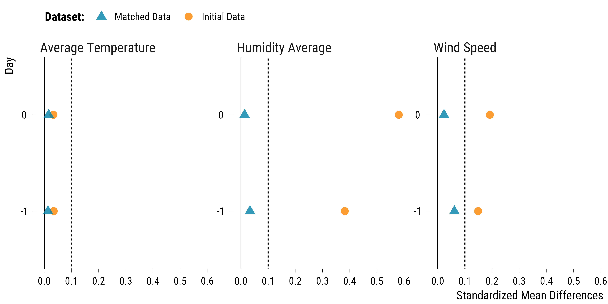
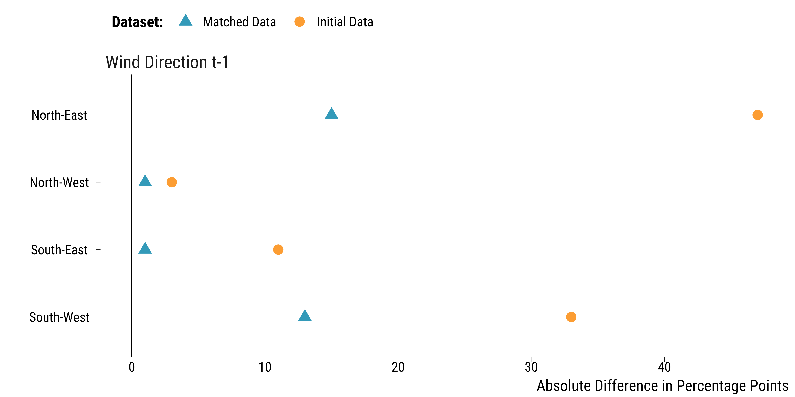
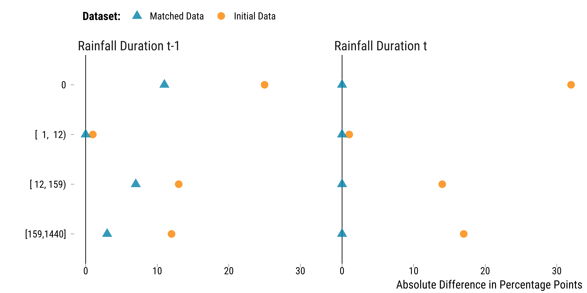
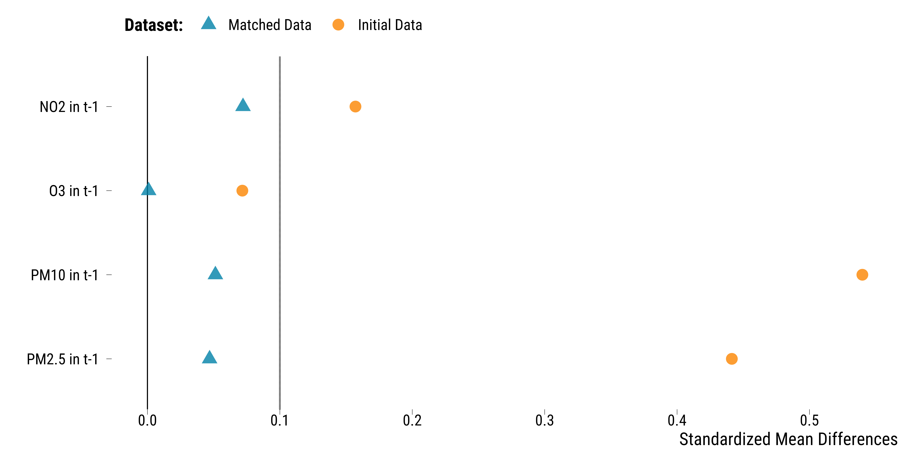
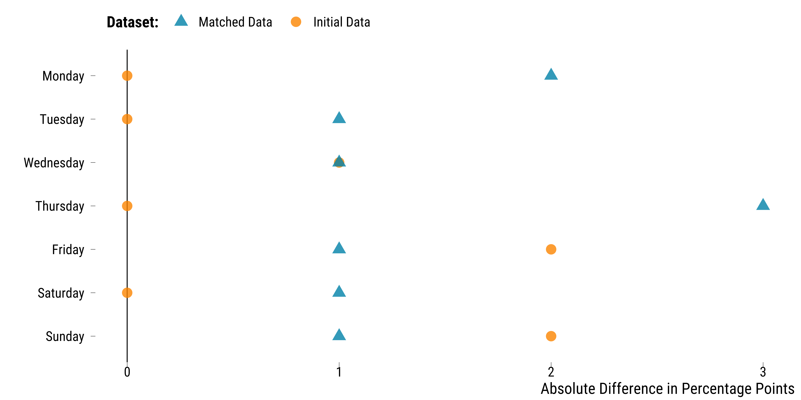
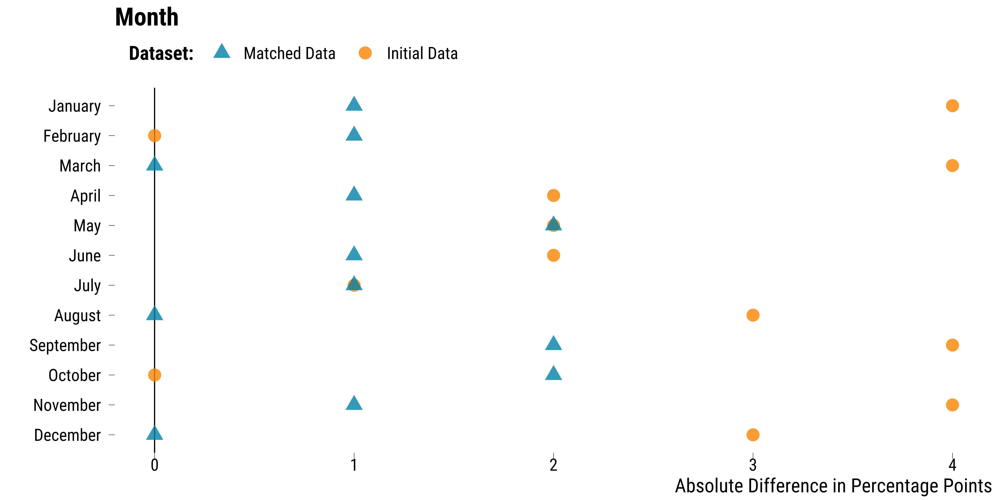
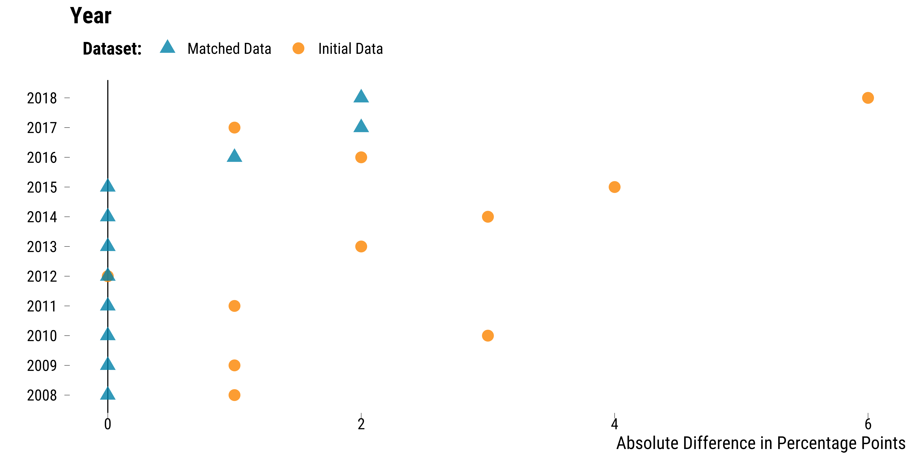
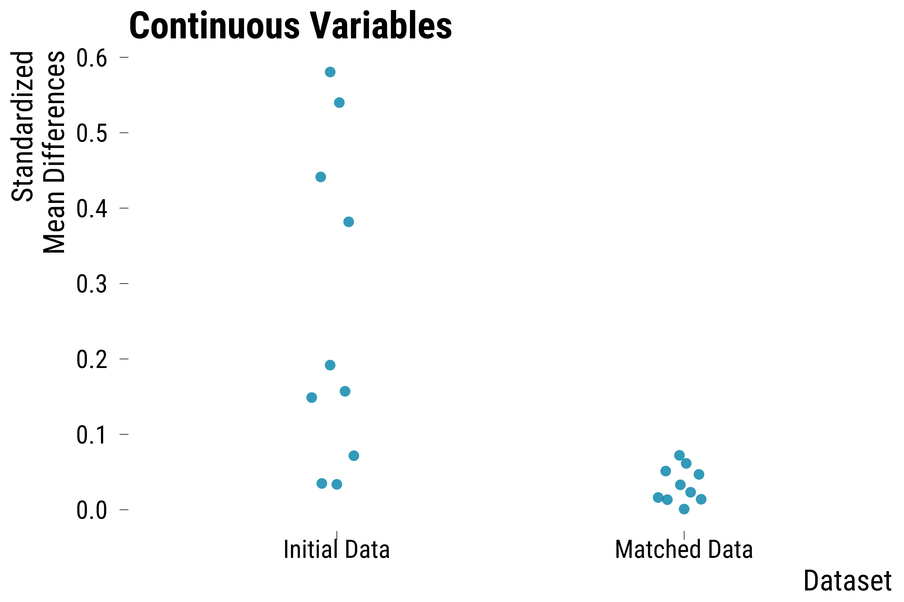
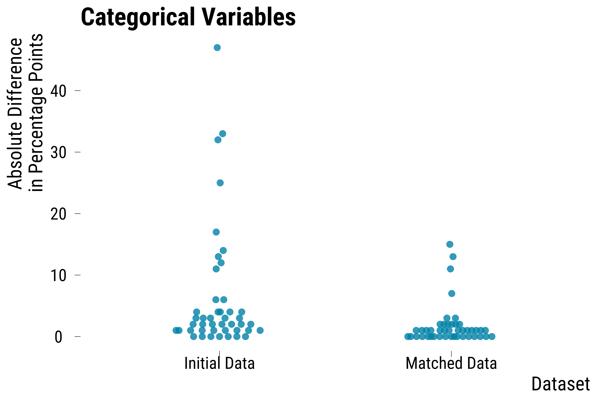

<style>
body {
text-align: justify}
</style>


In this document, we take great care providing all steps and R codes required to check whether our matching procedure allowed to improve covariates balance. We compare days where:

* treated units are days where winds blow from the North-East in *t*.
* control units are day winds blow from other directions in *t*.

We adjust for calendar indicators and weather confouding factors.

**Should you have any questions, need help to reproduce the analysis or find coding errors, please do not hesitate to contact me at leo.zabrocki@psemail.eu**

# Required Packages

To reproduce exactly the `4_script_checking_balance_improvement.html` document, we first need to have installed:

* the [R](https://www.r-project.org/) programming language 
* [RStudio](https://rstudio.com/), an integrated development environment for R, which will allow you to knit the `4_script_checking_balance_improvement.Rmd` file and interact with the R code chunks
* the [R Markdown](https://rmarkdown.rstudio.com/) package
* and the [Distill](https://rstudio.github.io/distill/) package which provides the template for this document. 

Once everything is set up, we have to load the following packages:

<div class="layout-chunk" data-layout="l-body-outset">
<div class="sourceCode"><pre class="sourceCode r"><code class="sourceCode r"><span class='co'># load required packages</span>
<span class='kw'><a href='https://rdrr.io/r/base/library.html'>library</a></span><span class='op'>(</span><span class='va'><a href='https://yihui.org/knitr/'>knitr</a></span><span class='op'>)</span> <span class='co'># for creating the R Markdown document</span>
<span class='kw'><a href='https://rdrr.io/r/base/library.html'>library</a></span><span class='op'>(</span><span class='va'><a href='https://here.r-lib.org/'>here</a></span><span class='op'>)</span> <span class='co'># for files paths organization</span>
<span class='kw'><a href='https://rdrr.io/r/base/library.html'>library</a></span><span class='op'>(</span><span class='va'><a href='https://tidyverse.tidyverse.org'>tidyverse</a></span><span class='op'>)</span> <span class='co'># for data manipulation and visualization</span>
<span class='kw'><a href='https://rdrr.io/r/base/library.html'>library</a></span><span class='op'>(</span><span class='va'><a href='https://wilkelab.org/ggridges/'>ggridges</a></span><span class='op'>)</span> <span class='co'># for ridge density plots</span>
<span class='kw'><a href='https://rdrr.io/r/base/library.html'>library</a></span><span class='op'>(</span><span class='va'><a href='http://www.rforge.net/Cairo/'>Cairo</a></span><span class='op'>)</span> <span class='co'># for printing custom police of graphs</span>
<span class='kw'><a href='https://rdrr.io/r/base/library.html'>library</a></span><span class='op'>(</span><span class='va'><a href='https://patchwork.data-imaginist.com'>patchwork</a></span><span class='op'>)</span> <span class='co'># combining plots</span>
</code></pre></div>

</div>


We finally load our custom `ggplot2` theme for graphs:

<div class="layout-chunk" data-layout="l-body-outset">
<div class="sourceCode"><pre class="sourceCode r"><code class="sourceCode r"><span class='co'># load ggplot custom theme</span>
<span class='kw'><a href='https://rdrr.io/r/base/source.html'>source</a></span><span class='op'>(</span><span class='fu'>here</span><span class='fu'>::</span><span class='fu'><a href='https://here.r-lib.org//reference/here.html'>here</a></span><span class='op'>(</span>
  <span class='st'>"2.scripts"</span>,
  <span class='st'>"4.custom_ggplot2_theme"</span>,
  <span class='st'>"script_theme_tufte.R"</span>
<span class='op'>)</span><span class='op'>)</span>
<span class='co'># define nice colors</span>
<span class='va'>my_blue</span> <span class='op'>&lt;-</span> <span class='st'>"#0081a7"</span>
<span class='va'>my_orange</span> <span class='op'>&lt;-</span> <span class='st'>"#fb8500"</span>
</code></pre></div>

</div>


# Preparing the Data

We load the initial and matched data and bind them together:

<div class="layout-chunk" data-layout="l-body-outset">
<div class="sourceCode"><pre class="sourceCode r"><code class="sourceCode r"><span class='co'># load matching data</span>
<span class='va'>data_matching</span> <span class='op'>&lt;-</span>
  <span class='fu'><a href='https://rdrr.io/r/base/readRDS.html'>readRDS</a></span><span class='op'>(</span><span class='fu'>here</span><span class='fu'>::</span><span class='fu'><a href='https://here.r-lib.org//reference/here.html'>here</a></span><span class='op'>(</span><span class='st'>"1.data"</span>, <span class='st'>"5.matched_data"</span>, <span class='st'>"matching_data.rds"</span><span class='op'>)</span><span class='op'>)</span> <span class='op'>%&gt;%</span>
  <span class='fu'>mutate</span><span class='op'>(</span>dataset <span class='op'>=</span> <span class='st'>"Initial Data"</span><span class='op'>)</span>

<span class='co'># load matched data</span>
<span class='va'>data_matched</span> <span class='op'>&lt;-</span>
  <span class='fu'><a href='https://rdrr.io/r/base/readRDS.html'>readRDS</a></span><span class='op'>(</span><span class='fu'>here</span><span class='fu'>::</span><span class='fu'><a href='https://here.r-lib.org//reference/here.html'>here</a></span><span class='op'>(</span><span class='st'>"1.data"</span>, <span class='st'>"5.matched_data"</span>, <span class='st'>"matched_data.rds"</span><span class='op'>)</span><span class='op'>)</span> <span class='op'>%&gt;%</span>
  <span class='fu'>mutate</span><span class='op'>(</span>dataset <span class='op'>=</span> <span class='st'>"Matched Data"</span><span class='op'>)</span>

<span class='co'># bind the two datasets</span>
<span class='va'>data</span> <span class='op'>&lt;-</span> <span class='fu'>bind_rows</span><span class='op'>(</span><span class='va'>data_matching</span>, <span class='va'>data_matched</span><span class='op'>)</span>
</code></pre></div>

</div>


We change labels of the `is_treated` variable :

<div class="layout-chunk" data-layout="l-body-outset">
<div class="sourceCode"><pre class="sourceCode r"><code class="sourceCode r"><span class='va'>data</span> <span class='op'>&lt;-</span> <span class='va'>data</span> <span class='op'>%&gt;%</span>
  <span class='fu'>mutate</span><span class='op'>(</span>is_treated <span class='op'>=</span> <span class='fu'><a href='https://rdrr.io/r/base/ifelse.html'>ifelse</a></span><span class='op'>(</span><span class='va'>is_treated</span> <span class='op'>==</span> <span class='st'>"TRUE"</span>, <span class='st'>"True"</span>, <span class='st'>"False"</span><span class='op'>)</span><span class='op'>)</span>
</code></pre></div>

</div>


# Love Plots

### Continuous Weather Covariates

<div class="layout-chunk" data-layout="l-body-outset">
<div class="sourceCode"><pre class="sourceCode r"><code class="sourceCode r"><span class='co'># compute figures for the love plot</span>
<span class='va'>data_weather_continuous</span> <span class='op'>&lt;-</span> <span class='va'>data</span> <span class='op'>%&gt;%</span>
  <span class='fu'>select</span><span class='op'>(</span>
    <span class='va'>dataset</span>,
    <span class='va'>is_treated</span>,
    <span class='fu'>contains</span><span class='op'>(</span><span class='st'>"temperature"</span><span class='op'>)</span>,
    <span class='fu'>contains</span><span class='op'>(</span><span class='st'>"humidity"</span><span class='op'>)</span>,
    <span class='fu'>contains</span><span class='op'>(</span><span class='st'>"wind_speed"</span><span class='op'>)</span>
  <span class='op'>)</span> <span class='op'>%&gt;%</span>
  <span class='fu'>pivot_longer</span><span class='op'>(</span>
    cols <span class='op'>=</span> <span class='op'>-</span><span class='fu'><a href='https://rdrr.io/r/base/c.html'>c</a></span><span class='op'>(</span><span class='va'>is_treated</span>, <span class='va'>dataset</span><span class='op'>)</span>,
    names_to <span class='op'>=</span> <span class='st'>"variable"</span>,
    values_to <span class='op'>=</span> <span class='st'>"values"</span>
  <span class='op'>)</span> <span class='op'>%&gt;%</span>
  <span class='fu'>mutate</span><span class='op'>(</span>
    weather_variable <span class='op'>=</span> <span class='cn'>NA</span> <span class='op'>%&gt;%</span>
      <span class='fu'><a href='https://rdrr.io/r/base/ifelse.html'>ifelse</a></span><span class='op'>(</span>
        <span class='fu'>str_detect</span><span class='op'>(</span><span class='va'>variable</span>, <span class='st'>"temperature_average"</span><span class='op'>)</span>,
        <span class='st'>"Average Temperature"</span>,
        <span class='va'>.</span>
      <span class='op'>)</span> <span class='op'>%&gt;%</span>
      <span class='fu'><a href='https://rdrr.io/r/base/ifelse.html'>ifelse</a></span><span class='op'>(</span>
        <span class='fu'>str_detect</span><span class='op'>(</span><span class='va'>variable</span>, <span class='st'>"humidity_average"</span><span class='op'>)</span>,
        <span class='st'>"Humidity Average"</span>,
        <span class='va'>.</span>
      <span class='op'>)</span> <span class='op'>%&gt;%</span>
      <span class='fu'><a href='https://rdrr.io/r/base/ifelse.html'>ifelse</a></span><span class='op'>(</span><span class='fu'>str_detect</span><span class='op'>(</span><span class='va'>variable</span>, <span class='st'>"wind_speed"</span><span class='op'>)</span>, <span class='st'>"Wind Speed"</span>, <span class='va'>.</span><span class='op'>)</span>
  <span class='op'>)</span> <span class='op'>%&gt;%</span>
  <span class='fu'>mutate</span><span class='op'>(</span>time <span class='op'>=</span> <span class='st'>"0"</span> <span class='op'>%&gt;%</span>
           <span class='fu'><a href='https://rdrr.io/r/base/ifelse.html'>ifelse</a></span><span class='op'>(</span><span class='fu'>str_detect</span><span class='op'>(</span><span class='va'>variable</span>, <span class='st'>"lag_1"</span><span class='op'>)</span>, <span class='st'>"-1"</span>, <span class='va'>.</span><span class='op'>)</span> <span class='op'>%&gt;%</span>
           <span class='fu'><a href='https://rdrr.io/r/base/ifelse.html'>ifelse</a></span><span class='op'>(</span><span class='fu'>str_detect</span><span class='op'>(</span><span class='va'>variable</span>, <span class='st'>"lead_1"</span><span class='op'>)</span>, <span class='st'>"+1"</span>, <span class='va'>.</span><span class='op'>)</span><span class='op'>)</span> <span class='op'>%&gt;%</span>
  <span class='fu'><a href='https://rdrr.io/r/stats/filter.html'>filter</a></span><span class='op'>(</span><span class='va'>time</span> <span class='op'>!=</span> <span class='st'>"+1"</span><span class='op'>)</span> <span class='op'>%&gt;%</span>
  <span class='fu'>mutate</span><span class='op'>(</span>time <span class='op'>=</span> <span class='fu'>fct_relevel</span><span class='op'>(</span><span class='va'>time</span>, <span class='st'>"-1"</span>, <span class='st'>"0"</span><span class='op'>)</span><span class='op'>)</span> <span class='op'>%&gt;%</span>
  <span class='fu'>select</span><span class='op'>(</span><span class='va'>dataset</span>, <span class='va'>is_treated</span>, <span class='va'>weather_variable</span>, <span class='va'>time</span>, <span class='va'>values</span><span class='op'>)</span>

<span class='va'>data_abs_difference_continuous_weather</span> <span class='op'>&lt;-</span>
  <span class='va'>data_weather_continuous</span> <span class='op'>%&gt;%</span>
  <span class='fu'>group_by</span><span class='op'>(</span><span class='va'>dataset</span>, <span class='va'>weather_variable</span>, <span class='va'>time</span>, <span class='va'>is_treated</span><span class='op'>)</span> <span class='op'>%&gt;%</span>
  <span class='fu'>summarise</span><span class='op'>(</span>mean_values <span class='op'>=</span> <span class='fu'><a href='https://rdrr.io/r/base/mean.html'>mean</a></span><span class='op'>(</span><span class='va'>values</span>, na.rm <span class='op'>=</span> <span class='cn'>TRUE</span><span class='op'>)</span><span class='op'>)</span> <span class='op'>%&gt;%</span>
  <span class='fu'>summarise</span><span class='op'>(</span>abs_difference <span class='op'>=</span> <span class='fu'><a href='https://rdrr.io/r/base/MathFun.html'>abs</a></span><span class='op'>(</span><span class='va'>mean_values</span><span class='op'>[</span><span class='fl'>2</span><span class='op'>]</span> <span class='op'>-</span> <span class='va'>mean_values</span><span class='op'>[</span><span class='fl'>1</span><span class='op'>]</span><span class='op'>)</span><span class='op'>)</span>

<span class='va'>data_sd_weather_continuous</span> <span class='op'>&lt;-</span>  <span class='va'>data_weather_continuous</span> <span class='op'>%&gt;%</span>
  <span class='fu'><a href='https://rdrr.io/r/stats/filter.html'>filter</a></span><span class='op'>(</span><span class='va'>dataset</span><span class='op'>==</span> <span class='st'>"Initial Data"</span> <span class='op'>&amp;</span> <span class='va'>is_treated</span> <span class='op'>==</span> <span class='st'>"True"</span><span class='op'>)</span> <span class='op'>%&gt;%</span>
  <span class='fu'>group_by</span><span class='op'>(</span><span class='va'>dataset</span>, <span class='va'>weather_variable</span>, <span class='va'>time</span>, <span class='va'>is_treated</span><span class='op'>)</span> <span class='op'>%&gt;%</span>
  <span class='fu'>summarise</span><span class='op'>(</span>sd_treatment <span class='op'>=</span> <span class='fu'><a href='https://rdrr.io/r/stats/sd.html'>sd</a></span><span class='op'>(</span><span class='va'>values</span>, na.rm <span class='op'>=</span> <span class='cn'>TRUE</span><span class='op'>)</span><span class='op'>)</span> <span class='op'>%&gt;%</span>
  <span class='fu'>ungroup</span><span class='op'>(</span><span class='op'>)</span> <span class='op'>%&gt;%</span>
  <span class='fu'>select</span><span class='op'>(</span><span class='va'>weather_variable</span>, <span class='va'>time</span>, <span class='va'>sd_treatment</span><span class='op'>)</span>

<span class='va'>data_love_continuous_weather</span> <span class='op'>&lt;-</span>
  <span class='fu'>left_join</span><span class='op'>(</span>
    <span class='va'>data_abs_difference_continuous_weather</span>,
    <span class='va'>data_sd_weather_continuous</span>,
    by <span class='op'>=</span> <span class='fu'><a href='https://rdrr.io/r/base/c.html'>c</a></span><span class='op'>(</span><span class='st'>"weather_variable"</span>, <span class='st'>"time"</span><span class='op'>)</span>
  <span class='op'>)</span> <span class='op'>%&gt;%</span>
  <span class='fu'>mutate</span><span class='op'>(</span>standardized_difference <span class='op'>=</span> <span class='va'>abs_difference</span> <span class='op'>/</span> <span class='va'>sd_treatment</span><span class='op'>)</span> <span class='op'>%&gt;%</span>
  <span class='fu'>select</span><span class='op'>(</span><span class='op'>-</span><span class='fu'><a href='https://rdrr.io/r/base/c.html'>c</a></span><span class='op'>(</span><span class='va'>abs_difference</span>, <span class='va'>sd_treatment</span><span class='op'>)</span><span class='op'>)</span>

<span class='co'># make the graph</span>
<span class='va'>graph_love_plot_continuous_weather</span> <span class='op'>&lt;-</span>
  <span class='fu'>ggplot</span><span class='op'>(</span>
    <span class='va'>data_love_continuous_weather</span>,
    <span class='fu'>aes</span><span class='op'>(</span>
      y <span class='op'>=</span> <span class='va'>time</span>,
      x <span class='op'>=</span> <span class='va'>standardized_difference</span>,
      colour <span class='op'>=</span> <span class='fu'>fct_rev</span><span class='op'>(</span><span class='va'>dataset</span><span class='op'>)</span>,
      shape <span class='op'>=</span> <span class='fu'>fct_rev</span><span class='op'>(</span><span class='va'>dataset</span><span class='op'>)</span>
    <span class='op'>)</span>
  <span class='op'>)</span> <span class='op'>+</span>
  <span class='fu'>geom_vline</span><span class='op'>(</span>xintercept <span class='op'>=</span> <span class='fl'>0</span>, size <span class='op'>=</span> <span class='fl'>0.3</span><span class='op'>)</span> <span class='op'>+</span>
  <span class='fu'>geom_vline</span><span class='op'>(</span>xintercept <span class='op'>=</span> <span class='fl'>0.1</span>,
             color <span class='op'>=</span> <span class='st'>"black"</span>,
             linetype <span class='op'>=</span> <span class='st'>"dashed"</span><span class='op'>)</span> <span class='op'>+</span>
  <span class='fu'>geom_point</span><span class='op'>(</span>size <span class='op'>=</span> <span class='fl'>4</span>, alpha <span class='op'>=</span> <span class='fl'>0.8</span><span class='op'>)</span> <span class='op'>+</span>
  <span class='fu'>scale_x_continuous</span><span class='op'>(</span>breaks <span class='op'>=</span> <span class='fu'>scales</span><span class='fu'>::</span><span class='fu'><a href='https://scales.r-lib.org/reference/breaks_pretty.html'>pretty_breaks</a></span><span class='op'>(</span>n <span class='op'>=</span> <span class='fl'>5</span><span class='op'>)</span><span class='op'>)</span> <span class='op'>+</span>
  <span class='fu'>scale_colour_manual</span><span class='op'>(</span>name <span class='op'>=</span> <span class='st'>"Dataset:"</span>, values <span class='op'>=</span> <span class='fu'><a href='https://rdrr.io/r/base/c.html'>c</a></span><span class='op'>(</span><span class='va'>my_blue</span>, <span class='va'>my_orange</span><span class='op'>)</span><span class='op'>)</span> <span class='op'>+</span>
  <span class='fu'>scale_shape_manual</span><span class='op'>(</span>name <span class='op'>=</span> <span class='st'>"Dataset:"</span>, values <span class='op'>=</span> <span class='fu'><a href='https://rdrr.io/r/base/c.html'>c</a></span><span class='op'>(</span><span class='fl'>17</span>, <span class='fl'>16</span><span class='op'>)</span><span class='op'>)</span> <span class='op'>+</span>
  <span class='fu'>facet_wrap</span><span class='op'>(</span> <span class='op'>~</span> <span class='va'>weather_variable</span>, scales <span class='op'>=</span> <span class='st'>"free_y"</span><span class='op'>)</span> <span class='op'>+</span>
  <span class='fu'>xlab</span><span class='op'>(</span><span class='st'>"Standardized Mean Differences"</span><span class='op'>)</span> <span class='op'>+</span>
  <span class='fu'>ylab</span><span class='op'>(</span><span class='st'>"Day"</span><span class='op'>)</span> <span class='op'>+</span>
  <span class='fu'>theme_tufte</span><span class='op'>(</span><span class='op'>)</span>

<span class='co'># plot the graph</span>
<span class='va'>graph_love_plot_continuous_weather</span>
</code></pre></div>
<!-- --><div class="sourceCode"><pre class="sourceCode r"><code class="sourceCode r"><span class='co'># save the graph</span>
<span class='fu'>ggsave</span><span class='op'>(</span>
  <span class='va'>graph_love_plot_continuous_weather</span>,
  filename <span class='op'>=</span> <span class='fu'>here</span><span class='fu'>::</span><span class='fu'><a href='https://here.r-lib.org//reference/here.html'>here</a></span><span class='op'>(</span>
    <span class='st'>"3.outputs"</span>,
    <span class='st'>"2.matching_analysis"</span>,
    <span class='st'>"graph_love_plot_continuous_weather.pdf"</span>
  <span class='op'>)</span>,
  width <span class='op'>=</span> <span class='fl'>30</span>,
  height <span class='op'>=</span> <span class='fl'>12</span>,
  units <span class='op'>=</span> <span class='st'>"cm"</span>,
  device <span class='op'>=</span> <span class='va'>cairo_pdf</span>
<span class='op'>)</span>
</code></pre></div>

</div>


### Categorical Weather Covariates

<div class="layout-chunk" data-layout="l-body-outset">
<div class="sourceCode"><pre class="sourceCode r"><code class="sourceCode r"><span class='co'># compute figures for the love plot</span>
<span class='va'>data_weather_categorical</span> <span class='op'>&lt;-</span> <span class='va'>data</span> <span class='op'>%&gt;%</span>
  <span class='fu'>select</span><span class='op'>(</span>
    <span class='va'>dataset</span>,
    <span class='va'>is_treated</span>,
    <span class='fu'>contains</span><span class='op'>(</span><span class='st'>"rainfall_duration"</span><span class='op'>)</span>,
    <span class='st'>"wind_direction_categories_lag_1"</span>
  <span class='op'>)</span> <span class='op'>%&gt;%</span>
  <span class='fu'>drop_na</span><span class='op'>(</span><span class='op'>)</span> <span class='op'>%&gt;%</span>
  <span class='fu'>mutate_all</span><span class='op'>(</span> <span class='op'>~</span> <span class='fu'><a href='https://rdrr.io/r/base/character.html'>as.character</a></span><span class='op'>(</span><span class='va'>.</span><span class='op'>)</span><span class='op'>)</span> <span class='op'>%&gt;%</span>
  <span class='fu'>pivot_longer</span><span class='op'>(</span>
    cols <span class='op'>=</span> <span class='op'>-</span><span class='fu'><a href='https://rdrr.io/r/base/c.html'>c</a></span><span class='op'>(</span><span class='va'>dataset</span>, <span class='va'>is_treated</span><span class='op'>)</span>,
    names_to <span class='op'>=</span> <span class='st'>"variable"</span>,
    values_to <span class='op'>=</span> <span class='st'>"values"</span>
  <span class='op'>)</span> <span class='op'>%&gt;%</span>
  <span class='co'># group by is_treated, variable and values</span>
  <span class='fu'>group_by</span><span class='op'>(</span><span class='va'>dataset</span>, <span class='va'>is_treated</span>, <span class='va'>variable</span>, <span class='va'>values</span><span class='op'>)</span> <span class='op'>%&gt;%</span>
  <span class='co'># compute the number of observations</span>
  <span class='fu'>summarise</span><span class='op'>(</span>n <span class='op'>=</span> <span class='fu'>n</span><span class='op'>(</span><span class='op'>)</span><span class='op'>)</span> <span class='op'>%&gt;%</span>
  <span class='co'># compute the proportion</span>
  <span class='fu'>mutate</span><span class='op'>(</span>freq <span class='op'>=</span> <span class='fu'><a href='https://rdrr.io/r/base/Round.html'>round</a></span><span class='op'>(</span><span class='va'>n</span> <span class='op'>/</span> <span class='fu'><a href='https://rdrr.io/r/base/sum.html'>sum</a></span><span class='op'>(</span><span class='va'>n</span><span class='op'>)</span> <span class='op'>*</span> <span class='fl'>100</span>, <span class='fl'>0</span><span class='op'>)</span><span class='op'>)</span> <span class='op'>%&gt;%</span>
  <span class='fu'>ungroup</span><span class='op'>(</span><span class='op'>)</span> <span class='op'>%&gt;%</span>
  <span class='fu'>mutate</span><span class='op'>(</span>
    weather_variable <span class='op'>=</span> <span class='cn'>NA</span> <span class='op'>%&gt;%</span>
      <span class='fu'><a href='https://rdrr.io/r/base/ifelse.html'>ifelse</a></span><span class='op'>(</span><span class='fu'>str_detect</span><span class='op'>(</span><span class='va'>variable</span>, <span class='st'>"wind"</span><span class='op'>)</span>, <span class='st'>"Wind Direction"</span>, <span class='va'>.</span><span class='op'>)</span> <span class='op'>%&gt;%</span>
      <span class='fu'><a href='https://rdrr.io/r/base/ifelse.html'>ifelse</a></span><span class='op'>(</span><span class='fu'>str_detect</span><span class='op'>(</span><span class='va'>variable</span>, <span class='st'>"rainfall"</span><span class='op'>)</span>, <span class='st'>"Rainfall Duration"</span>, <span class='va'>.</span><span class='op'>)</span>
  <span class='op'>)</span> <span class='op'>%&gt;%</span>
  <span class='fu'>mutate</span><span class='op'>(</span>time <span class='op'>=</span> <span class='st'>"t"</span> <span class='op'>%&gt;%</span>
           <span class='fu'><a href='https://rdrr.io/r/base/ifelse.html'>ifelse</a></span><span class='op'>(</span><span class='fu'>str_detect</span><span class='op'>(</span><span class='va'>variable</span>, <span class='st'>"lag_1"</span><span class='op'>)</span>, <span class='st'>"t-1"</span>, <span class='va'>.</span><span class='op'>)</span> <span class='op'>%&gt;%</span>
           <span class='fu'><a href='https://rdrr.io/r/base/ifelse.html'>ifelse</a></span><span class='op'>(</span><span class='fu'>str_detect</span><span class='op'>(</span><span class='va'>variable</span>, <span class='st'>"lead_1"</span><span class='op'>)</span>, <span class='st'>"t+1"</span>, <span class='va'>.</span><span class='op'>)</span><span class='op'>)</span> <span class='op'>%&gt;%</span>
  <span class='fu'><a href='https://rdrr.io/r/stats/filter.html'>filter</a></span><span class='op'>(</span><span class='va'>time</span> <span class='op'>!=</span> <span class='st'>"t+1"</span><span class='op'>)</span> <span class='op'>%&gt;%</span>
  <span class='fu'>mutate</span><span class='op'>(</span>variable <span class='op'>=</span> <span class='fu'><a href='https://rdrr.io/r/base/paste.html'>paste</a></span><span class='op'>(</span><span class='va'>weather_variable</span>, <span class='va'>time</span>, sep <span class='op'>=</span> <span class='st'>" "</span><span class='op'>)</span><span class='op'>)</span> <span class='op'>%&gt;%</span>
  <span class='fu'>select</span><span class='op'>(</span><span class='va'>dataset</span>, <span class='va'>is_treated</span>, <span class='va'>weather_variable</span>, <span class='va'>variable</span>, <span class='va'>values</span>, <span class='va'>freq</span><span class='op'>)</span> <span class='op'>%&gt;%</span>
  <span class='fu'>pivot_wider</span><span class='op'>(</span>names_from <span class='op'>=</span> <span class='va'>is_treated</span>, values_from <span class='op'>=</span> <span class='va'>freq</span><span class='op'>)</span> <span class='op'>%&gt;%</span>
  <span class='fu'>mutate</span><span class='op'>(</span>abs_difference <span class='op'>=</span> <span class='fu'><a href='https://rdrr.io/r/base/MathFun.html'>abs</a></span><span class='op'>(</span><span class='va'>`True`</span> <span class='op'>-</span> <span class='va'>`False`</span><span class='op'>)</span><span class='op'>)</span> <span class='op'>%&gt;%</span>
  <span class='fu'><a href='https://rdrr.io/r/stats/filter.html'>filter</a></span><span class='op'>(</span><span class='va'>weather_variable</span> <span class='op'>!=</span> <span class='st'>"Wind Direction t"</span><span class='op'>)</span>


<span class='co'># create the figure for wind direction</span>
<span class='va'>graph_love_plot_wind_direction</span> <span class='op'>&lt;-</span> <span class='va'>data_weather_categorical</span> <span class='op'>%&gt;%</span>
  <span class='fu'><a href='https://rdrr.io/r/stats/filter.html'>filter</a></span><span class='op'>(</span><span class='va'>weather_variable</span> <span class='op'>==</span> <span class='st'>"Wind Direction"</span><span class='op'>)</span> <span class='op'>%&gt;%</span>
  <span class='fu'>ggplot</span><span class='op'>(</span><span class='va'>.</span>,
         <span class='fu'>aes</span><span class='op'>(</span>
           y <span class='op'>=</span> <span class='fu'>fct_rev</span><span class='op'>(</span><span class='va'>values</span><span class='op'>)</span>,
           x <span class='op'>=</span> <span class='va'>abs_difference</span>,
           colour <span class='op'>=</span> <span class='fu'>fct_rev</span><span class='op'>(</span><span class='va'>dataset</span><span class='op'>)</span>,
           shape <span class='op'>=</span> <span class='fu'>fct_rev</span><span class='op'>(</span><span class='va'>dataset</span><span class='op'>)</span>
         <span class='op'>)</span><span class='op'>)</span> <span class='op'>+</span>
  <span class='fu'>geom_vline</span><span class='op'>(</span>xintercept <span class='op'>=</span> <span class='fl'>0</span>, size <span class='op'>=</span> <span class='fl'>0.3</span><span class='op'>)</span> <span class='op'>+</span>
  <span class='fu'>geom_point</span><span class='op'>(</span>size <span class='op'>=</span> <span class='fl'>4</span>, alpha <span class='op'>=</span> <span class='fl'>0.8</span><span class='op'>)</span> <span class='op'>+</span>
  <span class='fu'>scale_colour_manual</span><span class='op'>(</span>name <span class='op'>=</span> <span class='st'>"Dataset:"</span>, values <span class='op'>=</span> <span class='fu'><a href='https://rdrr.io/r/base/c.html'>c</a></span><span class='op'>(</span><span class='va'>my_blue</span>, <span class='va'>my_orange</span><span class='op'>)</span><span class='op'>)</span> <span class='op'>+</span>
  <span class='fu'>scale_shape_manual</span><span class='op'>(</span>name <span class='op'>=</span> <span class='st'>"Dataset:"</span>, values <span class='op'>=</span> <span class='fu'><a href='https://rdrr.io/r/base/c.html'>c</a></span><span class='op'>(</span><span class='fl'>17</span>, <span class='fl'>16</span><span class='op'>)</span><span class='op'>)</span> <span class='op'>+</span>
  <span class='fu'>facet_wrap</span><span class='op'>(</span> <span class='op'>~</span> <span class='va'>variable</span>, scales <span class='op'>=</span> <span class='st'>"free_y"</span>, ncol <span class='op'>=</span> <span class='fl'>3</span><span class='op'>)</span> <span class='op'>+</span>
  <span class='fu'>xlab</span><span class='op'>(</span><span class='st'>"Absolute Difference in Percentage Points"</span><span class='op'>)</span> <span class='op'>+</span>
  <span class='fu'>ylab</span><span class='op'>(</span><span class='st'>""</span><span class='op'>)</span> <span class='op'>+</span>
  <span class='fu'>theme_tufte</span><span class='op'>(</span><span class='op'>)</span> <span class='op'>+</span>
  <span class='fu'>theme</span><span class='op'>(</span>axis.text.x <span class='op'>=</span> <span class='fu'>element_text</span><span class='op'>(</span>margin <span class='op'>=</span> <span class='fu'>ggplot2</span><span class='fu'>::</span><span class='fu'><a href='https://ggplot2.tidyverse.org/reference/element.html'>margin</a></span><span class='op'>(</span>t <span class='op'>=</span> <span class='fl'>0</span>, unit <span class='op'>=</span> <span class='st'>"cm"</span><span class='op'>)</span><span class='op'>)</span><span class='op'>)</span>

<span class='co'># print the figure for wind direction</span>
<span class='va'>graph_love_plot_wind_direction</span>
</code></pre></div>
<!-- --><div class="sourceCode"><pre class="sourceCode r"><code class="sourceCode r"><span class='co'># save the figure for wind direction</span>
<span class='fu'>ggsave</span><span class='op'>(</span>
  <span class='va'>graph_love_plot_wind_direction</span>,
  filename <span class='op'>=</span> <span class='fu'>here</span><span class='fu'>::</span><span class='fu'><a href='https://here.r-lib.org//reference/here.html'>here</a></span><span class='op'>(</span>
    <span class='st'>"3.outputs"</span>,
    <span class='st'>"2.matching_analysis"</span>,
    <span class='st'>"graph_love_plot_wind_direction.pdf"</span>
  <span class='op'>)</span>,
  width <span class='op'>=</span> <span class='fl'>20</span>,
  height <span class='op'>=</span> <span class='fl'>10</span>,
  units <span class='op'>=</span> <span class='st'>"cm"</span>,
  device <span class='op'>=</span> <span class='va'>cairo_pdf</span>
<span class='op'>)</span>

<span class='co'># create the figure for rainfall dummy</span>
<span class='va'>graph_love_plot_rainfall</span> <span class='op'>&lt;-</span> <span class='va'>data_weather_categorical</span> <span class='op'>%&gt;%</span>
  <span class='fu'><a href='https://rdrr.io/r/stats/filter.html'>filter</a></span><span class='op'>(</span><span class='va'>weather_variable</span> <span class='op'>==</span> <span class='st'>"Rainfall Duration"</span><span class='op'>)</span> <span class='op'>%&gt;%</span>
  <span class='fu'>mutate</span><span class='op'>(</span>variable <span class='op'>=</span> <span class='fu'>fct_relevel</span><span class='op'>(</span><span class='va'>variable</span>, <span class='st'>"Rainfall Duration t-1"</span>, <span class='st'>"Rainfall Duration t"</span><span class='op'>)</span><span class='op'>)</span> <span class='op'>%&gt;%</span>
  <span class='fu'>ggplot</span><span class='op'>(</span><span class='va'>.</span>,
         <span class='fu'>aes</span><span class='op'>(</span>
           y <span class='op'>=</span> <span class='fu'>fct_rev</span><span class='op'>(</span><span class='va'>values</span><span class='op'>)</span>,
           x <span class='op'>=</span> <span class='va'>abs_difference</span>,
           colour <span class='op'>=</span> <span class='fu'>fct_rev</span><span class='op'>(</span><span class='va'>dataset</span><span class='op'>)</span>,
           shape <span class='op'>=</span> <span class='fu'>fct_rev</span><span class='op'>(</span><span class='va'>dataset</span><span class='op'>)</span>
         <span class='op'>)</span><span class='op'>)</span> <span class='op'>+</span>
  <span class='fu'>geom_vline</span><span class='op'>(</span>xintercept <span class='op'>=</span> <span class='fl'>0</span>, size <span class='op'>=</span> <span class='fl'>0.3</span><span class='op'>)</span> <span class='op'>+</span>
  <span class='fu'>geom_point</span><span class='op'>(</span>size <span class='op'>=</span> <span class='fl'>4</span>, alpha <span class='op'>=</span> <span class='fl'>0.8</span><span class='op'>)</span> <span class='op'>+</span>
  <span class='fu'>facet_wrap</span><span class='op'>(</span> <span class='op'>~</span> <span class='va'>variable</span><span class='op'>)</span> <span class='op'>+</span>
  <span class='fu'>scale_colour_manual</span><span class='op'>(</span>name <span class='op'>=</span> <span class='st'>"Dataset:"</span>, values <span class='op'>=</span> <span class='fu'><a href='https://rdrr.io/r/base/c.html'>c</a></span><span class='op'>(</span><span class='va'>my_blue</span>, <span class='va'>my_orange</span><span class='op'>)</span><span class='op'>)</span> <span class='op'>+</span>
  <span class='fu'>scale_shape_manual</span><span class='op'>(</span>name <span class='op'>=</span> <span class='st'>"Dataset:"</span>, values <span class='op'>=</span> <span class='fu'><a href='https://rdrr.io/r/base/c.html'>c</a></span><span class='op'>(</span><span class='fl'>17</span>, <span class='fl'>16</span><span class='op'>)</span><span class='op'>)</span> <span class='op'>+</span>
  <span class='fu'>xlab</span><span class='op'>(</span><span class='st'>"Absolute Difference in Percentage Points"</span><span class='op'>)</span> <span class='op'>+</span>
  <span class='fu'>ylab</span><span class='op'>(</span><span class='st'>""</span><span class='op'>)</span> <span class='op'>+</span>
  <span class='fu'>theme_tufte</span><span class='op'>(</span><span class='op'>)</span> <span class='op'>+</span>
  <span class='fu'>theme</span><span class='op'>(</span>axis.text.x <span class='op'>=</span> <span class='fu'>element_text</span><span class='op'>(</span>margin <span class='op'>=</span> <span class='fu'>ggplot2</span><span class='fu'>::</span><span class='fu'><a href='https://ggplot2.tidyverse.org/reference/element.html'>margin</a></span><span class='op'>(</span>t <span class='op'>=</span> <span class='fl'>0</span>, unit <span class='op'>=</span> <span class='st'>"cm"</span><span class='op'>)</span><span class='op'>)</span>,
        axis.text.y <span class='op'>=</span> <span class='fu'>element_text</span><span class='op'>(</span>hjust <span class='op'>=</span> <span class='fl'>1</span><span class='op'>)</span><span class='op'>)</span>

<span class='co'># print the figure for rainfall dummy</span>
<span class='va'>graph_love_plot_rainfall</span>
</code></pre></div>
<!-- --><div class="sourceCode"><pre class="sourceCode r"><code class="sourceCode r"><span class='co'># save the figure for rainfall dummy</span>
<span class='fu'>ggsave</span><span class='op'>(</span>
  <span class='va'>graph_love_plot_rainfall</span>,
  filename <span class='op'>=</span> <span class='fu'>here</span><span class='fu'>::</span><span class='fu'><a href='https://here.r-lib.org//reference/here.html'>here</a></span><span class='op'>(</span>
    <span class='st'>"3.outputs"</span>,
    <span class='st'>"2.matching_analysis"</span>,
    <span class='st'>"graph_love_plot_rainfall.pdf"</span>
  <span class='op'>)</span>,
  width <span class='op'>=</span> <span class='fl'>20</span>,
  height <span class='op'>=</span> <span class='fl'>10</span>,
  units <span class='op'>=</span> <span class='st'>"cm"</span>,
  device <span class='op'>=</span> <span class='va'>cairo_pdf</span>
<span class='op'>)</span>
</code></pre></div>

</div>


### Pollutants

<div class="layout-chunk" data-layout="l-body-outset">
<div class="sourceCode"><pre class="sourceCode r"><code class="sourceCode r"><span class='co'># compute figures for the love plot</span>
<span class='va'>data_pollutants</span> <span class='op'>&lt;-</span> <span class='va'>data</span> <span class='op'>%&gt;%</span>
  <span class='fu'>select</span><span class='op'>(</span>
    <span class='va'>dataset</span>,
    <span class='va'>is_treated</span>,
    <span class='va'>mean_no2_lag_1</span>,
    <span class='va'>mean_o3_lag_1</span>,
    <span class='va'>mean_pm10_lag_1</span>,
    <span class='va'>mean_pm25_lag_1</span>
  <span class='op'>)</span> <span class='op'>%&gt;%</span>
  <span class='fu'>pivot_longer</span><span class='op'>(</span>
    cols <span class='op'>=</span> <span class='op'>-</span><span class='fu'><a href='https://rdrr.io/r/base/c.html'>c</a></span><span class='op'>(</span><span class='va'>dataset</span>, <span class='va'>is_treated</span><span class='op'>)</span>,
    names_to <span class='op'>=</span> <span class='st'>"variable"</span>,
    values_to <span class='op'>=</span> <span class='st'>"values"</span>
  <span class='op'>)</span> <span class='op'>%&gt;%</span>
  <span class='fu'>mutate</span><span class='op'>(</span>
    pollutant <span class='op'>=</span> <span class='cn'>NA</span> <span class='op'>%&gt;%</span>
      <span class='fu'><a href='https://rdrr.io/r/base/ifelse.html'>ifelse</a></span><span class='op'>(</span><span class='fu'>str_detect</span><span class='op'>(</span><span class='va'>variable</span>, <span class='st'>"no2"</span><span class='op'>)</span>, <span class='st'>"NO2 in t-1"</span>, <span class='va'>.</span><span class='op'>)</span> <span class='op'>%&gt;%</span>
      <span class='fu'><a href='https://rdrr.io/r/base/ifelse.html'>ifelse</a></span><span class='op'>(</span><span class='fu'>str_detect</span><span class='op'>(</span><span class='va'>variable</span>, <span class='st'>"o3"</span><span class='op'>)</span>, <span class='st'>"O3 in t-1"</span>, <span class='va'>.</span><span class='op'>)</span> <span class='op'>%&gt;%</span>
      <span class='fu'><a href='https://rdrr.io/r/base/ifelse.html'>ifelse</a></span><span class='op'>(</span><span class='fu'>str_detect</span><span class='op'>(</span><span class='va'>variable</span>, <span class='st'>"pm10"</span><span class='op'>)</span>, <span class='st'>"PM10 in t-1"</span>, <span class='va'>.</span><span class='op'>)</span> <span class='op'>%&gt;%</span>
      <span class='fu'><a href='https://rdrr.io/r/base/ifelse.html'>ifelse</a></span><span class='op'>(</span><span class='fu'>str_detect</span><span class='op'>(</span><span class='va'>variable</span>, <span class='st'>"pm25"</span><span class='op'>)</span>, <span class='st'>"PM2.5 in t-1"</span>, <span class='va'>.</span><span class='op'>)</span>
  <span class='op'>)</span> <span class='op'>%&gt;%</span>
  <span class='fu'>select</span><span class='op'>(</span><span class='va'>dataset</span>, <span class='va'>is_treated</span>, <span class='va'>pollutant</span>, <span class='va'>values</span><span class='op'>)</span>

<span class='va'>data_abs_difference_pollutants</span> <span class='op'>&lt;-</span> <span class='va'>data_pollutants</span> <span class='op'>%&gt;%</span>
  <span class='fu'>group_by</span><span class='op'>(</span><span class='va'>dataset</span>, <span class='va'>pollutant</span>, <span class='va'>is_treated</span><span class='op'>)</span> <span class='op'>%&gt;%</span>
  <span class='fu'>summarise</span><span class='op'>(</span>mean_values <span class='op'>=</span> <span class='fu'><a href='https://rdrr.io/r/base/mean.html'>mean</a></span><span class='op'>(</span><span class='va'>values</span>, na.rm <span class='op'>=</span> <span class='cn'>TRUE</span><span class='op'>)</span><span class='op'>)</span> <span class='op'>%&gt;%</span>
  <span class='fu'>summarise</span><span class='op'>(</span>abs_difference <span class='op'>=</span> <span class='fu'><a href='https://rdrr.io/r/base/MathFun.html'>abs</a></span><span class='op'>(</span><span class='va'>mean_values</span><span class='op'>[</span><span class='fl'>2</span><span class='op'>]</span> <span class='op'>-</span> <span class='va'>mean_values</span><span class='op'>[</span><span class='fl'>1</span><span class='op'>]</span><span class='op'>)</span><span class='op'>)</span>

<span class='va'>data_sd_pollutants</span> <span class='op'>&lt;-</span>  <span class='va'>data_pollutants</span> <span class='op'>%&gt;%</span>
  <span class='fu'><a href='https://rdrr.io/r/stats/filter.html'>filter</a></span><span class='op'>(</span><span class='va'>dataset</span><span class='op'>==</span> <span class='st'>"Initial Data"</span> <span class='op'>&amp;</span> <span class='va'>is_treated</span> <span class='op'>==</span> <span class='st'>"True"</span><span class='op'>)</span> <span class='op'>%&gt;%</span>
  <span class='fu'>group_by</span><span class='op'>(</span><span class='va'>pollutant</span>, <span class='va'>is_treated</span><span class='op'>)</span> <span class='op'>%&gt;%</span>
  <span class='fu'>summarise</span><span class='op'>(</span>sd_treatment <span class='op'>=</span> <span class='fu'><a href='https://rdrr.io/r/stats/sd.html'>sd</a></span><span class='op'>(</span><span class='va'>values</span>, na.rm <span class='op'>=</span> <span class='cn'>TRUE</span><span class='op'>)</span><span class='op'>)</span> <span class='op'>%&gt;%</span>
  <span class='fu'>ungroup</span><span class='op'>(</span><span class='op'>)</span> <span class='op'>%&gt;%</span>
  <span class='fu'>select</span><span class='op'>(</span><span class='va'>pollutant</span>, <span class='va'>sd_treatment</span><span class='op'>)</span>

<span class='va'>data_love_pollutants</span> <span class='op'>&lt;-</span>
  <span class='fu'>left_join</span><span class='op'>(</span><span class='va'>data_abs_difference_pollutants</span>,
            <span class='va'>data_sd_pollutants</span>,
            by <span class='op'>=</span> <span class='fu'><a href='https://rdrr.io/r/base/c.html'>c</a></span><span class='op'>(</span><span class='st'>"pollutant"</span><span class='op'>)</span><span class='op'>)</span> <span class='op'>%&gt;%</span>
  <span class='fu'>mutate</span><span class='op'>(</span>standardized_difference <span class='op'>=</span> <span class='va'>abs_difference</span> <span class='op'>/</span> <span class='va'>sd_treatment</span><span class='op'>)</span> <span class='op'>%&gt;%</span>
  <span class='fu'>select</span><span class='op'>(</span><span class='op'>-</span><span class='fu'><a href='https://rdrr.io/r/base/c.html'>c</a></span><span class='op'>(</span><span class='va'>abs_difference</span>, <span class='va'>sd_treatment</span><span class='op'>)</span><span class='op'>)</span>

<span class='co'># create the graph</span>
<span class='va'>graph_love_plot_pollutants</span> <span class='op'>&lt;-</span>
  <span class='fu'>ggplot</span><span class='op'>(</span>
    <span class='va'>data_love_pollutants</span>,
    <span class='fu'>aes</span><span class='op'>(</span>
      y <span class='op'>=</span> <span class='fu'>fct_rev</span><span class='op'>(</span><span class='va'>pollutant</span><span class='op'>)</span>,
      x <span class='op'>=</span> <span class='va'>standardized_difference</span>,
      colour <span class='op'>=</span> <span class='fu'>fct_rev</span><span class='op'>(</span><span class='va'>dataset</span><span class='op'>)</span>,
      shape <span class='op'>=</span> <span class='fu'>fct_rev</span><span class='op'>(</span><span class='va'>dataset</span><span class='op'>)</span>
    <span class='op'>)</span>
  <span class='op'>)</span> <span class='op'>+</span>
  <span class='fu'>geom_vline</span><span class='op'>(</span>xintercept <span class='op'>=</span> <span class='fl'>0</span>, size <span class='op'>=</span> <span class='fl'>0.3</span><span class='op'>)</span> <span class='op'>+</span>
  <span class='fu'>geom_vline</span><span class='op'>(</span>xintercept <span class='op'>=</span> <span class='fl'>0.1</span>,
             color <span class='op'>=</span> <span class='st'>"black"</span>,
             linetype <span class='op'>=</span> <span class='st'>"dashed"</span><span class='op'>)</span> <span class='op'>+</span>
  <span class='fu'>geom_point</span><span class='op'>(</span>size <span class='op'>=</span> <span class='fl'>4</span>, alpha <span class='op'>=</span> <span class='fl'>0.8</span><span class='op'>)</span> <span class='op'>+</span>
  <span class='fu'>scale_x_continuous</span><span class='op'>(</span>breaks <span class='op'>=</span> <span class='fu'>scales</span><span class='fu'>::</span><span class='fu'><a href='https://scales.r-lib.org/reference/breaks_pretty.html'>pretty_breaks</a></span><span class='op'>(</span>n <span class='op'>=</span> <span class='fl'>5</span><span class='op'>)</span><span class='op'>)</span> <span class='op'>+</span>
  <span class='fu'>scale_colour_manual</span><span class='op'>(</span>name <span class='op'>=</span> <span class='st'>"Dataset:"</span>, values <span class='op'>=</span> <span class='fu'><a href='https://rdrr.io/r/base/c.html'>c</a></span><span class='op'>(</span><span class='va'>my_blue</span>, <span class='va'>my_orange</span><span class='op'>)</span><span class='op'>)</span> <span class='op'>+</span>
  <span class='fu'>scale_shape_manual</span><span class='op'>(</span>name <span class='op'>=</span> <span class='st'>"Dataset:"</span>, values <span class='op'>=</span> <span class='fu'><a href='https://rdrr.io/r/base/c.html'>c</a></span><span class='op'>(</span><span class='fl'>17</span>, <span class='fl'>16</span><span class='op'>)</span><span class='op'>)</span> <span class='op'>+</span>
  <span class='fu'>xlab</span><span class='op'>(</span><span class='st'>"Standardized Mean Differences"</span><span class='op'>)</span> <span class='op'>+</span>
  <span class='fu'>ylab</span><span class='op'>(</span><span class='st'>""</span><span class='op'>)</span> <span class='op'>+</span>
  <span class='fu'>theme_tufte</span><span class='op'>(</span><span class='op'>)</span> <span class='op'>+</span>
  <span class='fu'>theme</span><span class='op'>(</span>axis.text.x <span class='op'>=</span> <span class='fu'>element_text</span><span class='op'>(</span>margin <span class='op'>=</span> <span class='fu'>ggplot2</span><span class='fu'>::</span><span class='fu'><a href='https://ggplot2.tidyverse.org/reference/element.html'>margin</a></span><span class='op'>(</span>t <span class='op'>=</span> <span class='fl'>0</span>, unit <span class='op'>=</span> <span class='st'>"cm"</span><span class='op'>)</span><span class='op'>)</span>,
        axis.text.y <span class='op'>=</span> <span class='fu'>element_text</span><span class='op'>(</span>hjust <span class='op'>=</span> <span class='fl'>1</span><span class='op'>)</span><span class='op'>)</span>

<span class='co'># print the graph</span>
<span class='va'>graph_love_plot_pollutants</span>
</code></pre></div>
<!-- --><div class="sourceCode"><pre class="sourceCode r"><code class="sourceCode r"><span class='co'># save the graph</span>
<span class='fu'>ggsave</span><span class='op'>(</span>
  <span class='va'>graph_love_plot_pollutants</span>,
  filename <span class='op'>=</span> <span class='fu'>here</span><span class='fu'>::</span><span class='fu'><a href='https://here.r-lib.org//reference/here.html'>here</a></span><span class='op'>(</span>
    <span class='st'>"3.outputs"</span>,
    <span class='st'>"2.matching_analysis"</span>,
    <span class='st'>"graph_love_plot_pollutants.pdf"</span>
  <span class='op'>)</span>,
  width <span class='op'>=</span> <span class='fl'>20</span>,
  height <span class='op'>=</span> <span class='fl'>10</span>,
  units <span class='op'>=</span> <span class='st'>"cm"</span>,
  device <span class='op'>=</span> <span class='va'>cairo_pdf</span>
<span class='op'>)</span>
</code></pre></div>

</div>


### Calendar Indicators

Create the relevant data:

<div class="layout-chunk" data-layout="l-body-outset">
<div class="sourceCode"><pre class="sourceCode r"><code class="sourceCode r"><span class='co'># compute figures for the love plot</span>
<span class='va'>data_calendar</span> <span class='op'>&lt;-</span> <span class='va'>data</span> <span class='op'>%&gt;%</span>
  <span class='fu'>mutate</span><span class='op'>(</span>weekday <span class='op'>=</span> <span class='fu'>lubridate</span><span class='fu'>::</span><span class='fu'><a href='https://lubridate.tidyverse.org/reference/day.html'>wday</a></span><span class='op'>(</span><span class='va'>date</span>, abbr <span class='op'>=</span> <span class='cn'>FALSE</span>, label <span class='op'>=</span> <span class='cn'>TRUE</span><span class='op'>)</span><span class='op'>)</span> <span class='op'>%&gt;%</span>
  <span class='fu'>select</span><span class='op'>(</span><span class='va'>dataset</span>,
         <span class='va'>is_treated</span>,
         <span class='va'>weekday</span>,
         <span class='va'>holidays_dummy</span>,
         <span class='va'>bank_day_dummy</span>,
         <span class='va'>month</span>,
         <span class='va'>year</span><span class='op'>)</span> <span class='op'>%&gt;%</span>
  <span class='fu'>mutate_at</span><span class='op'>(</span><span class='fu'>vars</span><span class='op'>(</span><span class='va'>holidays_dummy</span>, <span class='va'>bank_day_dummy</span><span class='op'>)</span>,
            <span class='op'>~</span> <span class='fu'><a href='https://rdrr.io/r/base/ifelse.html'>ifelse</a></span><span class='op'>(</span><span class='va'>.</span> <span class='op'>==</span> <span class='fl'>1</span>, <span class='st'>"True"</span>, <span class='st'>"False"</span><span class='op'>)</span><span class='op'>)</span> <span class='op'>%&gt;%</span>
  <span class='fu'>mutate_all</span><span class='op'>(</span> <span class='op'>~</span> <span class='fu'><a href='https://rdrr.io/r/base/character.html'>as.character</a></span><span class='op'>(</span><span class='va'>.</span><span class='op'>)</span><span class='op'>)</span> <span class='op'>%&gt;%</span>
  <span class='fu'>pivot_longer</span><span class='op'>(</span>
    cols <span class='op'>=</span> <span class='op'>-</span><span class='fu'><a href='https://rdrr.io/r/base/c.html'>c</a></span><span class='op'>(</span><span class='va'>dataset</span>, <span class='va'>is_treated</span><span class='op'>)</span>,
    names_to <span class='op'>=</span> <span class='st'>"variable"</span>,
    values_to <span class='op'>=</span> <span class='st'>"values"</span>
  <span class='op'>)</span> <span class='op'>%&gt;%</span>
  <span class='co'># group by is_treated, variable and values</span>
  <span class='fu'>group_by</span><span class='op'>(</span><span class='va'>dataset</span>, <span class='va'>is_treated</span>, <span class='va'>variable</span>, <span class='va'>values</span><span class='op'>)</span> <span class='op'>%&gt;%</span>
  <span class='co'># compute the number of observations</span>
  <span class='fu'>summarise</span><span class='op'>(</span>n <span class='op'>=</span> <span class='fu'>n</span><span class='op'>(</span><span class='op'>)</span><span class='op'>)</span> <span class='op'>%&gt;%</span>
  <span class='co'># compute the proportion</span>
  <span class='fu'>mutate</span><span class='op'>(</span>freq <span class='op'>=</span> <span class='fu'><a href='https://rdrr.io/r/base/Round.html'>round</a></span><span class='op'>(</span><span class='va'>n</span> <span class='op'>/</span> <span class='fu'><a href='https://rdrr.io/r/base/sum.html'>sum</a></span><span class='op'>(</span><span class='va'>n</span><span class='op'>)</span> <span class='op'>*</span> <span class='fl'>100</span>, <span class='fl'>0</span><span class='op'>)</span><span class='op'>)</span> <span class='op'>%&gt;%</span>
  <span class='fu'>ungroup</span><span class='op'>(</span><span class='op'>)</span> <span class='op'>%&gt;%</span>
  <span class='fu'>mutate</span><span class='op'>(</span>
    calendar_variable <span class='op'>=</span> <span class='cn'>NA</span> <span class='op'>%&gt;%</span>
      <span class='fu'><a href='https://rdrr.io/r/base/ifelse.html'>ifelse</a></span><span class='op'>(</span><span class='fu'>str_detect</span><span class='op'>(</span><span class='va'>variable</span>, <span class='st'>"weekday"</span><span class='op'>)</span>, <span class='st'>"Day of the Week"</span>, <span class='va'>.</span><span class='op'>)</span> <span class='op'>%&gt;%</span>
      <span class='fu'><a href='https://rdrr.io/r/base/ifelse.html'>ifelse</a></span><span class='op'>(</span><span class='fu'>str_detect</span><span class='op'>(</span><span class='va'>variable</span>, <span class='st'>"holidays_dummy"</span><span class='op'>)</span>, <span class='st'>"Holidays"</span>, <span class='va'>.</span><span class='op'>)</span> <span class='op'>%&gt;%</span>
      <span class='fu'><a href='https://rdrr.io/r/base/ifelse.html'>ifelse</a></span><span class='op'>(</span><span class='fu'>str_detect</span><span class='op'>(</span><span class='va'>variable</span>, <span class='st'>"bank_day_dummy"</span><span class='op'>)</span>, <span class='st'>"Bank Day"</span>, <span class='va'>.</span><span class='op'>)</span> <span class='op'>%&gt;%</span>
      <span class='fu'><a href='https://rdrr.io/r/base/ifelse.html'>ifelse</a></span><span class='op'>(</span><span class='fu'>str_detect</span><span class='op'>(</span><span class='va'>variable</span>, <span class='st'>"month"</span><span class='op'>)</span>, <span class='st'>"Month"</span>, <span class='va'>.</span><span class='op'>)</span> <span class='op'>%&gt;%</span>
      <span class='fu'><a href='https://rdrr.io/r/base/ifelse.html'>ifelse</a></span><span class='op'>(</span><span class='fu'>str_detect</span><span class='op'>(</span><span class='va'>variable</span>, <span class='st'>"year"</span><span class='op'>)</span>, <span class='st'>"Year"</span>, <span class='va'>.</span><span class='op'>)</span>
  <span class='op'>)</span> <span class='op'>%&gt;%</span>
  <span class='fu'>select</span><span class='op'>(</span><span class='va'>dataset</span>, <span class='va'>is_treated</span>, <span class='va'>calendar_variable</span>, <span class='va'>values</span>, <span class='va'>freq</span><span class='op'>)</span> <span class='op'>%&gt;%</span>
  <span class='fu'>pivot_wider</span><span class='op'>(</span>names_from <span class='op'>=</span> <span class='va'>is_treated</span>, values_from <span class='op'>=</span> <span class='va'>freq</span><span class='op'>)</span> <span class='op'>%&gt;%</span>
  <span class='fu'>mutate</span><span class='op'>(</span>abs_difference <span class='op'>=</span> <span class='fu'><a href='https://rdrr.io/r/base/MathFun.html'>abs</a></span><span class='op'>(</span><span class='va'>`True`</span> <span class='op'>-</span> <span class='va'>`False`</span><span class='op'>)</span><span class='op'>)</span> <span class='op'>%&gt;%</span>
  <span class='fu'><a href='https://rdrr.io/r/stats/filter.html'>filter</a></span><span class='op'>(</span><span class='va'>values</span> <span class='op'>!=</span> <span class='st'>"False"</span><span class='op'>)</span>
</code></pre></div>

</div>


Plot for bank days and holidays:

<div class="layout-chunk" data-layout="l-body-outset">
<div class="sourceCode"><pre class="sourceCode r"><code class="sourceCode r"><span class='co'># graph for bank days and holidays</span>
<span class='va'>graph_love_plot_bank_holidays</span> <span class='op'>&lt;-</span> <span class='va'>data_calendar</span> <span class='op'>%&gt;%</span>
  <span class='fu'><a href='https://rdrr.io/r/stats/filter.html'>filter</a></span><span class='op'>(</span><span class='va'>calendar_variable</span> <span class='op'>%in%</span> <span class='fu'><a href='https://rdrr.io/r/base/c.html'>c</a></span><span class='op'>(</span><span class='st'>"Bank Day"</span>, <span class='st'>"Holidays"</span><span class='op'>)</span><span class='op'>)</span> <span class='op'>%&gt;%</span>
  <span class='fu'>ggplot</span><span class='op'>(</span><span class='va'>.</span>,
         <span class='fu'>aes</span><span class='op'>(</span>
           y <span class='op'>=</span> <span class='va'>values</span>,
           x <span class='op'>=</span> <span class='va'>abs_difference</span>,
           colour <span class='op'>=</span> <span class='fu'>fct_rev</span><span class='op'>(</span><span class='va'>dataset</span><span class='op'>)</span>,
           shape <span class='op'>=</span> <span class='fu'>fct_rev</span><span class='op'>(</span><span class='va'>dataset</span><span class='op'>)</span>
         <span class='op'>)</span><span class='op'>)</span> <span class='op'>+</span>
  <span class='fu'>geom_vline</span><span class='op'>(</span>xintercept <span class='op'>=</span> <span class='fl'>0</span>, size <span class='op'>=</span> <span class='fl'>0.3</span><span class='op'>)</span> <span class='op'>+</span>
  <span class='fu'>geom_point</span><span class='op'>(</span>size <span class='op'>=</span> <span class='fl'>4</span>, alpha <span class='op'>=</span> <span class='fl'>0.8</span><span class='op'>)</span> <span class='op'>+</span>
  <span class='fu'>scale_colour_manual</span><span class='op'>(</span>name <span class='op'>=</span> <span class='st'>"Dataset:"</span>, values <span class='op'>=</span> <span class='fu'><a href='https://rdrr.io/r/base/c.html'>c</a></span><span class='op'>(</span><span class='va'>my_blue</span>, <span class='va'>my_orange</span><span class='op'>)</span><span class='op'>)</span> <span class='op'>+</span>
  <span class='fu'>scale_shape_manual</span><span class='op'>(</span>name <span class='op'>=</span> <span class='st'>"Dataset:"</span>, values <span class='op'>=</span> <span class='fu'><a href='https://rdrr.io/r/base/c.html'>c</a></span><span class='op'>(</span><span class='fl'>17</span>, <span class='fl'>16</span><span class='op'>)</span><span class='op'>)</span> <span class='op'>+</span>
  <span class='fu'>facet_wrap</span><span class='op'>(</span><span class='op'>~</span> <span class='va'>calendar_variable</span><span class='op'>)</span> <span class='op'>+</span>
  <span class='fu'>xlab</span><span class='op'>(</span><span class='st'>"Absolute Difference in Percentage Points"</span><span class='op'>)</span> <span class='op'>+</span>
  <span class='fu'>ylab</span><span class='op'>(</span><span class='st'>""</span><span class='op'>)</span> <span class='op'>+</span>
  <span class='fu'>theme_tufte</span><span class='op'>(</span><span class='op'>)</span> <span class='op'>+</span>
  <span class='fu'>theme</span><span class='op'>(</span>axis.text.x <span class='op'>=</span> <span class='fu'>element_text</span><span class='op'>(</span>margin <span class='op'>=</span> <span class='fu'>ggplot2</span><span class='fu'>::</span><span class='fu'><a href='https://ggplot2.tidyverse.org/reference/element.html'>margin</a></span><span class='op'>(</span>t <span class='op'>=</span> <span class='fl'>0</span>, unit <span class='op'>=</span> <span class='st'>"cm"</span><span class='op'>)</span><span class='op'>)</span><span class='op'>)</span>

<span class='co'># print the plot</span>
<span class='va'>graph_love_plot_bank_holidays</span>
</code></pre></div>
<!-- --><div class="sourceCode"><pre class="sourceCode r"><code class="sourceCode r"><span class='co'># save the plot</span>
<span class='fu'>ggsave</span><span class='op'>(</span>
  <span class='va'>graph_love_plot_bank_holidays</span>,
  filename <span class='op'>=</span> <span class='fu'>here</span><span class='fu'>::</span><span class='fu'><a href='https://here.r-lib.org//reference/here.html'>here</a></span><span class='op'>(</span>
    <span class='st'>"3.outputs"</span>,
    <span class='st'>"2.matching_analysis"</span>,
    <span class='st'>"graph_love_plot_bank_holidays.pdf"</span>
  <span class='op'>)</span>,
  width <span class='op'>=</span> <span class='fl'>16</span>,
  height <span class='op'>=</span> <span class='fl'>8</span>,
  units <span class='op'>=</span> <span class='st'>"cm"</span>,
  device <span class='op'>=</span> <span class='va'>cairo_pdf</span>
<span class='op'>)</span>
</code></pre></div>

</div>


Plot for days of the week:

<div class="layout-chunk" data-layout="l-body-outset">
<div class="sourceCode"><pre class="sourceCode r"><code class="sourceCode r"><span class='co'># graph for weekdays</span>
<span class='va'>graph_love_plot_weekday</span> <span class='op'>&lt;-</span> <span class='va'>data_calendar</span> <span class='op'>%&gt;%</span>
  <span class='fu'><a href='https://rdrr.io/r/stats/filter.html'>filter</a></span><span class='op'>(</span><span class='va'>calendar_variable</span> <span class='op'>==</span> <span class='st'>"Day of the Week"</span><span class='op'>)</span> <span class='op'>%&gt;%</span>
  <span class='fu'>mutate</span><span class='op'>(</span>
    values <span class='op'>=</span> <span class='fu'>fct_relevel</span><span class='op'>(</span>
      <span class='va'>values</span>,
      <span class='st'>"Monday"</span>,
      <span class='st'>"Tuesday"</span>,
      <span class='st'>"Wednesday"</span>,
      <span class='st'>"Thursday"</span>,
      <span class='st'>"Friday"</span>,
      <span class='st'>"Saturday"</span>,
      <span class='st'>"Sunday"</span>
    <span class='op'>)</span>
  <span class='op'>)</span> <span class='op'>%&gt;%</span>
  <span class='fu'>ggplot</span><span class='op'>(</span><span class='va'>.</span>,
         <span class='fu'>aes</span><span class='op'>(</span>
           y <span class='op'>=</span> <span class='fu'>fct_rev</span><span class='op'>(</span><span class='va'>values</span><span class='op'>)</span>,
           x <span class='op'>=</span> <span class='va'>abs_difference</span>,
           colour <span class='op'>=</span> <span class='fu'>fct_rev</span><span class='op'>(</span><span class='va'>dataset</span><span class='op'>)</span>,
           shape <span class='op'>=</span> <span class='fu'>fct_rev</span><span class='op'>(</span><span class='va'>dataset</span><span class='op'>)</span>
         <span class='op'>)</span><span class='op'>)</span> <span class='op'>+</span>
  <span class='fu'>geom_vline</span><span class='op'>(</span>xintercept <span class='op'>=</span> <span class='fl'>0</span>, size <span class='op'>=</span> <span class='fl'>0.3</span><span class='op'>)</span> <span class='op'>+</span>
  <span class='fu'>geom_point</span><span class='op'>(</span>size <span class='op'>=</span> <span class='fl'>4</span>, alpha <span class='op'>=</span> <span class='fl'>0.8</span><span class='op'>)</span> <span class='op'>+</span>
  <span class='fu'>scale_colour_manual</span><span class='op'>(</span>name <span class='op'>=</span> <span class='st'>"Dataset:"</span>, values <span class='op'>=</span> <span class='fu'><a href='https://rdrr.io/r/base/c.html'>c</a></span><span class='op'>(</span><span class='va'>my_blue</span>, <span class='va'>my_orange</span><span class='op'>)</span><span class='op'>)</span> <span class='op'>+</span>
  <span class='fu'>scale_shape_manual</span><span class='op'>(</span>name <span class='op'>=</span> <span class='st'>"Dataset:"</span>, values <span class='op'>=</span> <span class='fu'><a href='https://rdrr.io/r/base/c.html'>c</a></span><span class='op'>(</span><span class='fl'>17</span>, <span class='fl'>16</span><span class='op'>)</span><span class='op'>)</span> <span class='op'>+</span>
  <span class='fu'>xlab</span><span class='op'>(</span><span class='st'>"Absolute Difference in Percentage Points"</span><span class='op'>)</span> <span class='op'>+</span>
  <span class='fu'>ylab</span><span class='op'>(</span><span class='st'>""</span><span class='op'>)</span> <span class='op'>+</span>
  <span class='fu'>theme_tufte</span><span class='op'>(</span><span class='op'>)</span> <span class='op'>+</span>
  <span class='fu'>theme</span><span class='op'>(</span>axis.text.x <span class='op'>=</span> <span class='fu'>element_text</span><span class='op'>(</span>margin <span class='op'>=</span> <span class='fu'>ggplot2</span><span class='fu'>::</span><span class='fu'><a href='https://ggplot2.tidyverse.org/reference/element.html'>margin</a></span><span class='op'>(</span>t <span class='op'>=</span> <span class='fl'>0</span>, unit <span class='op'>=</span> <span class='st'>"cm"</span><span class='op'>)</span><span class='op'>)</span>,
        axis.text.y <span class='op'>=</span> <span class='fu'>element_text</span><span class='op'>(</span>hjust <span class='op'>=</span> <span class='fl'>1</span><span class='op'>)</span><span class='op'>)</span>


<span class='co'># print the plot</span>
<span class='va'>graph_love_plot_weekday</span>
</code></pre></div>
<!-- --><div class="sourceCode"><pre class="sourceCode r"><code class="sourceCode r"><span class='co'># save the plot</span>
<span class='fu'>ggsave</span><span class='op'>(</span>
  <span class='va'>graph_love_plot_weekday</span>,
  filename <span class='op'>=</span> <span class='fu'>here</span><span class='fu'>::</span><span class='fu'><a href='https://here.r-lib.org//reference/here.html'>here</a></span><span class='op'>(</span>
    <span class='st'>"3.outputs"</span>,
    <span class='st'>"2.matching_analysis"</span>,
    <span class='st'>"graph_love_plot_weekday.pdf"</span>
  <span class='op'>)</span>,
  width <span class='op'>=</span> <span class='fl'>16</span>,
  height <span class='op'>=</span> <span class='fl'>8</span>,
  units <span class='op'>=</span> <span class='st'>"cm"</span>,
  device <span class='op'>=</span> <span class='va'>cairo_pdf</span>
<span class='op'>)</span>
</code></pre></div>

</div>


Plot for months:

<div class="layout-chunk" data-layout="l-body-outset">
<div class="sourceCode"><pre class="sourceCode r"><code class="sourceCode r"><span class='co'># graph for month</span>
<span class='va'>graph_love_plot_month</span> <span class='op'>&lt;-</span> <span class='va'>data_calendar</span> <span class='op'>%&gt;%</span>
  <span class='fu'><a href='https://rdrr.io/r/stats/filter.html'>filter</a></span><span class='op'>(</span><span class='va'>calendar_variable</span> <span class='op'>==</span> <span class='st'>"Month"</span><span class='op'>)</span> <span class='op'>%&gt;%</span>
  <span class='fu'>mutate</span><span class='op'>(</span>
    values <span class='op'>=</span> <span class='fu'>fct_relevel</span><span class='op'>(</span>
      <span class='va'>values</span>,
      <span class='st'>"January"</span>,
      <span class='st'>"February"</span>,
      <span class='st'>"March"</span>,
      <span class='st'>"April"</span>,
      <span class='st'>"May"</span>,
      <span class='st'>"June"</span>,
      <span class='st'>"July"</span>,
      <span class='st'>"August"</span>,
      <span class='st'>"September"</span>,
      <span class='st'>"October"</span>,
      <span class='st'>"November"</span>,
      <span class='st'>"December"</span>
    <span class='op'>)</span>
  <span class='op'>)</span> <span class='op'>%&gt;%</span>
  <span class='fu'>ggplot</span><span class='op'>(</span><span class='va'>.</span>,
         <span class='fu'>aes</span><span class='op'>(</span>
           y <span class='op'>=</span> <span class='fu'>fct_rev</span><span class='op'>(</span><span class='va'>values</span><span class='op'>)</span>,
           x <span class='op'>=</span> <span class='va'>abs_difference</span>,
           colour <span class='op'>=</span> <span class='fu'>fct_rev</span><span class='op'>(</span><span class='va'>dataset</span><span class='op'>)</span>,
           shape <span class='op'>=</span> <span class='fu'>fct_rev</span><span class='op'>(</span><span class='va'>dataset</span><span class='op'>)</span>
         <span class='op'>)</span><span class='op'>)</span> <span class='op'>+</span>
  <span class='fu'>geom_vline</span><span class='op'>(</span>xintercept <span class='op'>=</span> <span class='fl'>0</span>, size <span class='op'>=</span> <span class='fl'>0.3</span><span class='op'>)</span> <span class='op'>+</span>
  <span class='fu'>geom_point</span><span class='op'>(</span>size <span class='op'>=</span> <span class='fl'>4</span>, alpha <span class='op'>=</span> <span class='fl'>0.8</span><span class='op'>)</span> <span class='op'>+</span>
  <span class='fu'>scale_colour_manual</span><span class='op'>(</span>name <span class='op'>=</span> <span class='st'>"Dataset:"</span>, values <span class='op'>=</span> <span class='fu'><a href='https://rdrr.io/r/base/c.html'>c</a></span><span class='op'>(</span><span class='va'>my_blue</span>, <span class='va'>my_orange</span><span class='op'>)</span><span class='op'>)</span> <span class='op'>+</span>
  <span class='fu'>scale_shape_manual</span><span class='op'>(</span>name <span class='op'>=</span> <span class='st'>"Dataset:"</span>, values <span class='op'>=</span> <span class='fu'><a href='https://rdrr.io/r/base/c.html'>c</a></span><span class='op'>(</span><span class='fl'>17</span>, <span class='fl'>16</span><span class='op'>)</span><span class='op'>)</span> <span class='op'>+</span>
  <span class='fu'>ggtitle</span><span class='op'>(</span><span class='st'>"Month"</span><span class='op'>)</span> <span class='op'>+</span>
  <span class='fu'>xlab</span><span class='op'>(</span><span class='st'>"Absolute Difference in Percentage Points"</span><span class='op'>)</span> <span class='op'>+</span>
  <span class='fu'>ylab</span><span class='op'>(</span><span class='st'>""</span><span class='op'>)</span> <span class='op'>+</span>
  <span class='fu'>theme_tufte</span><span class='op'>(</span><span class='op'>)</span> <span class='op'>+</span>
  <span class='fu'>theme</span><span class='op'>(</span>axis.text.x <span class='op'>=</span> <span class='fu'>element_text</span><span class='op'>(</span>margin <span class='op'>=</span> <span class='fu'>ggplot2</span><span class='fu'>::</span><span class='fu'><a href='https://ggplot2.tidyverse.org/reference/element.html'>margin</a></span><span class='op'>(</span>t <span class='op'>=</span> <span class='fl'>0</span>, unit <span class='op'>=</span> <span class='st'>"cm"</span><span class='op'>)</span><span class='op'>)</span>,
        axis.text.y <span class='op'>=</span> <span class='fu'>element_text</span><span class='op'>(</span>hjust <span class='op'>=</span> <span class='fl'>1</span><span class='op'>)</span><span class='op'>)</span>

<span class='co'># print the plot</span>
<span class='va'>graph_love_plot_month</span>
</code></pre></div>
<!-- --><div class="sourceCode"><pre class="sourceCode r"><code class="sourceCode r"><span class='co'># save the plot</span>
<span class='fu'>ggsave</span><span class='op'>(</span>
  <span class='va'>graph_love_plot_month</span>,
  filename <span class='op'>=</span> <span class='fu'>here</span><span class='fu'>::</span><span class='fu'><a href='https://here.r-lib.org//reference/here.html'>here</a></span><span class='op'>(</span>
    <span class='st'>"3.outputs"</span>,
    <span class='st'>"2.matching_analysis"</span>,
    <span class='st'>"graph_love_plot_month.pdf"</span>
  <span class='op'>)</span>,
  width <span class='op'>=</span> <span class='fl'>16</span>,
  height <span class='op'>=</span> <span class='fl'>8</span>,
  units <span class='op'>=</span> <span class='st'>"cm"</span>,
  device <span class='op'>=</span> <span class='va'>cairo_pdf</span>
<span class='op'>)</span>
</code></pre></div>

</div>


Plot for years:

<div class="layout-chunk" data-layout="l-body-outset">
<div class="sourceCode"><pre class="sourceCode r"><code class="sourceCode r"><span class='co'># graph for year</span>
<span class='va'>graph_love_plot_year</span> <span class='op'>&lt;-</span> <span class='va'>data_calendar</span> <span class='op'>%&gt;%</span>
  <span class='fu'><a href='https://rdrr.io/r/stats/filter.html'>filter</a></span><span class='op'>(</span><span class='va'>calendar_variable</span> <span class='op'>==</span> <span class='st'>"Year"</span><span class='op'>)</span> <span class='op'>%&gt;%</span>
  <span class='fu'>ggplot</span><span class='op'>(</span><span class='va'>.</span>,
         <span class='fu'>aes</span><span class='op'>(</span>
           y <span class='op'>=</span> <span class='fu'><a href='https://rdrr.io/r/base/factor.html'>as.factor</a></span><span class='op'>(</span><span class='fu'><a href='https://rdrr.io/r/base/numeric.html'>as.numeric</a></span><span class='op'>(</span><span class='va'>values</span><span class='op'>)</span><span class='op'>)</span>,
           x <span class='op'>=</span> <span class='va'>abs_difference</span>,
           colour <span class='op'>=</span> <span class='fu'>fct_rev</span><span class='op'>(</span><span class='va'>dataset</span><span class='op'>)</span>,
           shape <span class='op'>=</span> <span class='fu'>fct_rev</span><span class='op'>(</span><span class='va'>dataset</span><span class='op'>)</span>
         <span class='op'>)</span><span class='op'>)</span> <span class='op'>+</span>
  <span class='fu'>geom_vline</span><span class='op'>(</span>xintercept <span class='op'>=</span> <span class='fl'>0</span>, size <span class='op'>=</span> <span class='fl'>0.3</span><span class='op'>)</span> <span class='op'>+</span>
  <span class='fu'>geom_point</span><span class='op'>(</span>size <span class='op'>=</span> <span class='fl'>4</span>, alpha <span class='op'>=</span> <span class='fl'>0.8</span><span class='op'>)</span> <span class='op'>+</span>
  <span class='fu'>scale_colour_manual</span><span class='op'>(</span>name <span class='op'>=</span> <span class='st'>"Dataset:"</span>, values <span class='op'>=</span> <span class='fu'><a href='https://rdrr.io/r/base/c.html'>c</a></span><span class='op'>(</span><span class='va'>my_blue</span>, <span class='va'>my_orange</span><span class='op'>)</span><span class='op'>)</span> <span class='op'>+</span>
  <span class='fu'>scale_shape_manual</span><span class='op'>(</span>name <span class='op'>=</span> <span class='st'>"Dataset:"</span>, values <span class='op'>=</span> <span class='fu'><a href='https://rdrr.io/r/base/c.html'>c</a></span><span class='op'>(</span><span class='fl'>17</span>, <span class='fl'>16</span><span class='op'>)</span><span class='op'>)</span> <span class='op'>+</span>
  <span class='fu'>ggtitle</span><span class='op'>(</span><span class='st'>"Year"</span><span class='op'>)</span> <span class='op'>+</span>
  <span class='fu'>xlab</span><span class='op'>(</span><span class='st'>"Absolute Difference in Percentage Points"</span><span class='op'>)</span> <span class='op'>+</span>
  <span class='fu'>ylab</span><span class='op'>(</span><span class='st'>""</span><span class='op'>)</span> <span class='op'>+</span>
  <span class='fu'>theme_tufte</span><span class='op'>(</span><span class='op'>)</span> <span class='op'>+</span>
  <span class='fu'>theme</span><span class='op'>(</span>axis.text.x <span class='op'>=</span> <span class='fu'>element_text</span><span class='op'>(</span>margin <span class='op'>=</span> <span class='fu'>ggplot2</span><span class='fu'>::</span><span class='fu'><a href='https://ggplot2.tidyverse.org/reference/element.html'>margin</a></span><span class='op'>(</span>t <span class='op'>=</span> <span class='fl'>0</span>, unit <span class='op'>=</span> <span class='st'>"cm"</span><span class='op'>)</span><span class='op'>)</span>,
        axis.text.y <span class='op'>=</span> <span class='fu'>element_text</span><span class='op'>(</span>hjust <span class='op'>=</span> <span class='fl'>1</span><span class='op'>)</span><span class='op'>)</span>


<span class='co'># print the graph</span>
<span class='va'>graph_love_plot_year</span>
</code></pre></div>
<!-- --><div class="sourceCode"><pre class="sourceCode r"><code class="sourceCode r"><span class='co'># save the plot</span>
<span class='fu'>ggsave</span><span class='op'>(</span>
  <span class='va'>graph_love_plot_year</span>,
  filename <span class='op'>=</span> <span class='fu'>here</span><span class='fu'>::</span><span class='fu'><a href='https://here.r-lib.org//reference/here.html'>here</a></span><span class='op'>(</span>
    <span class='st'>"3.outputs"</span>,
    <span class='st'>"2.matching_analysis"</span>,
    <span class='st'>"graph_love_plot_year.pdf"</span>
  <span class='op'>)</span>,
  width <span class='op'>=</span> <span class='fl'>16</span>,
  height <span class='op'>=</span> <span class='fl'>8</span>,
  units <span class='op'>=</span> <span class='st'>"cm"</span>,
  device <span class='op'>=</span> <span class='va'>cairo_pdf</span>
<span class='op'>)</span>
</code></pre></div>

</div>


# Overall Balance Improvement

We finally plot the distribution of standardized mean differences for continuous covariates or the absolute percentage points differences for categorical covariates between treated and control units before and after matching.

### Continuous Covariates

<div class="layout-chunk" data-layout="l-body-outset">
<div class="sourceCode"><pre class="sourceCode r"><code class="sourceCode r"><span class='co'># we select the dataset indicator and the standardized difference</span>
<span class='va'>data_love_pollutants</span> <span class='op'>&lt;-</span> <span class='va'>data_love_pollutants</span> <span class='op'>%&gt;%</span>
  <span class='fu'>ungroup</span><span class='op'>(</span><span class='op'>)</span> <span class='op'>%&gt;%</span>
  <span class='fu'>select</span><span class='op'>(</span><span class='va'>dataset</span>, <span class='va'>standardized_difference</span><span class='op'>)</span>

<span class='va'>data_love_continuous_weather</span> <span class='op'>&lt;-</span> <span class='va'>data_love_continuous_weather</span> <span class='op'>%&gt;%</span>
  <span class='fu'>ungroup</span><span class='op'>(</span><span class='op'>)</span> <span class='op'>%&gt;%</span>
  <span class='fu'>select</span><span class='op'>(</span><span class='va'>dataset</span>, <span class='va'>standardized_difference</span><span class='op'>)</span>

<span class='va'>data_continuous_love</span> <span class='op'>&lt;-</span>
  <span class='fu'>bind_rows</span><span class='op'>(</span><span class='va'>data_love_pollutants</span>, <span class='va'>data_love_continuous_weather</span><span class='op'>)</span>

<span class='co'># create the graph</span>
<span class='va'>graph_boxplot_continuous_balance_improvement</span> <span class='op'>&lt;-</span>
  <span class='fu'>ggplot</span><span class='op'>(</span><span class='va'>data_continuous_love</span>,
         <span class='fu'>aes</span><span class='op'>(</span>x <span class='op'>=</span> <span class='va'>dataset</span>, y <span class='op'>=</span> <span class='va'>standardized_difference</span><span class='op'>)</span><span class='op'>)</span> <span class='op'>+</span>
  <span class='fu'>ggbeeswarm</span><span class='fu'>::</span><span class='fu'><a href='https://rdrr.io/pkg/ggbeeswarm/man/geom_quasirandom.html'>geom_quasirandom</a></span><span class='op'>(</span>
    shape <span class='op'>=</span> <span class='fl'>16</span>,
    size <span class='op'>=</span> <span class='fl'>2</span>,
    width <span class='op'>=</span> <span class='fl'>0.1</span>,
    color <span class='op'>=</span> <span class='va'>my_blue</span>,
    alpha <span class='op'>=</span> <span class='fl'>0.8</span>
  <span class='op'>)</span> <span class='op'>+</span>
  <span class='fu'>scale_y_continuous</span><span class='op'>(</span>breaks <span class='op'>=</span> <span class='fu'>scales</span><span class='fu'>::</span><span class='fu'><a href='https://scales.r-lib.org/reference/breaks_pretty.html'>pretty_breaks</a></span><span class='op'>(</span>n <span class='op'>=</span> <span class='fl'>5</span><span class='op'>)</span><span class='op'>)</span> <span class='op'>+</span>
  <span class='fu'>xlab</span><span class='op'>(</span><span class='st'>"Dataset"</span><span class='op'>)</span> <span class='op'>+</span>
  <span class='fu'>ylab</span><span class='op'>(</span><span class='st'>"Standardized\nMean Differences"</span><span class='op'>)</span> <span class='op'>+</span>
  <span class='fu'>ggtitle</span><span class='op'>(</span><span class='st'>"Continuous Variables"</span><span class='op'>)</span> <span class='op'>+</span>
  <span class='fu'>theme_tufte</span><span class='op'>(</span><span class='op'>)</span> <span class='op'>+</span>
  <span class='fu'>theme</span><span class='op'>(</span>axis.text.x <span class='op'>=</span> <span class='fu'>element_text</span><span class='op'>(</span>margin <span class='op'>=</span> <span class='fu'>ggplot2</span><span class='fu'>::</span><span class='fu'><a href='https://ggplot2.tidyverse.org/reference/element.html'>margin</a></span><span class='op'>(</span>t <span class='op'>=</span> <span class='fl'>0</span>, unit <span class='op'>=</span> <span class='st'>"cm"</span><span class='op'>)</span><span class='op'>)</span><span class='op'>)</span>

<span class='co'># print the graph</span>
<span class='va'>graph_boxplot_continuous_balance_improvement</span>
</code></pre></div>
<!-- --><div class="sourceCode"><pre class="sourceCode r"><code class="sourceCode r"><span class='co'># save the graph</span>
<span class='fu'>ggsave</span><span class='op'>(</span>
  <span class='va'>graph_boxplot_continuous_balance_improvement</span>,
  filename <span class='op'>=</span> <span class='fu'>here</span><span class='fu'>::</span><span class='fu'><a href='https://here.r-lib.org//reference/here.html'>here</a></span><span class='op'>(</span>
    <span class='st'>"3.outputs"</span>,
    <span class='st'>"2.matching_analysis"</span>,
    <span class='st'>"graph_boxplot_continuous_balance_improvement.pdf"</span>
  <span class='op'>)</span>,
  width <span class='op'>=</span> <span class='fl'>12</span>,
  height <span class='op'>=</span> <span class='fl'>8</span>,
  units <span class='op'>=</span> <span class='st'>"cm"</span>,
  device <span class='op'>=</span> <span class='va'>cairo_pdf</span>
<span class='op'>)</span>
</code></pre></div>

</div>


### Categorical Covariates

<div class="layout-chunk" data-layout="l-body-outset">
<div class="sourceCode"><pre class="sourceCode r"><code class="sourceCode r"><span class='co'># we select the dataset indicator and the standardized difference</span>
<span class='va'>data_calendar</span> <span class='op'>&lt;-</span> <span class='va'>data_calendar</span> <span class='op'>%&gt;%</span>
  <span class='fu'>ungroup</span><span class='op'>(</span><span class='op'>)</span> <span class='op'>%&gt;%</span>
  <span class='fu'>select</span><span class='op'>(</span><span class='va'>dataset</span>, <span class='va'>abs_difference</span><span class='op'>)</span>

<span class='va'>data_weather_categorical</span> <span class='op'>&lt;-</span> <span class='va'>data_weather_categorical</span> <span class='op'>%&gt;%</span>
  <span class='fu'>ungroup</span><span class='op'>(</span><span class='op'>)</span> <span class='op'>%&gt;%</span>
  <span class='fu'>select</span><span class='op'>(</span><span class='va'>dataset</span>, <span class='va'>abs_difference</span><span class='op'>)</span>

<span class='va'>data_categorical_love</span> <span class='op'>&lt;-</span>
  <span class='fu'>bind_rows</span><span class='op'>(</span><span class='va'>data_calendar</span>, <span class='va'>data_weather_categorical</span><span class='op'>)</span>

<span class='co'># create the graph</span>
<span class='va'>graph_boxplot_categorical_balance_improvement</span> <span class='op'>&lt;-</span>
  <span class='fu'>ggplot</span><span class='op'>(</span><span class='va'>data_weather_categorical</span>, <span class='fu'>aes</span><span class='op'>(</span>x <span class='op'>=</span> <span class='va'>dataset</span>, y <span class='op'>=</span> <span class='va'>abs_difference</span><span class='op'>)</span><span class='op'>)</span> <span class='op'>+</span>
  <span class='fu'>ggbeeswarm</span><span class='fu'>::</span><span class='fu'><a href='https://rdrr.io/pkg/ggbeeswarm/man/geom_quasirandom.html'>geom_quasirandom</a></span><span class='op'>(</span>
    shape <span class='op'>=</span> <span class='fl'>16</span>,
    size <span class='op'>=</span> <span class='fl'>2</span>,
    width <span class='op'>=</span> <span class='fl'>0.2</span>,
    color <span class='op'>=</span> <span class='va'>my_blue</span>,
    alpha <span class='op'>=</span> <span class='fl'>0.8</span>
  <span class='op'>)</span> <span class='op'>+</span>
  <span class='fu'>scale_y_continuous</span><span class='op'>(</span>breaks <span class='op'>=</span> <span class='fu'>scales</span><span class='fu'>::</span><span class='fu'><a href='https://scales.r-lib.org/reference/breaks_pretty.html'>pretty_breaks</a></span><span class='op'>(</span>n <span class='op'>=</span> <span class='fl'>5</span><span class='op'>)</span><span class='op'>)</span> <span class='op'>+</span>
  <span class='fu'>xlab</span><span class='op'>(</span><span class='st'>"Dataset"</span><span class='op'>)</span> <span class='op'>+</span>
  <span class='fu'>ylab</span><span class='op'>(</span><span class='st'>"Absolute Difference \nin Percentage Points"</span><span class='op'>)</span> <span class='op'>+</span>
  <span class='fu'>ggtitle</span><span class='op'>(</span><span class='st'>"Categorical Variables"</span><span class='op'>)</span> <span class='op'>+</span>
  <span class='fu'>theme_tufte</span><span class='op'>(</span><span class='op'>)</span> <span class='op'>+</span>
  <span class='fu'>theme</span><span class='op'>(</span>axis.text.x <span class='op'>=</span> <span class='fu'>element_text</span><span class='op'>(</span>margin <span class='op'>=</span> <span class='fu'>ggplot2</span><span class='fu'>::</span><span class='fu'><a href='https://ggplot2.tidyverse.org/reference/element.html'>margin</a></span><span class='op'>(</span>t <span class='op'>=</span> <span class='fl'>0</span>, unit <span class='op'>=</span> <span class='st'>"cm"</span><span class='op'>)</span><span class='op'>)</span><span class='op'>)</span>


<span class='co'># print the graph</span>
<span class='va'>graph_boxplot_categorical_balance_improvement</span>
</code></pre></div>
<!-- --><div class="sourceCode"><pre class="sourceCode r"><code class="sourceCode r"><span class='co'># save the graph</span>
<span class='fu'>ggsave</span><span class='op'>(</span>
  <span class='va'>graph_boxplot_categorical_balance_improvement</span>,
  filename <span class='op'>=</span> <span class='fu'>here</span><span class='fu'>::</span><span class='fu'><a href='https://here.r-lib.org//reference/here.html'>here</a></span><span class='op'>(</span>
    <span class='st'>"3.outputs"</span>,
    <span class='st'>"2.matching_analysis"</span>,
    <span class='st'>"graph_boxplot_categorical_balance_improvement.pdf"</span>
  <span class='op'>)</span>,
  width <span class='op'>=</span> <span class='fl'>12</span>,
  height <span class='op'>=</span> <span class='fl'>8</span>,
  units <span class='op'>=</span> <span class='st'>"cm"</span>,
  device <span class='op'>=</span> <span class='va'>cairo_pdf</span>
<span class='op'>)</span>
</code></pre></div>

</div>


### Combining Plots

We combine the two previous plots:

<div class="layout-chunk" data-layout="l-body-outset">
<div class="sourceCode"><pre class="sourceCode r"><code class="sourceCode r"><span class='co'># combine the two previous plots</span>
<span class='va'>graph_overall_balance</span>  <span class='op'>&lt;-</span>
  <span class='va'>graph_boxplot_continuous_balance_improvement</span> <span class='op'>+</span> <span class='va'>graph_boxplot_categorical_balance_improvement</span> <span class='op'>+</span>
  <span class='fu'><a href='https://patchwork.data-imaginist.com/reference/plot_annotation.html'>plot_annotation</a></span><span class='op'>(</span>tag_levels <span class='op'>=</span> <span class='st'>'A'</span><span class='op'>)</span>

<span class='co'># save the graph</span>
<span class='fu'>ggsave</span><span class='op'>(</span>
  <span class='va'>graph_overall_balance</span>,
  filename <span class='op'>=</span> <span class='fu'>here</span><span class='fu'>::</span><span class='fu'><a href='https://here.r-lib.org//reference/here.html'>here</a></span><span class='op'>(</span>
    <span class='st'>"3.outputs"</span>,
    <span class='st'>"2.matching_analysis"</span>,
    <span class='st'>"graph_overall_balance.pdf"</span>
  <span class='op'>)</span>,
  width <span class='op'>=</span> <span class='fl'>20</span>,
  height <span class='op'>=</span> <span class='fl'>10</span>,
  units <span class='op'>=</span> <span class='st'>"cm"</span>,
  device <span class='op'>=</span> <span class='va'>cairo_pdf</span>
<span class='op'>)</span>
</code></pre></div>

</div>

```{.r .distill-force-highlighting-css}
```
