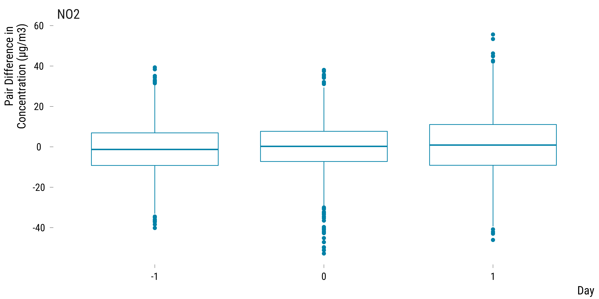
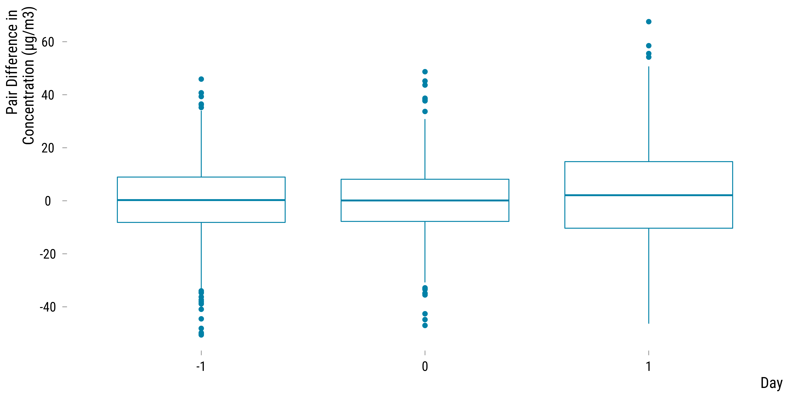
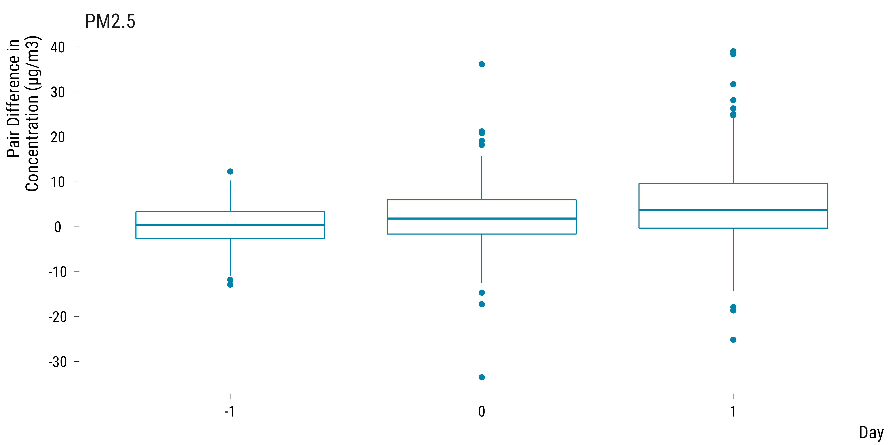
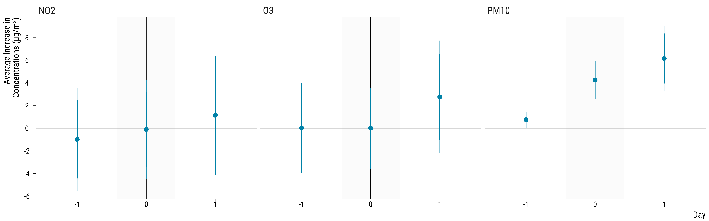

<style>
body {
text-align: justify}
</style>


In this document, we take great care providing all steps and R codes required to estimate the influence of North-East winds on air pollutants. We compare days where:

* treated units are days where winds blow from the North-East in *t*.
* control units are day winds blow from other directions in *t*.

We adjust for calendar indicators and weather confouding factors.

**Should you have any questions, need help to reproduce the analysis or find coding errors, please do not hesitate to contact me at leo.zabrocki@psemail.eu**

# Required Packages

To reproduce exactly the `5_script_analyzing_results.html` document, we first need to have installed:

* the [R](https://www.r-project.org/) programming language 
* [RStudio](https://rstudio.com/), an integrated development environment for R, which will allow you to knit the `5_script_analyzing_results.Rmd` file and interact with the R code chunks
* the [R Markdown](https://rmarkdown.rstudio.com/) package
* and the [Distill](https://rstudio.github.io/distill/) package which provides the template for this document. 

Once everything is set up, we have to load the following packages:

<div class="layout-chunk" data-layout="l-body-outset">
<div class="sourceCode"><pre class="sourceCode r"><code class="sourceCode r"><span class='co'># load required packages</span>
<span class='kw'><a href='https://rdrr.io/r/base/library.html'>library</a></span><span class='op'>(</span><span class='va'><a href='https://yihui.org/knitr/'>knitr</a></span><span class='op'>)</span> <span class='co'># for creating the R Markdown document</span>
<span class='kw'><a href='https://rdrr.io/r/base/library.html'>library</a></span><span class='op'>(</span><span class='va'><a href='https://here.r-lib.org/'>here</a></span><span class='op'>)</span> <span class='co'># for files paths organization</span>
<span class='kw'><a href='https://rdrr.io/r/base/library.html'>library</a></span><span class='op'>(</span><span class='va'><a href='https://tidyverse.tidyverse.org'>tidyverse</a></span><span class='op'>)</span> <span class='co'># for data manipulation and visualization</span>
<span class='kw'><a href='https://rdrr.io/r/base/library.html'>library</a></span><span class='op'>(</span><span class='va'><a href='https://github.com/andytimm/retrodesign'>retrodesign</a></span><span class='op'>)</span> <span class='co'># for assessing type m and s errors</span>
<span class='kw'><a href='https://rdrr.io/r/base/library.html'>library</a></span><span class='op'>(</span><span class='va'><a href='http://www.rforge.net/Cairo/'>Cairo</a></span><span class='op'>)</span> <span class='co'># for printing customed police of graphs</span>
<span class='kw'><a href='https://rdrr.io/r/base/library.html'>library</a></span><span class='op'>(</span><span class='va'><a href='https://patchwork.data-imaginist.com'>patchwork</a></span><span class='op'>)</span> <span class='co'># combining plots</span>
<span class='kw'><a href='https://rdrr.io/r/base/library.html'>library</a></span><span class='op'>(</span><span class='va'><a href='https://github.com/rstudio/DT'>DT</a></span><span class='op'>)</span> <span class='co'># for tables</span>
</code></pre></div>

</div>


We finally load our custom `ggplot2` theme for graphs:

<div class="layout-chunk" data-layout="l-body-outset">
<div class="sourceCode"><pre class="sourceCode r"><code class="sourceCode r"><span class='co'># load ggplot custom theme</span>
<span class='kw'><a href='https://rdrr.io/r/base/source.html'>source</a></span><span class='op'>(</span><span class='fu'>here</span><span class='fu'>::</span><span class='fu'><a href='https://here.r-lib.org//reference/here.html'>here</a></span><span class='op'>(</span>
  <span class='st'>"2.scripts"</span>,
  <span class='st'>"4.custom_ggplot2_theme"</span>,
  <span class='st'>"script_theme_tufte.R"</span>
<span class='op'>)</span><span class='op'>)</span>
<span class='co'># define nice colors</span>
<span class='va'>my_blue</span> <span class='op'>&lt;-</span> <span class='st'>"#0081a7"</span>
<span class='va'>my_orange</span> <span class='op'>&lt;-</span> <span class='st'>"#fb8500"</span>
</code></pre></div>

</div>


# Preparing the Data

We load the matched data:

<div class="layout-chunk" data-layout="l-body-outset">
<div class="sourceCode"><pre class="sourceCode r"><code class="sourceCode r"><span class='co'># load matched data</span>
<span class='va'>data_matched</span> <span class='op'>&lt;-</span>
  <span class='fu'><a href='https://rdrr.io/r/base/readRDS.html'>readRDS</a></span><span class='op'>(</span><span class='fu'>here</span><span class='fu'>::</span><span class='fu'><a href='https://here.r-lib.org//reference/here.html'>here</a></span><span class='op'>(</span><span class='st'>"1.data"</span>, <span class='st'>"6.matched_data"</span>, <span class='st'>"matched_data.rds"</span><span class='op'>)</span><span class='op'>)</span>
</code></pre></div>

</div>


# Distribution of the Pair Differences in Concentration between Treated and Control units for each Pollutant

### Computing Pairs Differences in Pollutant Concentrations

We first compute the differences in a pollutant's concentration for each pair over time:

<div class="layout-chunk" data-layout="l-body-outset">
<div class="sourceCode"><pre class="sourceCode r"><code class="sourceCode r"><span class='va'>data_matched_wide</span> <span class='op'>&lt;-</span> <span class='va'>data_matched</span> <span class='op'>%&gt;%</span>
  <span class='fu'>mutate</span><span class='op'>(</span>is_treated <span class='op'>=</span> <span class='fu'><a href='https://rdrr.io/r/base/ifelse.html'>ifelse</a></span><span class='op'>(</span><span class='va'>is_treated</span> <span class='op'>==</span> <span class='cn'>TRUE</span>, <span class='st'>"treated"</span>, <span class='st'>"control"</span><span class='op'>)</span><span class='op'>)</span> <span class='op'>%&gt;%</span>
  <span class='fu'>select</span><span class='op'>(</span>
    <span class='va'>is_treated</span>,
    <span class='va'>pair_number</span>,
    <span class='fu'>contains</span><span class='op'>(</span><span class='st'>"mean_no2"</span><span class='op'>)</span>,
    <span class='fu'>contains</span><span class='op'>(</span><span class='st'>"mean_o3"</span><span class='op'>)</span>,
    <span class='fu'>contains</span><span class='op'>(</span><span class='st'>"mean_pm10"</span><span class='op'>)</span>,
    <span class='fu'>contains</span><span class='op'>(</span><span class='st'>"mean_pm25"</span><span class='op'>)</span>
  <span class='op'>)</span> <span class='op'>%&gt;%</span>
  <span class='fu'>pivot_longer</span><span class='op'>(</span>
    cols <span class='op'>=</span> <span class='op'>-</span><span class='fu'><a href='https://rdrr.io/r/base/c.html'>c</a></span><span class='op'>(</span><span class='va'>pair_number</span>, <span class='va'>is_treated</span><span class='op'>)</span>,
    names_to <span class='op'>=</span> <span class='st'>"variable"</span>,
    values_to <span class='op'>=</span> <span class='st'>"concentration"</span>
  <span class='op'>)</span> <span class='op'>%&gt;%</span>
  <span class='fu'>mutate</span><span class='op'>(</span>
    pollutant <span class='op'>=</span> <span class='cn'>NA</span> <span class='op'>%&gt;%</span>
      <span class='fu'><a href='https://rdrr.io/r/base/ifelse.html'>ifelse</a></span><span class='op'>(</span><span class='fu'>str_detect</span><span class='op'>(</span><span class='va'>variable</span>, <span class='st'>"no2"</span><span class='op'>)</span>, <span class='st'>"NO2"</span>, <span class='va'>.</span><span class='op'>)</span> <span class='op'>%&gt;%</span>
      <span class='fu'><a href='https://rdrr.io/r/base/ifelse.html'>ifelse</a></span><span class='op'>(</span><span class='fu'>str_detect</span><span class='op'>(</span><span class='va'>variable</span>, <span class='st'>"o3"</span><span class='op'>)</span>, <span class='st'>"O3"</span>, <span class='va'>.</span><span class='op'>)</span> <span class='op'>%&gt;%</span>
      <span class='fu'><a href='https://rdrr.io/r/base/ifelse.html'>ifelse</a></span><span class='op'>(</span><span class='fu'>str_detect</span><span class='op'>(</span><span class='va'>variable</span>, <span class='st'>"pm10"</span><span class='op'>)</span>, <span class='st'>"PM10"</span>, <span class='va'>.</span><span class='op'>)</span> <span class='op'>%&gt;%</span>
      <span class='fu'><a href='https://rdrr.io/r/base/ifelse.html'>ifelse</a></span><span class='op'>(</span><span class='fu'>str_detect</span><span class='op'>(</span><span class='va'>variable</span>, <span class='st'>"pm25"</span><span class='op'>)</span>, <span class='st'>"PM2.5"</span>, <span class='va'>.</span><span class='op'>)</span>
  <span class='op'>)</span> <span class='op'>%&gt;%</span>
  <span class='fu'>mutate</span><span class='op'>(</span>time <span class='op'>=</span> <span class='fl'>0</span> <span class='op'>%&gt;%</span>
           <span class='fu'><a href='https://rdrr.io/r/base/ifelse.html'>ifelse</a></span><span class='op'>(</span><span class='fu'>str_detect</span><span class='op'>(</span><span class='va'>variable</span>, <span class='st'>"lag_1"</span><span class='op'>)</span>,<span class='op'>-</span><span class='fl'>1</span>, <span class='va'>.</span><span class='op'>)</span> <span class='op'>%&gt;%</span>
           <span class='fu'><a href='https://rdrr.io/r/base/ifelse.html'>ifelse</a></span><span class='op'>(</span><span class='fu'>str_detect</span><span class='op'>(</span><span class='va'>variable</span>, <span class='st'>"lead_1"</span><span class='op'>)</span>, <span class='fl'>1</span>, <span class='va'>.</span><span class='op'>)</span><span class='op'>)</span> <span class='op'>%&gt;%</span>
  <span class='fu'>select</span><span class='op'>(</span><span class='op'>-</span><span class='va'>variable</span><span class='op'>)</span> <span class='op'>%&gt;%</span>
  <span class='fu'>select</span><span class='op'>(</span><span class='va'>pair_number</span>, <span class='va'>is_treated</span>, <span class='va'>pollutant</span>, <span class='va'>time</span>, <span class='va'>concentration</span><span class='op'>)</span> <span class='op'>%&gt;%</span>
  <span class='fu'>pivot_wider</span><span class='op'>(</span>names_from <span class='op'>=</span> <span class='va'>is_treated</span>, values_from <span class='op'>=</span> <span class='va'>concentration</span><span class='op'>)</span>

<span class='va'>data_pair_difference_pollutant</span> <span class='op'>&lt;-</span> <span class='va'>data_matched_wide</span> <span class='op'>%&gt;%</span>
  <span class='fu'>mutate</span><span class='op'>(</span>difference <span class='op'>=</span> <span class='va'>treated</span> <span class='op'>-</span> <span class='va'>control</span><span class='op'>)</span> <span class='op'>%&gt;%</span>
  <span class='fu'>select</span><span class='op'>(</span><span class='op'>-</span><span class='fu'><a href='https://rdrr.io/r/base/c.html'>c</a></span><span class='op'>(</span><span class='va'>treated</span>, <span class='va'>control</span><span class='op'>)</span><span class='op'>)</span> 
</code></pre></div>

</div>


### Pairs Differences in NO2 Concentrations

Boxplots for NO2:

<div class="layout-chunk" data-layout="l-body-outset">
<div class="sourceCode"><pre class="sourceCode r"><code class="sourceCode r"><span class='co'># create the graph for no2</span>
<span class='va'>graph_boxplot_difference_pollutant_no2</span> <span class='op'>&lt;-</span>
  <span class='va'>data_pair_difference_pollutant</span> <span class='op'>%&gt;%</span>
  <span class='fu'><a href='https://rdrr.io/r/stats/filter.html'>filter</a></span><span class='op'>(</span><span class='fu'>str_detect</span><span class='op'>(</span><span class='va'>pollutant</span>, <span class='st'>"NO2"</span><span class='op'>)</span><span class='op'>)</span> <span class='op'>%&gt;%</span>
  <span class='fu'>ggplot</span><span class='op'>(</span><span class='va'>.</span>, <span class='fu'>aes</span><span class='op'>(</span>x <span class='op'>=</span> <span class='fu'><a href='https://rdrr.io/r/base/factor.html'>as.factor</a></span><span class='op'>(</span><span class='va'>time</span><span class='op'>)</span>, y <span class='op'>=</span> <span class='va'>difference</span><span class='op'>)</span><span class='op'>)</span> <span class='op'>+</span>
  <span class='fu'>geom_boxplot</span><span class='op'>(</span>colour <span class='op'>=</span> <span class='va'>my_blue</span>, size <span class='op'>=</span> <span class='fl'>0.3</span><span class='op'>)</span> <span class='op'>+</span>
  <span class='fu'>scale_y_continuous</span><span class='op'>(</span>breaks <span class='op'>=</span> <span class='fu'>scales</span><span class='fu'>::</span><span class='fu'><a href='https://scales.r-lib.org/reference/breaks_pretty.html'>pretty_breaks</a></span><span class='op'>(</span>n <span class='op'>=</span> <span class='fl'>8</span><span class='op'>)</span><span class='op'>)</span> <span class='op'>+</span>
  <span class='fu'>facet_wrap</span><span class='op'>(</span> <span class='op'>~</span> <span class='va'>pollutant</span><span class='op'>)</span> <span class='op'>+</span>
  <span class='fu'>ylab</span><span class='op'>(</span><span class='st'>"Pair Difference in \nConcentration (µg/m3)"</span><span class='op'>)</span> <span class='op'>+</span> <span class='fu'>xlab</span><span class='op'>(</span><span class='st'>"Day"</span><span class='op'>)</span> <span class='op'>+</span>
  <span class='fu'>theme_tufte</span><span class='op'>(</span><span class='op'>)</span>

<span class='co'># display the graph</span>
<span class='va'>graph_boxplot_difference_pollutant_no2</span>
</code></pre></div>
<!-- --><div class="sourceCode"><pre class="sourceCode r"><code class="sourceCode r"><span class='co'># save the graph</span>
<span class='fu'>ggsave</span><span class='op'>(</span>
  <span class='va'>graph_boxplot_difference_pollutant_no2</span>,
  filename <span class='op'>=</span> <span class='fu'>here</span><span class='fu'>::</span><span class='fu'><a href='https://here.r-lib.org//reference/here.html'>here</a></span><span class='op'>(</span>
    <span class='st'>"3.outputs"</span>,
    <span class='st'>"2.matching_analysis"</span>,
    <span class='st'>"graph_boxplot_difference_pollutant_no2.pdf"</span>
  <span class='op'>)</span>,
  width <span class='op'>=</span> <span class='fl'>18</span>,
  height <span class='op'>=</span> <span class='fl'>9</span>,
  units <span class='op'>=</span> <span class='st'>"cm"</span>,
  device <span class='op'>=</span> <span class='va'>cairo_pdf</span>
<span class='op'>)</span>
</code></pre></div>

</div>


### Pairs Differences in O3 Concentrations

Boxplots for O3:

<div class="layout-chunk" data-layout="l-body-outset">
<div class="sourceCode"><pre class="sourceCode r"><code class="sourceCode r"><span class='co'># create the graph for o3</span>
<span class='va'>graph_boxplot_difference_pollutant_o3</span> <span class='op'>&lt;-</span>
  <span class='va'>data_pair_difference_pollutant</span> <span class='op'>%&gt;%</span>
  <span class='fu'><a href='https://rdrr.io/r/stats/filter.html'>filter</a></span><span class='op'>(</span><span class='fu'>str_detect</span><span class='op'>(</span><span class='va'>pollutant</span>, <span class='st'>"O3"</span><span class='op'>)</span><span class='op'>)</span> <span class='op'>%&gt;%</span>
  <span class='fu'>ggplot</span><span class='op'>(</span><span class='va'>.</span>, <span class='fu'>aes</span><span class='op'>(</span>x <span class='op'>=</span> <span class='fu'><a href='https://rdrr.io/r/base/factor.html'>as.factor</a></span><span class='op'>(</span><span class='va'>time</span><span class='op'>)</span>, y <span class='op'>=</span> <span class='va'>difference</span><span class='op'>)</span><span class='op'>)</span> <span class='op'>+</span>
  <span class='fu'>geom_boxplot</span><span class='op'>(</span>colour <span class='op'>=</span> <span class='va'>my_blue</span>, size <span class='op'>=</span> <span class='fl'>0.3</span><span class='op'>)</span> <span class='op'>+</span>
  <span class='fu'>scale_y_continuous</span><span class='op'>(</span>breaks <span class='op'>=</span> <span class='fu'>scales</span><span class='fu'>::</span><span class='fu'><a href='https://scales.r-lib.org/reference/breaks_pretty.html'>pretty_breaks</a></span><span class='op'>(</span>n <span class='op'>=</span> <span class='fl'>8</span><span class='op'>)</span><span class='op'>)</span> <span class='op'>+</span>
  <span class='fu'>ylab</span><span class='op'>(</span><span class='st'>"Pair Difference in \nConcentration (µg/m3)"</span><span class='op'>)</span> <span class='op'>+</span> <span class='fu'>xlab</span><span class='op'>(</span><span class='st'>"Day"</span><span class='op'>)</span> <span class='op'>+</span>
  <span class='fu'>theme_tufte</span><span class='op'>(</span><span class='op'>)</span>

<span class='co'># display the graph</span>
<span class='va'>graph_boxplot_difference_pollutant_o3</span>
</code></pre></div>
<!-- --><div class="sourceCode"><pre class="sourceCode r"><code class="sourceCode r"><span class='co'># save the graph</span>
<span class='fu'>ggsave</span><span class='op'>(</span>
  <span class='va'>graph_boxplot_difference_pollutant_o3</span>,
  filename <span class='op'>=</span> <span class='fu'>here</span><span class='fu'>::</span><span class='fu'><a href='https://here.r-lib.org//reference/here.html'>here</a></span><span class='op'>(</span>
    <span class='st'>"3.outputs"</span>,
    <span class='st'>"2.matching_analysis"</span>,
    <span class='st'>"graph_boxplot_difference_pollutant_o3.pdf"</span>
  <span class='op'>)</span>,
  width <span class='op'>=</span> <span class='fl'>18</span>,
  height <span class='op'>=</span> <span class='fl'>9</span>,
  units <span class='op'>=</span> <span class='st'>"cm"</span>,
  device <span class='op'>=</span> <span class='va'>cairo_pdf</span>
<span class='op'>)</span>
</code></pre></div>

</div>


### Pairs Differences in PM10 Concentrations

Boxplots for PM10:

<div class="layout-chunk" data-layout="l-body-outset">
<div class="sourceCode"><pre class="sourceCode r"><code class="sourceCode r"><span class='co'># create the graph for pm10</span>
<span class='va'>graph_boxplot_difference_pollutant_pm10</span> <span class='op'>&lt;-</span>
  <span class='va'>data_pair_difference_pollutant</span> <span class='op'>%&gt;%</span>
  <span class='fu'><a href='https://rdrr.io/r/stats/filter.html'>filter</a></span><span class='op'>(</span><span class='fu'>str_detect</span><span class='op'>(</span><span class='va'>pollutant</span>, <span class='st'>"PM10"</span><span class='op'>)</span><span class='op'>)</span> <span class='op'>%&gt;%</span>
  <span class='fu'>ggplot</span><span class='op'>(</span><span class='va'>.</span>, <span class='fu'>aes</span><span class='op'>(</span>x <span class='op'>=</span> <span class='fu'><a href='https://rdrr.io/r/base/factor.html'>as.factor</a></span><span class='op'>(</span><span class='va'>time</span><span class='op'>)</span>, y <span class='op'>=</span> <span class='va'>difference</span><span class='op'>)</span><span class='op'>)</span> <span class='op'>+</span>
  <span class='fu'>geom_boxplot</span><span class='op'>(</span>colour <span class='op'>=</span> <span class='va'>my_blue</span>, size <span class='op'>=</span> <span class='fl'>0.3</span><span class='op'>)</span> <span class='op'>+</span>
  <span class='fu'>scale_y_continuous</span><span class='op'>(</span>breaks <span class='op'>=</span> <span class='fu'>scales</span><span class='fu'>::</span><span class='fu'><a href='https://scales.r-lib.org/reference/breaks_pretty.html'>pretty_breaks</a></span><span class='op'>(</span>n <span class='op'>=</span> <span class='fl'>8</span><span class='op'>)</span><span class='op'>)</span> <span class='op'>+</span>
  <span class='fu'>facet_wrap</span><span class='op'>(</span> <span class='op'>~</span> <span class='va'>pollutant</span><span class='op'>)</span> <span class='op'>+</span>
  <span class='fu'>ylab</span><span class='op'>(</span><span class='st'>"Pair Difference in \nConcentration (µg/m3)"</span><span class='op'>)</span> <span class='op'>+</span> <span class='fu'>xlab</span><span class='op'>(</span><span class='st'>"Day"</span><span class='op'>)</span> <span class='op'>+</span>
  <span class='fu'>theme_tufte</span><span class='op'>(</span><span class='op'>)</span>

<span class='co'># display the graph</span>
<span class='va'>graph_boxplot_difference_pollutant_pm10</span>
</code></pre></div>
<!-- --><div class="sourceCode"><pre class="sourceCode r"><code class="sourceCode r"><span class='co'># save the graph</span>
<span class='fu'>ggsave</span><span class='op'>(</span>
  <span class='va'>graph_boxplot_difference_pollutant_pm10</span>,
  filename <span class='op'>=</span> <span class='fu'>here</span><span class='fu'>::</span><span class='fu'><a href='https://here.r-lib.org//reference/here.html'>here</a></span><span class='op'>(</span>
    <span class='st'>"3.outputs"</span>,
    <span class='st'>"2.matching_analysis"</span>,
    <span class='st'>"graph_boxplot_difference_pollutant_pm10.pdf"</span>
  <span class='op'>)</span>,
  width <span class='op'>=</span> <span class='fl'>18</span>,
  height <span class='op'>=</span> <span class='fl'>9</span>,
  units <span class='op'>=</span> <span class='st'>"cm"</span>,
  device <span class='op'>=</span> <span class='va'>cairo_pdf</span>
<span class='op'>)</span>
</code></pre></div>

</div>


### Pairs Differences in PM2.5 Concentrations

Boxplots for PM2.5:

<div class="layout-chunk" data-layout="l-body-outset">
<div class="sourceCode"><pre class="sourceCode r"><code class="sourceCode r"><span class='co'># create the graph for pm10</span>
<span class='va'>graph_boxplot_difference_pollutant_pm25</span> <span class='op'>&lt;-</span>
  <span class='va'>data_pair_difference_pollutant</span> <span class='op'>%&gt;%</span>
  <span class='fu'><a href='https://rdrr.io/r/stats/filter.html'>filter</a></span><span class='op'>(</span><span class='fu'>str_detect</span><span class='op'>(</span><span class='va'>pollutant</span>, <span class='st'>"PM2.5"</span><span class='op'>)</span><span class='op'>)</span> <span class='op'>%&gt;%</span>
  <span class='fu'>ggplot</span><span class='op'>(</span><span class='va'>.</span>, <span class='fu'>aes</span><span class='op'>(</span>x <span class='op'>=</span> <span class='fu'><a href='https://rdrr.io/r/base/factor.html'>as.factor</a></span><span class='op'>(</span><span class='va'>time</span><span class='op'>)</span>, y <span class='op'>=</span> <span class='va'>difference</span><span class='op'>)</span><span class='op'>)</span> <span class='op'>+</span>
  <span class='fu'>geom_boxplot</span><span class='op'>(</span>colour <span class='op'>=</span> <span class='va'>my_blue</span>, size <span class='op'>=</span> <span class='fl'>0.3</span><span class='op'>)</span> <span class='op'>+</span>
  <span class='fu'>scale_y_continuous</span><span class='op'>(</span>breaks <span class='op'>=</span> <span class='fu'>scales</span><span class='fu'>::</span><span class='fu'><a href='https://scales.r-lib.org/reference/breaks_pretty.html'>pretty_breaks</a></span><span class='op'>(</span>n <span class='op'>=</span> <span class='fl'>8</span><span class='op'>)</span><span class='op'>)</span> <span class='op'>+</span>
  <span class='fu'>facet_wrap</span><span class='op'>(</span> <span class='op'>~</span> <span class='va'>pollutant</span><span class='op'>)</span> <span class='op'>+</span>
  <span class='fu'>ylab</span><span class='op'>(</span><span class='st'>"Pair Difference in \nConcentration (µg/m3)"</span><span class='op'>)</span> <span class='op'>+</span> <span class='fu'>xlab</span><span class='op'>(</span><span class='st'>"Day"</span><span class='op'>)</span> <span class='op'>+</span>
  <span class='fu'>theme_tufte</span><span class='op'>(</span><span class='op'>)</span>

<span class='co'># display the graph</span>
<span class='va'>graph_boxplot_difference_pollutant_pm25</span>
</code></pre></div>
<!-- --><div class="sourceCode"><pre class="sourceCode r"><code class="sourceCode r"><span class='co'># save the graph</span>
<span class='fu'>ggsave</span><span class='op'>(</span>
  <span class='va'>graph_boxplot_difference_pollutant_pm25</span>,
  filename <span class='op'>=</span> <span class='fu'>here</span><span class='fu'>::</span><span class='fu'><a href='https://here.r-lib.org//reference/here.html'>here</a></span><span class='op'>(</span>
    <span class='st'>"3.outputs"</span>,
    <span class='st'>"2.matching_analysis"</span>,
    <span class='st'>"graph_boxplot_difference_pollutant_pm25.pdf"</span>
  <span class='op'>)</span>,
  width <span class='op'>=</span> <span class='fl'>18</span>,
  height <span class='op'>=</span> <span class='fl'>9</span>,
  units <span class='op'>=</span> <span class='st'>"cm"</span>,
  device <span class='op'>=</span> <span class='va'>cairo_pdf</span>
<span class='op'>)</span>
</code></pre></div>

</div>


#  Neymanian Inference: Computing 99% and 95% Confidence Intervals for the Average Treatment Effects

We compute confidence intervals for the average treatement (ATE) of North-East winds using Neyman's approach. We use the formula for the standard error of pair randomized experiment found in Imbens and Rubin (2015).

<div class="layout-chunk" data-layout="l-body-outset">
<div class="sourceCode"><pre class="sourceCode r"><code class="sourceCode r"><span class='co'># we first compute the average treatment effects for each pollutant and day</span>
<span class='va'>data_pair_mean_difference</span> <span class='op'>&lt;-</span> <span class='va'>data_pair_difference_pollutant</span> <span class='op'>%&gt;%</span>
  <span class='fu'><a href='https://rdrr.io/r/stats/filter.html'>filter</a></span><span class='op'>(</span><span class='va'>pollutant</span> <span class='op'>!=</span> <span class='st'>"PM2.5"</span><span class='op'>)</span> <span class='op'>%&gt;%</span>
  <span class='fu'>group_by</span><span class='op'>(</span><span class='va'>pollutant</span>, <span class='va'>time</span><span class='op'>)</span> <span class='op'>%&gt;%</span>
  <span class='fu'>summarise</span><span class='op'>(</span>mean_difference <span class='op'>=</span> <span class='fu'><a href='https://rdrr.io/r/base/mean.html'>mean</a></span><span class='op'>(</span><span class='va'>difference</span><span class='op'>)</span><span class='op'>)</span> <span class='op'>%&gt;%</span>
  <span class='fu'>ungroup</span><span class='op'>(</span><span class='op'>)</span>

<span class='co'># we store the number of pairs</span>
<span class='va'>n_pair</span> <span class='op'>&lt;-</span> <span class='fu'><a href='https://rdrr.io/r/base/nrow.html'>nrow</a></span><span class='op'>(</span><span class='va'>data_matched</span><span class='op'>)</span> <span class='op'>/</span> <span class='fl'>2</span>

<span class='co'># compute the standard error</span>
<span class='va'>data_se_neyman_pair</span> <span class='op'>&lt;-</span>
  <span class='fu'>left_join</span><span class='op'>(</span>
    <span class='va'>data_pair_difference_pollutant</span>,
    <span class='va'>data_pair_mean_difference</span>,
    by <span class='op'>=</span> <span class='fu'><a href='https://rdrr.io/r/base/c.html'>c</a></span><span class='op'>(</span><span class='st'>"pollutant"</span>, <span class='st'>"time"</span><span class='op'>)</span>
  <span class='op'>)</span> <span class='op'>%&gt;%</span>
  <span class='fu'>mutate</span><span class='op'>(</span>squared_difference <span class='op'>=</span> <span class='op'>(</span><span class='va'>difference</span> <span class='op'>-</span> <span class='va'>mean_difference</span><span class='op'>)</span> <span class='op'>^</span> <span class='fl'>2</span><span class='op'>)</span> <span class='op'>%&gt;%</span>
  <span class='fu'>group_by</span><span class='op'>(</span><span class='va'>pollutant</span>, <span class='va'>time</span><span class='op'>)</span> <span class='op'>%&gt;%</span>
  <span class='fu'>summarise</span><span class='op'>(</span>standard_error <span class='op'>=</span> <span class='fu'><a href='https://rdrr.io/r/base/MathFun.html'>sqrt</a></span><span class='op'>(</span><span class='fl'>1</span> <span class='op'>/</span> <span class='op'>(</span><span class='va'>n_pair</span> <span class='op'>*</span> <span class='op'>(</span><span class='va'>n_pair</span> <span class='op'>-</span> <span class='fl'>1</span><span class='op'>)</span><span class='op'>)</span> <span class='op'>*</span> <span class='fu'><a href='https://rdrr.io/r/base/sum.html'>sum</a></span><span class='op'>(</span><span class='va'>squared_difference</span><span class='op'>)</span><span class='op'>)</span><span class='op'>)</span> <span class='op'>%&gt;%</span>
  <span class='fu'>select</span><span class='op'>(</span><span class='va'>pollutant</span>, <span class='va'>time</span>, <span class='va'>standard_error</span><span class='op'>)</span> <span class='op'>%&gt;%</span>
  <span class='fu'>ungroup</span><span class='op'>(</span><span class='op'>)</span>

<span class='co'># merge the average treatment effect data witht the standard error data</span>
<span class='va'>data_neyman</span> <span class='op'>&lt;-</span>
  <span class='fu'>left_join</span><span class='op'>(</span><span class='va'>data_pair_mean_difference</span>,
            <span class='va'>data_se_neyman_pair</span>,
            by <span class='op'>=</span> <span class='fu'><a href='https://rdrr.io/r/base/c.html'>c</a></span><span class='op'>(</span><span class='st'>"pollutant"</span>, <span class='st'>"time"</span><span class='op'>)</span><span class='op'>)</span> <span class='op'>%&gt;%</span>
<span class='co'># compute the 95% and 99% confidence intervals</span>
  <span class='fu'>mutate</span><span class='op'>(</span>
    upper_bound_95 <span class='op'>=</span> <span class='va'>mean_difference</span> <span class='op'>+</span> <span class='op'>(</span><span class='op'>-</span><span class='fu'><a href='https://rdrr.io/r/stats/Normal.html'>qnorm</a></span><span class='op'>(</span><span class='op'>(</span><span class='fl'>1</span> <span class='op'>-</span> <span class='fl'>0.95</span><span class='op'>)</span> <span class='op'>/</span> <span class='fl'>2</span><span class='op'>)</span> <span class='op'>*</span> <span class='va'>standard_error</span><span class='op'>)</span>,
    lower_bound_95 <span class='op'>=</span> <span class='va'>mean_difference</span> <span class='op'>-</span> <span class='op'>(</span><span class='op'>-</span><span class='fu'><a href='https://rdrr.io/r/stats/Normal.html'>qnorm</a></span><span class='op'>(</span><span class='op'>(</span><span class='fl'>1</span> <span class='op'>-</span> <span class='fl'>0.95</span><span class='op'>)</span> <span class='op'>/</span> <span class='fl'>2</span><span class='op'>)</span> <span class='op'>*</span> <span class='va'>standard_error</span><span class='op'>)</span>,
    upper_bound_99 <span class='op'>=</span> <span class='va'>mean_difference</span> <span class='op'>+</span> <span class='op'>(</span><span class='op'>-</span><span class='fu'><a href='https://rdrr.io/r/stats/Normal.html'>qnorm</a></span><span class='op'>(</span><span class='op'>(</span><span class='fl'>1</span> <span class='op'>-</span> <span class='fl'>0.99</span><span class='op'>)</span> <span class='op'>/</span> <span class='fl'>2</span><span class='op'>)</span> <span class='op'>*</span> <span class='va'>standard_error</span><span class='op'>)</span>,
    lower_bound_99 <span class='op'>=</span> <span class='va'>mean_difference</span> <span class='op'>-</span> <span class='op'>(</span><span class='op'>-</span><span class='fu'><a href='https://rdrr.io/r/stats/Normal.html'>qnorm</a></span><span class='op'>(</span><span class='op'>(</span><span class='fl'>1</span> <span class='op'>-</span> <span class='fl'>0.99</span><span class='op'>)</span> <span class='op'>/</span> <span class='fl'>2</span><span class='op'>)</span> <span class='op'>*</span> <span class='va'>standard_error</span><span class='op'>)</span>
  <span class='op'>)</span>
</code></pre></div>

</div>


We plot below the point estimates for the ATE and the associated 95% and 99% confidence intervals:

<div class="layout-chunk" data-layout="l-body-outset">
<div class="sourceCode"><pre class="sourceCode r"><code class="sourceCode r"><span class='co'># create an indicator to alternate shading of confidence intervals</span>
<span class='va'>data_neyman</span> <span class='op'>&lt;-</span> <span class='va'>data_neyman</span> <span class='op'>%&gt;%</span>
  <span class='fu'>arrange</span><span class='op'>(</span><span class='va'>pollutant</span>, <span class='va'>time</span><span class='op'>)</span> <span class='op'>%&gt;%</span>
  <span class='fu'>mutate</span><span class='op'>(</span>stripe <span class='op'>=</span> <span class='fu'><a href='https://rdrr.io/r/base/ifelse.html'>ifelse</a></span><span class='op'>(</span><span class='op'>(</span><span class='va'>time</span> <span class='op'>%%</span> <span class='fl'>2</span><span class='op'>)</span> <span class='op'>==</span> <span class='fl'>0</span>, <span class='st'>"Grey"</span>, <span class='st'>"White"</span><span class='op'>)</span><span class='op'>)</span> <span class='op'>%&gt;%</span>
  <span class='fu'>ungroup</span><span class='op'>(</span><span class='op'>)</span>

<span class='co'># make the graph</span>
<span class='va'>graph_ci</span> <span class='op'>&lt;-</span>
  <span class='fu'>ggplot</span><span class='op'>(</span><span class='va'>data_neyman</span>,
         <span class='fu'>aes</span><span class='op'>(</span>x <span class='op'>=</span> <span class='fu'><a href='https://rdrr.io/r/base/factor.html'>as.factor</a></span><span class='op'>(</span><span class='va'>time</span><span class='op'>)</span>, y <span class='op'>=</span> <span class='va'>mean_difference</span><span class='op'>)</span><span class='op'>)</span> <span class='op'>+</span>
  <span class='fu'>geom_rect</span><span class='op'>(</span>
    <span class='fu'>aes</span><span class='op'>(</span>fill <span class='op'>=</span> <span class='va'>stripe</span><span class='op'>)</span>,
    xmin <span class='op'>=</span> <span class='fu'><a href='https://rdrr.io/r/base/numeric.html'>as.numeric</a></span><span class='op'>(</span><span class='fu'><a href='https://rdrr.io/r/base/factor.html'>as.factor</a></span><span class='op'>(</span><span class='va'>data_neyman</span><span class='op'>$</span><span class='va'>time</span><span class='op'>)</span><span class='op'>)</span> <span class='op'>-</span> <span class='fl'>0.42</span>,
    xmax <span class='op'>=</span> <span class='fu'><a href='https://rdrr.io/r/base/numeric.html'>as.numeric</a></span><span class='op'>(</span><span class='fu'><a href='https://rdrr.io/r/base/factor.html'>as.factor</a></span><span class='op'>(</span><span class='va'>data_neyman</span><span class='op'>$</span><span class='va'>time</span><span class='op'>)</span><span class='op'>)</span> <span class='op'>+</span> <span class='fl'>0.42</span>,
    ymin <span class='op'>=</span> <span class='op'>-</span><span class='cn'>Inf</span>,
    ymax <span class='op'>=</span> <span class='cn'>Inf</span>,
    color <span class='op'>=</span> <span class='cn'>NA</span>,
    alpha <span class='op'>=</span> <span class='fl'>0.4</span>
  <span class='op'>)</span> <span class='op'>+</span>
  <span class='fu'>geom_hline</span><span class='op'>(</span>yintercept <span class='op'>=</span> <span class='fl'>0</span>,
             color <span class='op'>=</span> <span class='st'>"black"</span>,
             size <span class='op'>=</span> <span class='fl'>0.3</span><span class='op'>)</span> <span class='op'>+</span>
  <span class='fu'>geom_vline</span><span class='op'>(</span>xintercept <span class='op'>=</span> <span class='st'>"0"</span>,
             color <span class='op'>=</span> <span class='st'>"black"</span>,
             size <span class='op'>=</span> <span class='fl'>0.3</span><span class='op'>)</span> <span class='op'>+</span>
  <span class='fu'>geom_pointrange</span><span class='op'>(</span>
    <span class='fu'>aes</span><span class='op'>(</span>
      x <span class='op'>=</span> <span class='fu'><a href='https://rdrr.io/r/base/factor.html'>as.factor</a></span><span class='op'>(</span><span class='va'>time</span><span class='op'>)</span>,
      y <span class='op'>=</span> <span class='va'>mean_difference</span>,
      ymin <span class='op'>=</span> <span class='va'>lower_bound_95</span> ,
      ymax <span class='op'>=</span> <span class='va'>upper_bound_95</span>
    <span class='op'>)</span>,
    colour <span class='op'>=</span> <span class='va'>my_blue</span>,
    lwd <span class='op'>=</span> <span class='fl'>0.8</span>
  <span class='op'>)</span> <span class='op'>+</span>
  <span class='fu'>geom_pointrange</span><span class='op'>(</span>
    <span class='fu'>aes</span><span class='op'>(</span>
      x <span class='op'>=</span> <span class='fu'><a href='https://rdrr.io/r/base/factor.html'>as.factor</a></span><span class='op'>(</span><span class='va'>time</span><span class='op'>)</span>,
      y <span class='op'>=</span> <span class='va'>mean_difference</span>,
      ymin <span class='op'>=</span> <span class='va'>lower_bound_99</span> ,
      ymax <span class='op'>=</span> <span class='va'>upper_bound_99</span>
    <span class='op'>)</span>,
    colour <span class='op'>=</span> <span class='va'>my_blue</span>,
    lwd <span class='op'>=</span> <span class='fl'>0.4</span>
  <span class='op'>)</span> <span class='op'>+</span>
  <span class='fu'>scale_y_continuous</span><span class='op'>(</span>breaks <span class='op'>=</span> <span class='fu'>scales</span><span class='fu'>::</span><span class='fu'><a href='https://scales.r-lib.org/reference/breaks_pretty.html'>pretty_breaks</a></span><span class='op'>(</span>n <span class='op'>=</span> <span class='fl'>8</span><span class='op'>)</span><span class='op'>)</span> <span class='op'>+</span>
  <span class='fu'>facet_wrap</span><span class='op'>(</span> <span class='op'>~</span> <span class='va'>pollutant</span>, ncol <span class='op'>=</span> <span class='fl'>4</span><span class='op'>)</span> <span class='op'>+</span>
  <span class='fu'>scale_fill_manual</span><span class='op'>(</span>values <span class='op'>=</span> <span class='fu'><a href='https://rdrr.io/r/base/c.html'>c</a></span><span class='op'>(</span><span class='st'>'gray96'</span>, <span class='cn'>NA</span><span class='op'>)</span><span class='op'>)</span> <span class='op'>+</span>
  <span class='fu'>guides</span><span class='op'>(</span>fill <span class='op'>=</span> <span class='cn'>FALSE</span><span class='op'>)</span> <span class='op'>+</span>
  <span class='fu'>ylab</span><span class='op'>(</span><span class='st'>"Average Increase in\n Concentrations (µg/m³)"</span><span class='op'>)</span> <span class='op'>+</span> <span class='fu'>xlab</span><span class='op'>(</span><span class='st'>"Day"</span><span class='op'>)</span> <span class='op'>+</span>
  <span class='fu'>theme_tufte</span><span class='op'>(</span><span class='op'>)</span> <span class='op'>+</span>
  <span class='fu'>theme</span><span class='op'>(</span>axis.text.x <span class='op'>=</span> <span class='fu'>element_text</span><span class='op'>(</span>margin <span class='op'>=</span> <span class='fu'>ggplot2</span><span class='fu'>::</span><span class='fu'><a href='https://ggplot2.tidyverse.org/reference/element.html'>margin</a></span><span class='op'>(</span>t <span class='op'>=</span> <span class='fl'>0</span>, unit <span class='op'>=</span> <span class='st'>"cm"</span><span class='op'>)</span><span class='op'>)</span><span class='op'>)</span>


<span class='co'># print the graph</span>
<span class='va'>graph_ci</span>
</code></pre></div>
<!-- --><div class="sourceCode"><pre class="sourceCode r"><code class="sourceCode r"><span class='co'># save the graph</span>
<span class='fu'>ggsave</span><span class='op'>(</span>
  <span class='va'>graph_ci</span>,
  filename <span class='op'>=</span> <span class='fu'>here</span><span class='fu'>::</span><span class='fu'><a href='https://here.r-lib.org//reference/here.html'>here</a></span><span class='op'>(</span><span class='st'>"3.outputs"</span>, <span class='st'>"2.matching_analysis"</span>, <span class='st'>"graph_ci.pdf"</span><span class='op'>)</span>,
  width <span class='op'>=</span> <span class='fl'>20</span>,
  height <span class='op'>=</span> <span class='fl'>8</span>,
  units <span class='op'>=</span> <span class='st'>"cm"</span>,
  device <span class='op'>=</span> <span class='va'>cairo_pdf</span>
<span class='op'>)</span>
</code></pre></div>

</div>


We display below the table with the point estimates and the 95% and 99% confidence intervals:

<div class="layout-chunk" data-layout="l-body-outset">

```{=html}
<div id="htmlwidget-7466aa1dd6ac86f03441" style="width:100%;height:auto;" class="datatables html-widget"></div>
<script type="application/json" data-for="htmlwidget-7466aa1dd6ac86f03441">{"x":{"filter":"none","data":[["1","2","3","4","5","6","7","8","9"],["NO2","NO2","NO2","O3","O3","O3","PM10","PM10","PM10"],[-1,0,1,-1,0,1,-1,0,1],[0.4,0.4,2.3,-0.5,0.3,3.5,-0.8,3.7,7],[-2,-1.7,-0.2,-3.6,-2,0.7,-3.1,1.3,4.4],[2.7,2.6,4.8,2.7,2.7,6.3,1.5,6.2,9.7],[-2.7,-2.4,-0.9,-4.6,-2.7,-0.2,-3.8,0.5,3.5],[3.5,3.3,5.6,3.7,3.4,7.2,2.2,6.9,10.5]],"container":"<table class=\"display\">\n  <thead>\n    <tr>\n      <th> <\/th>\n      <th>Pollutant<\/th>\n      <th>Time<\/th>\n      <th>Point Estimate<\/th>\n      <th>Lower Bound of the 95% Fisherian Interval<\/th>\n      <th>Upper Bound of the 95% Fisherian Interval<\/th>\n      <th>Lower Bound of the 99% Confidence Interval<\/th>\n      <th>Upper Bound of the 99% Confidence Interval<\/th>\n    <\/tr>\n  <\/thead>\n<\/table>","options":{"columnDefs":[{"className":"dt-right","targets":[2,3,4,5,6,7]},{"orderable":false,"targets":0}],"order":[],"autoWidth":false,"orderClasses":false}},"evals":[],"jsHooks":[]}</script>
```

</div>


We can finally check if there is also an effect on North-East winds on PM2.5 concentrations. One issue is that Paris did not have measuring stations for background PM2.5 concentrations from 2009-09-22 to 2010-06-23, that is to say 274 days. We did not impute these missing concentrations but can nonetheless assess if the North-East winds influence the observed pollutant concentrations. We proceed as before but only work with pairs of days without missing PM2.5 recordings:

<div class="layout-chunk" data-layout="l-body-outset">
<div class="sourceCode"><pre class="sourceCode r"><code class="sourceCode r"><span class='co'># we first only select pm2.5 pair differences</span>
<span class='va'>data_pair_difference_pollutant_pm25</span> <span class='op'>&lt;-</span> <span class='va'>data_pair_difference_pollutant</span> <span class='op'>%&gt;%</span>
  <span class='fu'><a href='https://rdrr.io/r/stats/filter.html'>filter</a></span><span class='op'>(</span><span class='va'>pollutant</span> <span class='op'>==</span> <span class='st'>"PM2.5"</span><span class='op'>)</span>

<span class='co'># we then find pairs with missing PM2.5 concentrations</span>
<span class='va'>pairs_to_remove</span> <span class='op'>&lt;-</span> <span class='va'>data_pair_difference_pollutant_pm25</span> <span class='op'>%&gt;%</span>
  <span class='fu'><a href='https://rdrr.io/r/stats/filter.html'>filter</a></span><span class='op'>(</span><span class='fu'><a href='https://rdrr.io/r/base/NA.html'>is.na</a></span><span class='op'>(</span><span class='va'>difference</span><span class='op'>)</span><span class='op'>)</span> <span class='op'>%&gt;%</span> 
  <span class='fu'>distinct</span><span class='op'>(</span><span class='va'>pair_number</span><span class='op'>)</span> <span class='op'>%&gt;%</span>
  <span class='fu'>pull</span><span class='op'>(</span><span class='va'>pair_number</span><span class='op'>)</span>

<span class='co'># we remove those pairs</span>
<span class='va'>data_pair_difference_pollutant_pm25</span> <span class='op'>&lt;-</span> <span class='va'>data_pair_difference_pollutant_pm25</span> <span class='op'>%&gt;%</span>
  <span class='fu'><a href='https://rdrr.io/r/stats/filter.html'>filter</a></span><span class='op'>(</span><span class='op'>!</span><span class='op'>(</span><span class='va'>pair_number</span> <span class='op'>%in%</span> <span class='va'>pairs_to_remove</span><span class='op'>)</span><span class='op'>)</span>

<span class='co'># we compute the average treatment effects for pm2.5 and by day</span>
<span class='va'>data_pair_mean_difference_pm25</span> <span class='op'>&lt;-</span>  <span class='va'>data_pair_difference_pollutant_pm25</span> <span class='op'>%&gt;%</span>
  <span class='fu'>group_by</span><span class='op'>(</span><span class='va'>time</span><span class='op'>)</span> <span class='op'>%&gt;%</span>
  <span class='fu'>summarise</span><span class='op'>(</span>mean_difference <span class='op'>=</span> <span class='fu'><a href='https://rdrr.io/r/base/mean.html'>mean</a></span><span class='op'>(</span><span class='va'>difference</span>, na.rm <span class='op'>=</span> <span class='cn'>TRUE</span><span class='op'>)</span><span class='op'>)</span> <span class='op'>%&gt;%</span>
  <span class='fu'>ungroup</span><span class='op'>(</span><span class='op'>)</span>

<span class='co'># we store the number of pairs</span>
<span class='va'>n_pair</span> <span class='op'>&lt;-</span> <span class='fu'><a href='https://rdrr.io/r/base/length.html'>length</a></span><span class='op'>(</span><span class='fu'><a href='https://rdrr.io/r/base/unique.html'>unique</a></span><span class='op'>(</span><span class='va'>data_pair_difference_pollutant_pm25</span><span class='op'>$</span><span class='va'>pair_number</span><span class='op'>)</span><span class='op'>)</span>

<span class='co'># we compute the standard error</span>
<span class='va'>data_se_neyman_pair_pm25</span> <span class='op'>&lt;-</span>
  <span class='fu'>left_join</span><span class='op'>(</span>
    <span class='va'>data_pair_difference_pollutant_pm25</span>,
    <span class='va'>data_pair_mean_difference_pm25</span>,
    by <span class='op'>=</span> <span class='fu'><a href='https://rdrr.io/r/base/c.html'>c</a></span><span class='op'>(</span><span class='st'>"time"</span><span class='op'>)</span>
  <span class='op'>)</span> <span class='op'>%&gt;%</span>
  <span class='fu'>mutate</span><span class='op'>(</span>squared_difference <span class='op'>=</span> <span class='op'>(</span><span class='va'>difference</span> <span class='op'>-</span> <span class='va'>mean_difference</span><span class='op'>)</span> <span class='op'>^</span> <span class='fl'>2</span><span class='op'>)</span> <span class='op'>%&gt;%</span>
  <span class='fu'>group_by</span><span class='op'>(</span><span class='va'>time</span><span class='op'>)</span> <span class='op'>%&gt;%</span>
  <span class='fu'>summarise</span><span class='op'>(</span>standard_error <span class='op'>=</span> <span class='fu'><a href='https://rdrr.io/r/base/MathFun.html'>sqrt</a></span><span class='op'>(</span><span class='fl'>1</span> <span class='op'>/</span> <span class='op'>(</span><span class='va'>n_pair</span> <span class='op'>*</span> <span class='op'>(</span><span class='va'>n_pair</span> <span class='op'>-</span> <span class='fl'>1</span><span class='op'>)</span><span class='op'>)</span> <span class='op'>*</span> <span class='fu'><a href='https://rdrr.io/r/base/sum.html'>sum</a></span><span class='op'>(</span><span class='va'>squared_difference</span><span class='op'>)</span><span class='op'>)</span><span class='op'>)</span> <span class='op'>%&gt;%</span>
  <span class='fu'>select</span><span class='op'>(</span><span class='va'>time</span>, <span class='va'>standard_error</span><span class='op'>)</span> <span class='op'>%&gt;%</span>
  <span class='fu'>ungroup</span><span class='op'>(</span><span class='op'>)</span>

<span class='co'># merge the average treatment effect data witht the standard error data</span>
<span class='va'>data_neyman_pm25</span> <span class='op'>&lt;-</span>
  <span class='fu'>left_join</span><span class='op'>(</span><span class='va'>data_pair_mean_difference_pm25</span>,
            <span class='va'>data_se_neyman_pair_pm25</span>,
            by <span class='op'>=</span> <span class='fu'><a href='https://rdrr.io/r/base/c.html'>c</a></span><span class='op'>(</span><span class='st'>"time"</span><span class='op'>)</span><span class='op'>)</span> <span class='op'>%&gt;%</span>
<span class='co'># compute the 95% and 99% confidence intervals</span>
  <span class='fu'>mutate</span><span class='op'>(</span>
    upper_bound_95 <span class='op'>=</span> <span class='va'>mean_difference</span> <span class='op'>+</span> <span class='op'>(</span><span class='op'>-</span><span class='fu'><a href='https://rdrr.io/r/stats/Normal.html'>qnorm</a></span><span class='op'>(</span><span class='op'>(</span><span class='fl'>1</span> <span class='op'>-</span> <span class='fl'>0.95</span><span class='op'>)</span> <span class='op'>/</span> <span class='fl'>2</span><span class='op'>)</span> <span class='op'>*</span> <span class='va'>standard_error</span><span class='op'>)</span>,
    lower_bound_95 <span class='op'>=</span> <span class='va'>mean_difference</span> <span class='op'>-</span> <span class='op'>(</span><span class='op'>-</span><span class='fu'><a href='https://rdrr.io/r/stats/Normal.html'>qnorm</a></span><span class='op'>(</span><span class='op'>(</span><span class='fl'>1</span> <span class='op'>-</span> <span class='fl'>0.95</span><span class='op'>)</span> <span class='op'>/</span> <span class='fl'>2</span><span class='op'>)</span> <span class='op'>*</span> <span class='va'>standard_error</span><span class='op'>)</span>,
    upper_bound_99 <span class='op'>=</span> <span class='va'>mean_difference</span> <span class='op'>+</span> <span class='op'>(</span><span class='op'>-</span><span class='fu'><a href='https://rdrr.io/r/stats/Normal.html'>qnorm</a></span><span class='op'>(</span><span class='op'>(</span><span class='fl'>1</span> <span class='op'>-</span> <span class='fl'>0.99</span><span class='op'>)</span> <span class='op'>/</span> <span class='fl'>2</span><span class='op'>)</span> <span class='op'>*</span> <span class='va'>standard_error</span><span class='op'>)</span>,
    lower_bound_99 <span class='op'>=</span> <span class='va'>mean_difference</span> <span class='op'>-</span> <span class='op'>(</span><span class='op'>-</span><span class='fu'><a href='https://rdrr.io/r/stats/Normal.html'>qnorm</a></span><span class='op'>(</span><span class='op'>(</span><span class='fl'>1</span> <span class='op'>-</span> <span class='fl'>0.99</span><span class='op'>)</span> <span class='op'>/</span> <span class='fl'>2</span><span class='op'>)</span> <span class='op'>*</span> <span class='va'>standard_error</span><span class='op'>)</span>
  <span class='op'>)</span>
</code></pre></div>

</div>


We display below the estimates for the ATE and the associated 95% and 99% confidence intervals:

<div class="layout-chunk" data-layout="l-body-outset">

```{=html}
<div id="htmlwidget-16add11e5574128ba416" style="width:100%;height:auto;" class="datatables html-widget"></div>
<script type="application/json" data-for="htmlwidget-16add11e5574128ba416">{"x":{"filter":"none","data":[["1","2","3"],[-1,0,1],[1.6,1.2,3.8],[-3,-2.9,-0.2],[6.1,5.3,7.7],[-4.4,-4.2,-1.4],[7.6,6.6,9]],"container":"<table class=\"display\">\n  <thead>\n    <tr>\n      <th> <\/th>\n      <th>Time<\/th>\n      <th>Point Estimate<\/th>\n      <th>Lower Bound of the 95% Confidence Interval<\/th>\n      <th>Upper Bound of the 95% Confidence Interval<\/th>\n      <th>Lower Bound of the 99% Confidence Interval<\/th>\n      <th>Upper Bound of the 99% Confidence Interval<\/th>\n    <\/tr>\n  <\/thead>\n<\/table>","options":{"columnDefs":[{"className":"dt-right","targets":[1,2,3,4,5,6]},{"orderable":false,"targets":0}],"order":[],"autoWidth":false,"orderClasses":false}},"evals":[],"jsHooks":[]}</script>
```

</div>


# Sensitivity Analysis

### Are results on PM$_{10}$ sensitive to hidden bias?

To assess whether the effects of North-East winds on PM$_{10}$ concentrations could be due to hidden bias, we implement the studentized sensitivity analysis for the ATE developed by Colin B. Fogarty (2019). We first load the relevant functions:

<div class="layout-chunk" data-layout="l-body-outset">
<div class="sourceCode"><pre class="sourceCode r"><code class="sourceCode r"><span class='co'># load fogarty's studentized Sensitivity Analysis functions</span>
<span class='co'># retrieved from http://www.mit.edu/~cfogarty/StudentizedSensitivity.R</span>

<span class='co'>#' StudentizedSensitivity</span>
<span class='co'>#'Function to perform a Studentized Sensitivity analysis on the sample average treatment</span>
<span class='co'>#'effect in a paired observational study</span>
<span class='co'>#'</span>
<span class='co'>#' @param PairedDiff: Vector of treated-minus-control paired differences.</span>
<span class='co'>#' @param null: Value of the sample average treatment effect under the null.</span>
<span class='co'>#' @param alpha: Desired Type I error rate.</span>
<span class='co'>#' @param alternative: Can be "less", "greater", or "two.sided".</span>
<span class='co'>#' @param Gamma: Vector of values for Gamma at which to perform the sensitivity</span>
<span class='co'>#'  analysis.</span>
<span class='co'>#' @param nperm: Number of permutations to perform permutation test.</span>
<span class='co'>#' @param Changepoint: If true, function returns the maximal Gamma for which the</span>
<span class='co'>#' test rejects at level alpha.</span>
<span class='co'>#' @param SensitivityInterval: If true, function returns (100-alpha) sensitivity</span>
<span class='co'>#' intervals. They will be one-sided if the alternative is less than or greater than,</span>
<span class='co'>#' and two-sided if the alternative is two-sided.</span>
<span class='co'>#'</span>
<span class='co'>#' @return Gamma: Vector of Gammas for which the sensitivity analysis was performed.</span>
<span class='co'>#' @return pval: P-values for each value of Gamma.</span>
<span class='co'>#' @return GammaPval: Matrix combining Gamma and pval.</span>
<span class='co'>#' @return Changepoint: Maximal Gamma for which the test rejected at level alpha.</span>
<span class='co'>#' @return SensitivityInterval: Upper and lower bounds for 100(1-alpha) sensitivity</span>
<span class='co'>#' intervals for each value of Gamma.</span>
<span class='co'>#' @export</span>


<span class='va'>StudentizedSensitivity</span> <span class='op'>=</span> <span class='kw'>function</span><span class='op'>(</span><span class='va'>PairedDiff</span>, <span class='va'>null</span> <span class='op'>=</span> <span class='fl'>0</span>, <span class='va'>alpha</span> <span class='op'>=</span> <span class='fl'>0.05</span>, <span class='va'>alternative</span> <span class='op'>=</span> <span class='st'>"greater"</span>, <span class='va'>Gamma</span> <span class='op'>=</span> <span class='fl'>1</span>, <span class='va'>nperm</span> <span class='op'>=</span> <span class='fl'>50000</span>, <span class='va'>Changepoint</span> <span class='op'>=</span> <span class='cn'>T</span>, <span class='va'>SensitivityInterval</span> <span class='op'>=</span> <span class='cn'>T</span><span class='op'>)</span>
<span class='op'>{</span>
   <span class='kw'>if</span><span class='op'>(</span><span class='fu'><a href='https://rdrr.io/r/base/any.html'>any</a></span><span class='op'>(</span><span class='va'>Gamma</span> <span class='op'>&lt;</span> <span class='fl'>1</span><span class='op'>)</span><span class='op'>)</span>
   <span class='op'>{</span>
     <span class='kw'><a href='https://rdrr.io/r/base/stop.html'>stop</a></span><span class='op'>(</span><span class='st'>"Values for Gamma must be &gt;= 1"</span><span class='op'>)</span>
   <span class='op'>}</span>
   <span class='kw'>if</span><span class='op'>(</span><span class='va'>alternative</span><span class='op'>!=</span><span class='st'>"less"</span> <span class='op'>&amp;</span> <span class='va'>alternative</span><span class='op'>!=</span> <span class='st'>"greater"</span> <span class='op'>&amp;</span> <span class='va'>alternative</span> <span class='op'>!=</span> <span class='st'>"two.sided"</span><span class='op'>)</span>
   <span class='op'>{</span>
     <span class='kw'><a href='https://rdrr.io/r/base/stop.html'>stop</a></span><span class='op'>(</span><span class='st'>"Values for alternative are `less', `greater', or `two.sided'"</span><span class='op'>)</span>
   <span class='op'>}</span>
   <span class='kw'>if</span><span class='op'>(</span><span class='fu'><a href='https://rdrr.io/r/base/length.html'>length</a></span><span class='op'>(</span><span class='va'>null</span><span class='op'>)</span> <span class='op'>&gt;</span> <span class='fl'>1</span><span class='op'>)</span>
   <span class='op'>{</span>
     <span class='kw'><a href='https://rdrr.io/r/base/stop.html'>stop</a></span><span class='op'>(</span><span class='st'>"Value under the null must be a scalar"</span><span class='op'>)</span>
   <span class='op'>}</span>
      <span class='kw'>if</span><span class='op'>(</span><span class='va'>alpha</span> <span class='op'>&lt;</span> <span class='fl'>0</span> <span class='op'>|</span> <span class='va'>alpha</span> <span class='op'>&gt;</span> <span class='fl'>0.5</span><span class='op'>)</span>
   <span class='op'>{</span>
     <span class='kw'><a href='https://rdrr.io/r/base/stop.html'>stop</a></span><span class='op'>(</span><span class='st'>"alpha must be between 0 and 0.5"</span><span class='op'>)</span>
      <span class='op'>}</span>

  <span class='va'>PairedDifftrue</span> <span class='op'>&lt;-</span> <span class='va'>PairedDiff</span>
  <span class='va'>alphatrue</span> <span class='op'>&lt;-</span> <span class='va'>alpha</span>
  <span class='va'>I</span> <span class='op'>&lt;-</span> <span class='fu'><a href='https://rdrr.io/r/base/length.html'>length</a></span><span class='op'>(</span><span class='va'>PairedDiff</span><span class='op'>)</span>
  <span class='va'>Adjust</span> <span class='op'>&lt;-</span> <span class='va'>PairedDiff</span> <span class='op'>-</span> <span class='va'>null</span>

  <span class='kw'>if</span><span class='op'>(</span><span class='va'>alternative</span> <span class='op'>==</span> <span class='st'>"less"</span><span class='op'>)</span>
  <span class='op'>{</span>
    <span class='va'>Adjust</span> <span class='op'>&lt;-</span> <span class='op'>-</span><span class='va'>Adjust</span>
  <span class='op'>}</span>
  <span class='kw'>if</span><span class='op'>(</span><span class='va'>alternative</span> <span class='op'>==</span> <span class='st'>"two.sided"</span><span class='op'>)</span>
  <span class='op'>{</span>
    <span class='va'>alpha</span> <span class='op'>&lt;-</span> <span class='va'>alphatrue</span><span class='op'>/</span><span class='fl'>2</span>

    <span class='kw'>if</span><span class='op'>(</span><span class='fu'><a href='https://rdrr.io/r/base/mean.html'>mean</a></span><span class='op'>(</span><span class='va'>Adjust</span><span class='op'>)</span> <span class='op'>&lt;</span> <span class='fl'>0</span><span class='op'>)</span>
    <span class='op'>{</span>
      <span class='va'>Adjust</span> <span class='op'>&lt;-</span> <span class='op'>-</span><span class='va'>Adjust</span>
    <span class='op'>}</span>
  <span class='op'>}</span>

  <span class='va'>pval</span> <span class='op'>&lt;-</span> <span class='fu'><a href='https://rdrr.io/r/base/rep.html'>rep</a></span><span class='op'>(</span><span class='fl'>0</span>, <span class='fu'><a href='https://rdrr.io/r/base/length.html'>length</a></span><span class='op'>(</span><span class='va'>Gamma</span><span class='op'>)</span><span class='op'>)</span>

  <span class='kw'>for</span><span class='op'>(</span><span class='va'>i</span> <span class='kw'>in</span> <span class='fl'>1</span><span class='op'>:</span><span class='fu'><a href='https://rdrr.io/r/base/length.html'>length</a></span><span class='op'>(</span><span class='va'>Gamma</span><span class='op'>)</span><span class='op'>)</span>

  <span class='op'>{</span>
  <span class='va'>D</span> <span class='op'>&lt;-</span> <span class='op'>(</span><span class='va'>Adjust</span><span class='op'>)</span> <span class='op'>-</span> <span class='op'>(</span><span class='va'>Gamma</span><span class='op'>[</span><span class='va'>i</span><span class='op'>]</span><span class='op'>-</span><span class='fl'>1</span><span class='op'>)</span><span class='op'>/</span><span class='op'>(</span><span class='fl'>1</span><span class='op'>+</span><span class='va'>Gamma</span><span class='op'>[</span><span class='va'>i</span><span class='op'>]</span><span class='op'>)</span><span class='op'>*</span><span class='fu'><a href='https://rdrr.io/r/base/MathFun.html'>abs</a></span><span class='op'>(</span><span class='va'>Adjust</span><span class='op'>)</span>
  <span class='va'>obs</span> <span class='op'>&lt;-</span> <span class='fu'><a href='https://rdrr.io/r/base/mean.html'>mean</a></span><span class='op'>(</span><span class='va'>D</span><span class='op'>)</span><span class='op'>/</span><span class='op'>(</span><span class='fu'><a href='https://rdrr.io/r/stats/sd.html'>sd</a></span><span class='op'>(</span><span class='va'>D</span><span class='op'>)</span><span class='op'>/</span><span class='fu'><a href='https://rdrr.io/r/base/MathFun.html'>sqrt</a></span><span class='op'>(</span><span class='va'>I</span><span class='op'>)</span><span class='op'>)</span>
  <span class='va'>Adjmat</span> <span class='op'>&lt;-</span> <span class='fu'><a href='https://rdrr.io/r/base/matrix.html'>matrix</a></span><span class='op'>(</span><span class='fu'><a href='https://rdrr.io/r/base/MathFun.html'>abs</a></span><span class='op'>(</span><span class='va'>Adjust</span><span class='op'>)</span>, <span class='va'>I</span>, <span class='va'>nperm</span><span class='op'>)</span>
  <span class='va'>Zmat</span> <span class='op'>&lt;-</span> <span class='fu'><a href='https://rdrr.io/r/base/matrix.html'>matrix</a></span><span class='op'>(</span><span class='fu'><a href='https://rdrr.io/r/stats/Uniform.html'>runif</a></span><span class='op'>(</span><span class='va'>I</span><span class='op'>*</span><span class='va'>nperm</span><span class='op'>)</span> <span class='op'>&lt;</span> <span class='va'>Gamma</span><span class='op'>[</span><span class='va'>i</span><span class='op'>]</span><span class='op'>/</span><span class='op'>(</span><span class='fl'>1</span><span class='op'>+</span><span class='va'>Gamma</span><span class='op'>[</span><span class='va'>i</span><span class='op'>]</span><span class='op'>)</span>, <span class='va'>I</span>, <span class='va'>nperm</span><span class='op'>)</span>
  <span class='va'>Dmat</span> <span class='op'>&lt;-</span> <span class='op'>(</span><span class='fl'>2</span><span class='op'>*</span><span class='va'>Zmat</span><span class='op'>-</span><span class='fl'>1</span><span class='op'>)</span><span class='op'>*</span><span class='op'>(</span><span class='va'>Adjmat</span><span class='op'>)</span> <span class='op'>-</span> <span class='op'>(</span><span class='va'>Gamma</span><span class='op'>[</span><span class='va'>i</span><span class='op'>]</span><span class='op'>-</span><span class='fl'>1</span><span class='op'>)</span><span class='op'>/</span><span class='op'>(</span><span class='fl'>1</span><span class='op'>+</span><span class='va'>Gamma</span><span class='op'>[</span><span class='va'>i</span><span class='op'>]</span><span class='op'>)</span><span class='op'>*</span><span class='va'>Adjmat</span>
  <span class='va'>perm</span> <span class='op'>&lt;-</span> <span class='fu'><a href='https://rdrr.io/r/base/colSums.html'>colMeans</a></span><span class='op'>(</span><span class='va'>Dmat</span><span class='op'>)</span><span class='op'>/</span><span class='op'>(</span><span class='fu'><a href='https://rdrr.io/r/base/MathFun.html'>sqrt</a></span><span class='op'>(</span><span class='fu'>colVars</span><span class='op'>(</span><span class='va'>Dmat</span><span class='op'>)</span><span class='op'>/</span><span class='va'>I</span><span class='op'>)</span><span class='op'>)</span>
  <span class='va'>pval</span><span class='op'>[</span><span class='va'>i</span><span class='op'>]</span> <span class='op'>&lt;-</span> <span class='op'>(</span><span class='fl'>1</span><span class='op'>+</span><span class='fu'><a href='https://rdrr.io/r/base/sum.html'>sum</a></span><span class='op'>(</span><span class='va'>perm</span><span class='op'>&gt;=</span><span class='va'>obs</span><span class='op'>)</span><span class='op'>)</span><span class='op'>/</span><span class='op'>(</span><span class='va'>nperm</span> <span class='op'>+</span> <span class='fl'>1</span><span class='op'>)</span>
  <span class='op'>}</span>
  <span class='va'>pvalret</span> <span class='op'>=</span> <span class='va'>pval</span>
  <span class='kw'>if</span><span class='op'>(</span><span class='va'>alternative</span> <span class='op'>==</span> <span class='st'>"two.sided"</span><span class='op'>)</span>
  <span class='op'>{</span>
    <span class='va'>pvalret</span> <span class='op'>=</span> <span class='fl'>2</span><span class='op'>*</span><span class='va'>pval</span>
  <span class='op'>}</span>
  <span class='va'>Pmatrix</span> <span class='op'>&lt;-</span> <span class='fu'><a href='https://rdrr.io/r/base/cbind.html'>cbind</a></span><span class='op'>(</span><span class='va'>Gamma</span>, <span class='va'>pvalret</span><span class='op'>)</span>
  <span class='fu'><a href='https://rdrr.io/r/base/colnames.html'>colnames</a></span><span class='op'>(</span><span class='va'>Pmatrix</span><span class='op'>)</span> <span class='op'>&lt;-</span> <span class='fu'><a href='https://rdrr.io/r/base/c.html'>c</a></span><span class='op'>(</span><span class='st'>"Gamma"</span>, <span class='st'>"P-value"</span><span class='op'>)</span>

  <span class='kw'>if</span><span class='op'>(</span><span class='va'>Changepoint</span> <span class='op'>==</span> <span class='cn'>T</span><span class='op'>)</span>
  <span class='op'>{</span>
    <span class='va'>proceed</span> <span class='op'>&lt;-</span> <span class='fu'>StudentizedSensitivity</span><span class='op'>(</span><span class='va'>PairedDifftrue</span>, <span class='va'>null</span>, <span class='va'>alphatrue</span>, <span class='va'>alternative</span>, Gamma<span class='op'>=</span><span class='fl'>1</span>, <span class='va'>nperm</span>,
                                      Changepoint <span class='op'>=</span> <span class='cn'>F</span>, SensitivityInterval <span class='op'>=</span> <span class='cn'>F</span><span class='op'>)</span><span class='op'>$</span><span class='va'>pval</span> <span class='op'>&lt;=</span> <span class='va'>alphatrue</span>

    <span class='va'>change</span> <span class='op'>&lt;-</span> <span class='fl'>1</span>

    <span class='kw'>if</span><span class='op'>(</span><span class='va'>proceed</span><span class='op'>)</span>
    <span class='op'>{</span>
      <span class='va'>change</span> <span class='op'>&lt;-</span> <span class='fu'><a href='https://rdrr.io/r/stats/uniroot.html'>uniroot</a></span><span class='op'>(</span><span class='va'>StudentizedChangepoint</span>, interval <span class='op'>=</span> <span class='fu'><a href='https://rdrr.io/r/base/c.html'>c</a></span><span class='op'>(</span><span class='fl'>1</span>, <span class='fl'>30</span><span class='op'>)</span>, PairedDiff <span class='op'>=</span> <span class='va'>PairedDifftrue</span>, null <span class='op'>=</span> <span class='va'>null</span>,
                        alpha <span class='op'>=</span> <span class='va'>alphatrue</span>, alternative <span class='op'>=</span> <span class='va'>alternative</span>, nperm <span class='op'>=</span> <span class='va'>nperm</span>,
                        extendInt <span class='op'>=</span> <span class='st'>"upX"</span><span class='op'>)</span><span class='op'>$</span><span class='va'>root</span>
    <span class='op'>}</span>
  <span class='op'>}</span>

  <span class='kw'>if</span><span class='op'>(</span><span class='va'>SensitivityInterval</span> <span class='op'>==</span> <span class='cn'>T</span><span class='op'>)</span>
    <span class='op'>{</span>
      <span class='va'>lb</span> <span class='op'>=</span> <span class='fu'><a href='https://rdrr.io/r/base/rep.html'>rep</a></span><span class='op'>(</span><span class='op'>-</span><span class='cn'>Inf</span>, <span class='fu'><a href='https://rdrr.io/r/base/length.html'>length</a></span><span class='op'>(</span><span class='va'>Gamma</span><span class='op'>)</span><span class='op'>)</span>
      <span class='va'>ub</span> <span class='op'>=</span> <span class='fu'><a href='https://rdrr.io/r/base/rep.html'>rep</a></span><span class='op'>(</span><span class='cn'>Inf</span>, <span class='fu'><a href='https://rdrr.io/r/base/length.html'>length</a></span><span class='op'>(</span><span class='va'>Gamma</span><span class='op'>)</span><span class='op'>)</span>
      <span class='kw'>for</span><span class='op'>(</span><span class='va'>i</span> <span class='kw'>in</span> <span class='fl'>1</span><span class='op'>:</span><span class='fu'><a href='https://rdrr.io/r/base/length.html'>length</a></span><span class='op'>(</span><span class='va'>Gamma</span><span class='op'>)</span><span class='op'>)</span>
      <span class='op'>{</span>
        <span class='co'># Warm Starts</span>
      <span class='va'>UB</span> <span class='op'>=</span> <span class='fu'><a href='https://rdrr.io/r/stats/uniroot.html'>uniroot</a></span><span class='op'>(</span><span class='va'>BoundFinder</span>, <span class='va'>PairedDifftrue</span>, <span class='va'>Gamma</span><span class='op'>[</span><span class='va'>i</span><span class='op'>]</span>,
                   interval <span class='op'>=</span> <span class='fu'><a href='https://rdrr.io/r/base/c.html'>c</a></span><span class='op'>(</span><span class='fu'><a href='https://rdrr.io/r/base/mean.html'>mean</a></span><span class='op'>(</span><span class='va'>PairedDifftrue</span><span class='op'>)</span>, <span class='fu'><a href='https://rdrr.io/r/base/mean.html'>mean</a></span><span class='op'>(</span><span class='va'>PairedDifftrue</span><span class='op'>)</span><span class='op'>+</span><span class='fl'>4</span><span class='op'>*</span><span class='fu'><a href='https://rdrr.io/r/stats/sd.html'>sd</a></span><span class='op'>(</span><span class='va'>PairedDifftrue</span><span class='op'>)</span><span class='op'>/</span><span class='fu'><a href='https://rdrr.io/r/base/MathFun.html'>sqrt</a></span><span class='op'>(</span><span class='va'>I</span><span class='op'>)</span><span class='op'>)</span>, extendInt <span class='op'>=</span> <span class='st'>"yes"</span><span class='op'>)</span><span class='op'>$</span><span class='va'>root</span>
      <span class='va'>LB</span> <span class='op'>=</span> <span class='op'>-</span><span class='fu'><a href='https://rdrr.io/r/stats/uniroot.html'>uniroot</a></span><span class='op'>(</span><span class='va'>BoundFinder</span>, <span class='op'>-</span><span class='va'>PairedDifftrue</span>, <span class='va'>Gamma</span><span class='op'>[</span><span class='va'>i</span><span class='op'>]</span>,
                    interval <span class='op'>=</span> <span class='fu'><a href='https://rdrr.io/r/base/c.html'>c</a></span><span class='op'>(</span><span class='op'>-</span><span class='fu'><a href='https://rdrr.io/r/base/mean.html'>mean</a></span><span class='op'>(</span><span class='va'>PairedDifftrue</span><span class='op'>)</span><span class='op'>-</span><span class='fl'>4</span><span class='op'>*</span><span class='fu'><a href='https://rdrr.io/r/stats/sd.html'>sd</a></span><span class='op'>(</span><span class='va'>PairedDifftrue</span><span class='op'>)</span><span class='op'>/</span><span class='fu'><a href='https://rdrr.io/r/base/MathFun.html'>sqrt</a></span><span class='op'>(</span><span class='va'>I</span><span class='op'>)</span>, <span class='op'>-</span><span class='fu'><a href='https://rdrr.io/r/base/mean.html'>mean</a></span><span class='op'>(</span><span class='va'>PairedDifftrue</span><span class='op'>)</span><span class='op'>)</span>, extendInt <span class='op'>=</span> <span class='st'>"yes"</span><span class='op'>)</span><span class='op'>$</span><span class='va'>root</span>

      <span class='va'>SUB</span> <span class='op'>=</span> <span class='cn'>Inf</span>
      <span class='va'>SLB</span> <span class='op'>=</span> <span class='op'>-</span><span class='cn'>Inf</span>

      <span class='kw'>if</span><span class='op'>(</span><span class='va'>alternative</span> <span class='op'>==</span> <span class='st'>"greater"</span><span class='op'>)</span>
      <span class='op'>{</span>
        <span class='va'>SLB</span> <span class='op'>=</span> <span class='fu'><a href='https://rdrr.io/r/stats/uniroot.html'>uniroot</a></span><span class='op'>(</span><span class='va'>StudentizedSI</span>, interval <span class='op'>=</span> <span class='fu'><a href='https://rdrr.io/r/base/c.html'>c</a></span><span class='op'>(</span><span class='va'>UB</span><span class='op'>-</span><span class='fl'>4</span><span class='op'>*</span><span class='fu'><a href='https://rdrr.io/r/stats/sd.html'>sd</a></span><span class='op'>(</span><span class='va'>PairedDifftrue</span><span class='op'>)</span><span class='op'>/</span><span class='fu'><a href='https://rdrr.io/r/base/MathFun.html'>sqrt</a></span><span class='op'>(</span><span class='va'>I</span><span class='op'>)</span>, <span class='va'>UB</span><span class='op'>)</span>, extendInt <span class='op'>=</span> <span class='st'>"yes"</span>,
                      Gamma <span class='op'>=</span> <span class='va'>Gamma</span><span class='op'>[</span><span class='va'>i</span><span class='op'>]</span>, PairedDiff<span class='op'>=</span><span class='va'>PairedDifftrue</span>, alternative <span class='op'>=</span> <span class='st'>"greater"</span>, alpha <span class='op'>=</span> <span class='va'>alpha</span>, nperm <span class='op'>=</span> <span class='va'>nperm</span><span class='op'>)</span><span class='op'>$</span><span class='va'>root</span>
      <span class='op'>}</span>

      <span class='kw'>if</span><span class='op'>(</span><span class='va'>alternative</span> <span class='op'>==</span> <span class='st'>"less"</span><span class='op'>)</span>
      <span class='op'>{</span>
        <span class='va'>SUB</span> <span class='op'>=</span> <span class='fu'><a href='https://rdrr.io/r/stats/uniroot.html'>uniroot</a></span><span class='op'>(</span><span class='va'>StudentizedSI</span>, interval <span class='op'>=</span> <span class='fu'><a href='https://rdrr.io/r/base/c.html'>c</a></span><span class='op'>(</span><span class='va'>LB</span>, <span class='va'>LB</span> <span class='op'>+</span> <span class='fl'>4</span><span class='op'>*</span><span class='fu'><a href='https://rdrr.io/r/stats/sd.html'>sd</a></span><span class='op'>(</span><span class='va'>PairedDifftrue</span><span class='op'>)</span><span class='op'>/</span><span class='fu'><a href='https://rdrr.io/r/base/MathFun.html'>sqrt</a></span><span class='op'>(</span><span class='va'>I</span><span class='op'>)</span><span class='op'>)</span>, extendInt <span class='op'>=</span> <span class='st'>"yes"</span>,
                      Gamma <span class='op'>=</span> <span class='va'>Gamma</span><span class='op'>[</span><span class='va'>i</span><span class='op'>]</span>, PairedDiff<span class='op'>=</span><span class='va'>PairedDifftrue</span>, alternative <span class='op'>=</span> <span class='st'>"less"</span>, alpha <span class='op'>=</span> <span class='va'>alpha</span>, nperm <span class='op'>=</span> <span class='va'>nperm</span><span class='op'>)</span><span class='op'>$</span><span class='va'>root</span>
      <span class='op'>}</span>

      <span class='kw'>if</span><span class='op'>(</span><span class='va'>alternative</span> <span class='op'>==</span> <span class='st'>"two.sided"</span><span class='op'>)</span>
      <span class='op'>{</span>
       <span class='va'>SLB</span> <span class='op'>=</span> <span class='fu'><a href='https://rdrr.io/r/stats/uniroot.html'>uniroot</a></span><span class='op'>(</span><span class='va'>StudentizedSI</span>, interval <span class='op'>=</span> <span class='fu'><a href='https://rdrr.io/r/base/c.html'>c</a></span><span class='op'>(</span><span class='va'>UB</span><span class='op'>-</span><span class='fl'>4</span><span class='op'>*</span><span class='fu'><a href='https://rdrr.io/r/stats/sd.html'>sd</a></span><span class='op'>(</span><span class='va'>PairedDifftrue</span><span class='op'>)</span><span class='op'>/</span><span class='fu'><a href='https://rdrr.io/r/base/MathFun.html'>sqrt</a></span><span class='op'>(</span><span class='va'>I</span><span class='op'>)</span>, <span class='va'>UB</span><span class='op'>)</span>, extendInt <span class='op'>=</span> <span class='st'>"yes"</span>,
                     Gamma <span class='op'>=</span> <span class='va'>Gamma</span><span class='op'>[</span><span class='va'>i</span><span class='op'>]</span>, PairedDiff<span class='op'>=</span><span class='va'>PairedDifftrue</span>, alternative <span class='op'>=</span> <span class='st'>"greater"</span>, alpha <span class='op'>=</span> <span class='va'>alpha</span>, nperm <span class='op'>=</span> <span class='va'>nperm</span><span class='op'>)</span><span class='op'>$</span><span class='va'>root</span>
       <span class='va'>SUB</span> <span class='op'>=</span> <span class='fu'><a href='https://rdrr.io/r/stats/uniroot.html'>uniroot</a></span><span class='op'>(</span><span class='va'>StudentizedSI</span>, interval <span class='op'>=</span> <span class='fu'><a href='https://rdrr.io/r/base/c.html'>c</a></span><span class='op'>(</span><span class='va'>LB</span>, <span class='va'>LB</span><span class='op'>+</span><span class='fl'>4</span><span class='op'>*</span><span class='fu'><a href='https://rdrr.io/r/stats/sd.html'>sd</a></span><span class='op'>(</span><span class='va'>PairedDifftrue</span><span class='op'>)</span><span class='op'>/</span><span class='fu'><a href='https://rdrr.io/r/base/MathFun.html'>sqrt</a></span><span class='op'>(</span><span class='va'>I</span><span class='op'>)</span><span class='op'>)</span>, extendInt <span class='op'>=</span> <span class='st'>"yes"</span>,
                     Gamma <span class='op'>=</span> <span class='va'>Gamma</span><span class='op'>[</span><span class='va'>i</span><span class='op'>]</span>, PairedDiff<span class='op'>=</span><span class='va'>PairedDifftrue</span>, alternative <span class='op'>=</span> <span class='st'>"less"</span>, alpha <span class='op'>=</span> <span class='va'>alpha</span>, nperm <span class='op'>=</span> <span class='va'>nperm</span><span class='op'>)</span><span class='op'>$</span><span class='va'>root</span>
      <span class='op'>}</span>

      <span class='va'>lb</span><span class='op'>[</span><span class='va'>i</span><span class='op'>]</span> <span class='op'>=</span> <span class='va'>SLB</span>
      <span class='va'>ub</span><span class='op'>[</span><span class='va'>i</span><span class='op'>]</span> <span class='op'>=</span> <span class='va'>SUB</span>
      <span class='op'>}</span>

    <span class='va'>SImat</span> <span class='op'>=</span> <span class='fu'><a href='https://rdrr.io/r/base/cbind.html'>cbind</a></span><span class='op'>(</span><span class='va'>Gamma</span>, <span class='va'>lb</span>, <span class='va'>ub</span><span class='op'>)</span>
    <span class='fu'><a href='https://rdrr.io/r/base/colnames.html'>colnames</a></span><span class='op'>(</span><span class='va'>SImat</span><span class='op'>)</span> <span class='op'>=</span> <span class='fu'><a href='https://rdrr.io/r/base/c.html'>c</a></span><span class='op'>(</span><span class='st'>"Gamma"</span>, <span class='st'>"Lower Bound"</span>, <span class='st'>"Upper Bound"</span><span class='op'>)</span>
    <span class='op'>}</span>
    <span class='kw'>if</span><span class='op'>(</span><span class='va'>Changepoint</span> <span class='op'>==</span> <span class='cn'>F</span> <span class='op'>&amp;</span> <span class='va'>SensitivityInterval</span> <span class='op'>==</span> <span class='cn'>F</span><span class='op'>)</span>
    <span class='op'>{</span>
      <span class='kw'><a href='https://rdrr.io/r/base/function.html'>return</a></span><span class='op'>(</span><span class='fu'><a href='https://rdrr.io/r/base/list.html'>list</a></span><span class='op'>(</span>Gamma<span class='op'>=</span><span class='va'>Gamma</span>, pval <span class='op'>=</span> <span class='va'>pvalret</span>, GammaPval <span class='op'>=</span> <span class='va'>Pmatrix</span><span class='op'>)</span><span class='op'>)</span>
    <span class='op'>}</span>
    <span class='kw'>if</span><span class='op'>(</span><span class='va'>Changepoint</span> <span class='op'>==</span> <span class='cn'>F</span> <span class='op'>&amp;</span> <span class='va'>SensitivityInterval</span> <span class='op'>==</span> <span class='cn'>T</span><span class='op'>)</span>
    <span class='op'>{</span>
      <span class='kw'><a href='https://rdrr.io/r/base/function.html'>return</a></span><span class='op'>(</span><span class='fu'><a href='https://rdrr.io/r/base/list.html'>list</a></span><span class='op'>(</span>Gamma <span class='op'>=</span> <span class='va'>Gamma</span>, pval <span class='op'>=</span> <span class='va'>pvalret</span>, GammaPval <span class='op'>=</span> <span class='va'>Pmatrix</span>, SensitivityInterval <span class='op'>=</span> <span class='va'>SImat</span><span class='op'>)</span><span class='op'>)</span>
    <span class='op'>}</span>
    <span class='kw'>if</span><span class='op'>(</span><span class='va'>Changepoint</span> <span class='op'>==</span> <span class='cn'>T</span> <span class='op'>&amp;</span> <span class='va'>SensitivityInterval</span> <span class='op'>==</span> <span class='cn'>F</span><span class='op'>)</span>
    <span class='op'>{</span>
      <span class='kw'><a href='https://rdrr.io/r/base/function.html'>return</a></span><span class='op'>(</span><span class='fu'><a href='https://rdrr.io/r/base/list.html'>list</a></span><span class='op'>(</span>Gamma <span class='op'>=</span> <span class='va'>Gamma</span>, pval <span class='op'>=</span> <span class='va'>pvalret</span>, GammaPval <span class='op'>=</span> <span class='va'>Pmatrix</span>, Changepoint <span class='op'>=</span> <span class='va'>change</span><span class='op'>)</span><span class='op'>)</span>
    <span class='op'>}</span>
    <span class='kw'>if</span><span class='op'>(</span><span class='va'>Changepoint</span> <span class='op'>==</span> <span class='cn'>T</span> <span class='op'>&amp;</span> <span class='va'>SensitivityInterval</span> <span class='op'>==</span> <span class='cn'>T</span><span class='op'>)</span>
    <span class='op'>{</span>
      <span class='kw'><a href='https://rdrr.io/r/base/function.html'>return</a></span><span class='op'>(</span><span class='fu'><a href='https://rdrr.io/r/base/list.html'>list</a></span><span class='op'>(</span>Gamma <span class='op'>=</span> <span class='va'>Gamma</span>, pval <span class='op'>=</span> <span class='va'>pvalret</span>, GammaPval <span class='op'>=</span> <span class='va'>Pmatrix</span>, Changepoint <span class='op'>=</span> <span class='va'>change</span>,
                  SensitivityInterval <span class='op'>=</span> <span class='va'>SImat</span><span class='op'>)</span><span class='op'>)</span>
    <span class='op'>}</span>

<span class='op'>}</span>

<span class='co'>####These are auxiliary functions used for root finding and for calculating columnwise variances in StudentizedSensitivity</span>
<span class='va'>StudentizedChangepoint</span> <span class='op'>=</span> <span class='kw'>function</span><span class='op'>(</span><span class='va'>Gamma</span>, <span class='va'>PairedDiff</span>, <span class='va'>null</span>, <span class='va'>alternative</span>, <span class='va'>alpha</span>, <span class='va'>nperm</span><span class='op'>)</span>
<span class='op'>{</span>
  <span class='va'>alphachange</span> <span class='op'>=</span> <span class='va'>alpha</span>
  <span class='fu'>StudentizedSensitivity</span><span class='op'>(</span><span class='va'>PairedDiff</span>, <span class='va'>null</span>, <span class='va'>alpha</span>, <span class='va'>alternative</span>, <span class='va'>Gamma</span>, <span class='va'>nperm</span>, Changepoint <span class='op'>=</span> <span class='cn'>F</span>, SensitivityInterval <span class='op'>=</span> <span class='cn'>F</span><span class='op'>)</span><span class='op'>$</span><span class='va'>pval</span> <span class='op'>-</span> <span class='va'>alphachange</span>
<span class='op'>}</span>

<span class='va'>StudentizedSI</span> <span class='op'>=</span> <span class='kw'>function</span><span class='op'>(</span><span class='va'>null</span>,  <span class='va'>Gamma</span>, <span class='va'>PairedDiff</span>,  <span class='va'>alternative</span>, <span class='va'>alpha</span>, <span class='va'>nperm</span><span class='op'>)</span>
<span class='op'>{</span>
  <span class='fu'>StudentizedSensitivity</span><span class='op'>(</span><span class='va'>PairedDiff</span>, <span class='va'>null</span>, <span class='va'>alpha</span>, <span class='va'>alternative</span>, <span class='va'>Gamma</span>, <span class='va'>nperm</span>, Changepoint <span class='op'>=</span> <span class='cn'>F</span>, SensitivityInterval <span class='op'>=</span> <span class='cn'>F</span><span class='op'>)</span><span class='op'>$</span><span class='va'>pval</span> <span class='op'>-</span> <span class='va'>alpha</span>
<span class='op'>}</span>

<span class='va'>BoundFinder</span> <span class='op'>=</span> <span class='kw'>function</span><span class='op'>(</span><span class='va'>null</span>,  <span class='va'>PairedDiff</span>, <span class='va'>Gamma</span><span class='op'>)</span>
<span class='op'>{</span>
  <span class='fu'><a href='https://rdrr.io/r/base/mean.html'>mean</a></span><span class='op'>(</span><span class='va'>PairedDiff</span> <span class='op'>-</span> <span class='va'>null</span> <span class='op'>-</span> <span class='op'>(</span><span class='va'>Gamma</span><span class='op'>-</span><span class='fl'>1</span><span class='op'>)</span><span class='op'>/</span><span class='op'>(</span><span class='fl'>1</span><span class='op'>+</span><span class='va'>Gamma</span><span class='op'>)</span><span class='op'>*</span><span class='fu'><a href='https://rdrr.io/r/base/MathFun.html'>abs</a></span><span class='op'>(</span><span class='va'>PairedDiff</span><span class='op'>-</span><span class='va'>null</span><span class='op'>)</span><span class='op'>)</span>
<span class='op'>}</span>

<span class='va'>colVars</span> <span class='op'>&lt;-</span> <span class='kw'>function</span><span class='op'>(</span><span class='va'>x</span><span class='op'>)</span> <span class='op'>{</span>
  <span class='va'>N</span> <span class='op'>=</span> <span class='fu'><a href='https://rdrr.io/r/base/nrow.html'>nrow</a></span><span class='op'>(</span><span class='va'>x</span><span class='op'>)</span>
  <span class='op'>(</span><span class='fu'><a href='https://rdrr.io/r/base/colSums.html'>colSums</a></span><span class='op'>(</span><span class='va'>x</span><span class='op'>^</span><span class='fl'>2</span><span class='op'>)</span> <span class='op'>-</span> <span class='fu'><a href='https://rdrr.io/r/base/colSums.html'>colSums</a></span><span class='op'>(</span><span class='va'>x</span><span class='op'>)</span><span class='op'>^</span><span class='fl'>2</span><span class='op'>/</span><span class='va'>N</span><span class='op'>)</span> <span class='op'>/</span> <span class='op'>(</span><span class='va'>N</span><span class='op'>-</span><span class='fl'>1</span><span class='op'>)</span>
<span class='op'>}</span>
</code></pre></div>

</div>


We select the pair differences for PM$_{10}$ concentrations in $t$ and run the function for $\Gamma$=2:

<div class="layout-chunk" data-layout="l-body-outset">
<div class="sourceCode"><pre class="sourceCode r"><code class="sourceCode r"><span class='co'># we select the relevant pair differences</span>
<span class='va'>PairedDiff</span> <span class='op'>&lt;-</span> <span class='va'>data_pair_difference_pollutant</span> <span class='op'>%&gt;%</span>
  <span class='fu'><a href='https://rdrr.io/r/stats/filter.html'>filter</a></span><span class='op'>(</span><span class='va'>pollutant</span> <span class='op'>==</span> <span class='st'>"PM10"</span> <span class='op'>&amp;</span> <span class='va'>time</span> <span class='op'>==</span> <span class='fl'>0</span><span class='op'>)</span> <span class='op'>%&gt;%</span>
  <span class='fu'>pull</span><span class='op'>(</span><span class='va'>difference</span><span class='op'>)</span>

<span class='co'># we run the function</span>
<span class='fu'>StudentizedSensitivity</span><span class='op'>(</span>
  <span class='va'>PairedDiff</span>,
  null <span class='op'>=</span> <span class='fl'>0</span>,
  alpha <span class='op'>=</span> <span class='fl'>0.05</span>,
  alternative <span class='op'>=</span> <span class='st'>"two.sided"</span>,
  Gamma <span class='op'>=</span> <span class='fl'>2</span>,
  nperm <span class='op'>=</span> <span class='fl'>50000</span>,
  Changepoint <span class='op'>=</span> <span class='cn'>T</span>,
  SensitivityInterval <span class='op'>=</span> <span class='cn'>T</span>
<span class='op'>)</span><span class='op'>$</span><span class='va'>SensitivityInterval</span> <span class='op'>%&gt;%</span>
  <span class='fu'>as_tibble</span><span class='op'>(</span><span class='op'>)</span> <span class='op'>%&gt;%</span>
  <span class='fu'>mutate_all</span><span class='op'>(</span><span class='op'>~</span> <span class='fu'><a href='https://rdrr.io/r/base/Round.html'>round</a></span><span class='op'>(</span><span class='va'>.</span>, <span class='fl'>2</span><span class='op'>)</span><span class='op'>)</span> <span class='op'>%&gt;%</span>
  <span class='fu'><a href='https://rdrr.io/pkg/DT/man/datatable.html'>datatable</a></span><span class='op'>(</span><span class='va'>.</span><span class='op'>)</span>
</code></pre></div>

```{=html}
<div id="htmlwidget-ddfe1ae479dff55a497c" style="width:100%;height:auto;" class="datatables html-widget"></div>
<script type="application/json" data-for="htmlwidget-ddfe1ae479dff55a497c">{"x":{"filter":"none","data":[["1"],[2],[-2.28],[9.97]],"container":"<table class=\"display\">\n  <thead>\n    <tr>\n      <th> <\/th>\n      <th>Gamma<\/th>\n      <th>Lower Bound<\/th>\n      <th>Upper Bound<\/th>\n    <\/tr>\n  <\/thead>\n<\/table>","options":{"columnDefs":[{"className":"dt-right","targets":[1,2,3]},{"orderable":false,"targets":0}],"order":[],"autoWidth":false,"orderClasses":false}},"evals":[],"jsHooks":[]}</script>
```

</div>


We then implement the same procedure but for concentrations in $t+1$:

<div class="layout-chunk" data-layout="l-body-outset">
<div class="sourceCode"><pre class="sourceCode r"><code class="sourceCode r"><span class='co'># we select the relevant pair differences</span>
<span class='va'>PairedDiff</span> <span class='op'>&lt;-</span> <span class='va'>data_pair_difference_pollutant</span> <span class='op'>%&gt;%</span>
  <span class='fu'><a href='https://rdrr.io/r/stats/filter.html'>filter</a></span><span class='op'>(</span><span class='va'>pollutant</span> <span class='op'>==</span> <span class='st'>"PM10"</span> <span class='op'>&amp;</span> <span class='va'>time</span> <span class='op'>==</span> <span class='fl'>1</span><span class='op'>)</span> <span class='op'>%&gt;%</span>
  <span class='fu'>pull</span><span class='op'>(</span><span class='va'>difference</span><span class='op'>)</span>

<span class='co'># we run the function</span>
<span class='fu'>StudentizedSensitivity</span><span class='op'>(</span>
  <span class='va'>PairedDiff</span>,
  null <span class='op'>=</span> <span class='fl'>0</span>,
  alpha <span class='op'>=</span> <span class='fl'>0.05</span>,
  alternative <span class='op'>=</span> <span class='st'>"two.sided"</span>,
  Gamma <span class='op'>=</span> <span class='fl'>2</span>,
  nperm <span class='op'>=</span> <span class='fl'>50000</span>,
  Changepoint <span class='op'>=</span> <span class='cn'>T</span>,
  SensitivityInterval <span class='op'>=</span> <span class='cn'>T</span>
<span class='op'>)</span><span class='op'>$</span><span class='va'>SensitivityInterval</span> <span class='op'>%&gt;%</span>
  <span class='fu'>as_tibble</span><span class='op'>(</span><span class='op'>)</span> <span class='op'>%&gt;%</span>
  <span class='fu'>mutate_all</span><span class='op'>(</span> <span class='op'>~</span> <span class='fu'><a href='https://rdrr.io/r/base/Round.html'>round</a></span><span class='op'>(</span><span class='va'>.</span>, <span class='fl'>2</span><span class='op'>)</span><span class='op'>)</span> <span class='op'>%&gt;%</span>
  <span class='fu'><a href='https://rdrr.io/pkg/DT/man/datatable.html'>datatable</a></span><span class='op'>(</span><span class='va'>.</span><span class='op'>)</span>
</code></pre></div>

```{=html}
<div id="htmlwidget-e3ea7c5cd180fcad5912" style="width:100%;height:auto;" class="datatables html-widget"></div>
<script type="application/json" data-for="htmlwidget-e3ea7c5cd180fcad5912">{"x":{"filter":"none","data":[["1"],[2],[0.19],[14]],"container":"<table class=\"display\">\n  <thead>\n    <tr>\n      <th> <\/th>\n      <th>Gamma<\/th>\n      <th>Lower Bound<\/th>\n      <th>Upper Bound<\/th>\n    <\/tr>\n  <\/thead>\n<\/table>","options":{"columnDefs":[{"className":"dt-right","targets":[1,2,3]},{"orderable":false,"targets":0}],"order":[],"autoWidth":false,"orderClasses":false}},"evals":[],"jsHooks":[]}</script>
```

</div>


### Does pairing improve precision?

To check that our pair matching procedure improves precsision, we compare the estimate of the variance for a pair experiment with the one of a complete experiment (the formula can be found in Imbens & Rubin 2015's textbook):

<div class="layout-chunk" data-layout="l-body-outset">
<div class="sourceCode"><pre class="sourceCode r"><code class="sourceCode r"><span class='co'># compute estimates of the sampling variability</span>
<span class='co'># for a complete experiment</span>
<span class='va'>sampling_variability_complete</span> <span class='op'>&lt;-</span> <span class='va'>data_matched</span> <span class='op'>%&gt;%</span>
  <span class='fu'>select</span><span class='op'>(</span><span class='va'>is_treated</span>, <span class='va'>mean_no2</span>, <span class='va'>mean_o3</span>, <span class='va'>mean_pm10</span><span class='op'>)</span> <span class='op'>%&gt;%</span>
  <span class='fu'>pivot_longer</span><span class='op'>(</span>
    cols <span class='op'>=</span> <span class='fu'><a href='https://rdrr.io/r/base/c.html'>c</a></span><span class='op'>(</span><span class='va'>mean_no2</span><span class='op'>:</span><span class='va'>mean_pm10</span><span class='op'>)</span>,
    names_to <span class='op'>=</span> <span class='st'>"pollutant"</span>,
    values_to <span class='op'>=</span> <span class='st'>"concentration"</span>
  <span class='op'>)</span> <span class='op'>%&gt;%</span>
  <span class='fu'>group_by</span><span class='op'>(</span><span class='va'>pollutant</span>, <span class='va'>is_treated</span><span class='op'>)</span> <span class='op'>%&gt;%</span>
  <span class='fu'>mutate</span><span class='op'>(</span>
    n_obs <span class='op'>=</span> <span class='fu'>n</span><span class='op'>(</span><span class='op'>)</span>,
    average_concentration <span class='op'>=</span> <span class='fu'><a href='https://rdrr.io/r/base/mean.html'>mean</a></span><span class='op'>(</span><span class='va'>concentration</span><span class='op'>)</span>,
    squared_difference <span class='op'>=</span> <span class='op'>(</span><span class='va'>concentration</span> <span class='op'>-</span> <span class='va'>average_concentration</span><span class='op'>)</span> <span class='op'>^</span>
      <span class='fl'>2</span>,
    variance_group <span class='op'>=</span> <span class='fu'><a href='https://rdrr.io/r/base/sum.html'>sum</a></span><span class='op'>(</span><span class='va'>squared_difference</span><span class='op'>)</span> <span class='op'>/</span> <span class='op'>(</span><span class='va'>n_obs</span> <span class='op'>-</span> <span class='fl'>1</span><span class='op'>)</span>
  <span class='op'>)</span> <span class='op'>%&gt;%</span>
  <span class='fu'>summarise</span><span class='op'>(</span>variance_component <span class='op'>=</span> <span class='fu'><a href='https://rdrr.io/r/base/mean.html'>mean</a></span><span class='op'>(</span><span class='va'>variance_group</span> <span class='op'>/</span> <span class='va'>n_obs</span><span class='op'>)</span><span class='op'>)</span> <span class='op'>%&gt;%</span>
  <span class='fu'>group_by</span><span class='op'>(</span><span class='va'>pollutant</span><span class='op'>)</span> <span class='op'>%&gt;%</span>
  <span class='fu'>summarise</span><span class='op'>(</span>
    variance <span class='op'>=</span> <span class='fu'><a href='https://rdrr.io/r/base/sum.html'>sum</a></span><span class='op'>(</span><span class='va'>variance_component</span><span class='op'>)</span>,
    standard_error_complete <span class='op'>=</span> <span class='fu'><a href='https://rdrr.io/r/base/MathFun.html'>sqrt</a></span><span class='op'>(</span><span class='va'>variance</span><span class='op'>)</span>
  <span class='op'>)</span> <span class='op'>%&gt;%</span>
  <span class='fu'>select</span><span class='op'>(</span><span class='op'>-</span><span class='va'>variance</span><span class='op'>)</span> <span class='op'>%&gt;%</span>
  <span class='fu'>mutate</span><span class='op'>(</span>
    pollutant <span class='op'>=</span> <span class='fu'>case_when</span><span class='op'>(</span>
      <span class='va'>pollutant</span> <span class='op'>==</span> <span class='st'>"mean_no2"</span> <span class='op'>~</span> <span class='st'>"NO2"</span>,
      <span class='va'>pollutant</span> <span class='op'>==</span> <span class='st'>"mean_o3"</span> <span class='op'>~</span> <span class='st'>"O3"</span>,
      <span class='va'>pollutant</span> <span class='op'>==</span> <span class='st'>"mean_pm10"</span> <span class='op'>~</span> <span class='st'>"PM10"</span>
    <span class='op'>)</span>
  <span class='op'>)</span>

<span class='co'># estimates of the sampling variability for a pair experiment</span>
<span class='va'>sampling_variability_pair</span> <span class='op'>&lt;-</span> <span class='va'>data_se_neyman_pair</span> <span class='op'>%&gt;%</span>
  <span class='fu'><a href='https://rdrr.io/r/stats/filter.html'>filter</a></span><span class='op'>(</span><span class='va'>time</span> <span class='op'>==</span> <span class='fl'>0</span> <span class='op'>&amp;</span> <span class='va'>pollutant</span> <span class='op'>!=</span> <span class='st'>"PM2.5"</span><span class='op'>)</span> <span class='op'>%&gt;%</span>
  <span class='fu'>select</span><span class='op'>(</span><span class='op'>-</span><span class='va'>time</span><span class='op'>)</span> <span class='op'>%&gt;%</span>
  <span class='fu'>rename</span><span class='op'>(</span>standard_error_pair <span class='op'>=</span> <span class='va'>standard_error</span><span class='op'>)</span>

<span class='co'># merge the two datasets and display results</span>
<span class='fu'>left_join</span><span class='op'>(</span><span class='va'>sampling_variability_pair</span>,
          <span class='va'>sampling_variability_complete</span>,
          by <span class='op'>=</span> <span class='fu'><a href='https://rdrr.io/r/base/c.html'>c</a></span><span class='op'>(</span><span class='st'>"pollutant"</span><span class='op'>)</span><span class='op'>)</span> <span class='op'>%&gt;%</span>
  <span class='fu'>mutate</span><span class='op'>(</span>
    <span class='st'>"Precision Improvement (%)"</span> <span class='op'>=</span> <span class='op'>(</span><span class='va'>standard_error_pair</span> <span class='op'>-</span> <span class='va'>standard_error_complete</span><span class='op'>)</span> <span class='op'>/</span>
      <span class='va'>standard_error_complete</span> <span class='op'>*</span> <span class='fl'>100</span>
  <span class='op'>)</span> <span class='op'>%&gt;%</span>
  <span class='fu'>mutate_at</span><span class='op'>(</span><span class='fu'>vars</span><span class='op'>(</span><span class='va'>standard_error_pair</span>, <span class='va'>standard_error_complete</span><span class='op'>)</span>, <span class='op'>~</span> <span class='fu'><a href='https://rdrr.io/r/base/Round.html'>round</a></span><span class='op'>(</span><span class='va'>.</span>, <span class='fl'>2</span><span class='op'>)</span><span class='op'>)</span> <span class='op'>%&gt;%</span>
  <span class='fu'>mutate</span><span class='op'>(</span>`Precision Improvement (%)` <span class='op'>=</span> <span class='fu'><a href='https://rdrr.io/r/base/Round.html'>round</a></span><span class='op'>(</span><span class='va'>`Precision Improvement (%)`</span>, <span class='fl'>0</span><span class='op'>)</span><span class='op'>)</span> <span class='op'>%&gt;%</span>
  <span class='fu'>rename</span><span class='op'>(</span>
    <span class='st'>"Pollutant"</span> <span class='op'>=</span> <span class='va'>pollutant</span>,
    <span class='st'>"S.E Pair Experiment"</span> <span class='op'>=</span> <span class='va'>standard_error_pair</span>,
    <span class='st'>"S.E Complete Experiment"</span> <span class='op'>=</span> <span class='va'>standard_error_complete</span>
  <span class='op'>)</span> <span class='op'>%&gt;%</span>
  <span class='fu'><a href='https://rdrr.io/pkg/DT/man/datatable.html'>datatable</a></span><span class='op'>(</span><span class='va'>.</span><span class='op'>)</span>
</code></pre></div>

```{=html}
<div id="htmlwidget-494617597e82ac0a6071" style="width:100%;height:auto;" class="datatables html-widget"></div>
<script type="application/json" data-for="htmlwidget-494617597e82ac0a6071">{"x":{"filter":"none","data":[["1","2","3"],["NO2","O3","PM10"],[1.1,1.19,1.24],[1.74,3.02,1.74],[-37,-61,-29]],"container":"<table class=\"display\">\n  <thead>\n    <tr>\n      <th> <\/th>\n      <th>Pollutant<\/th>\n      <th>S.E Pair Experiment<\/th>\n      <th>S.E Complete Experiment<\/th>\n      <th>Precision Improvement (%)<\/th>\n    <\/tr>\n  <\/thead>\n<\/table>","options":{"columnDefs":[{"className":"dt-right","targets":[2,3,4]},{"orderable":false,"targets":0}],"order":[],"autoWidth":false,"orderClasses":false}},"evals":[],"jsHooks":[]}</script>
```

</div>


```{.r .distill-force-highlighting-css}
```
