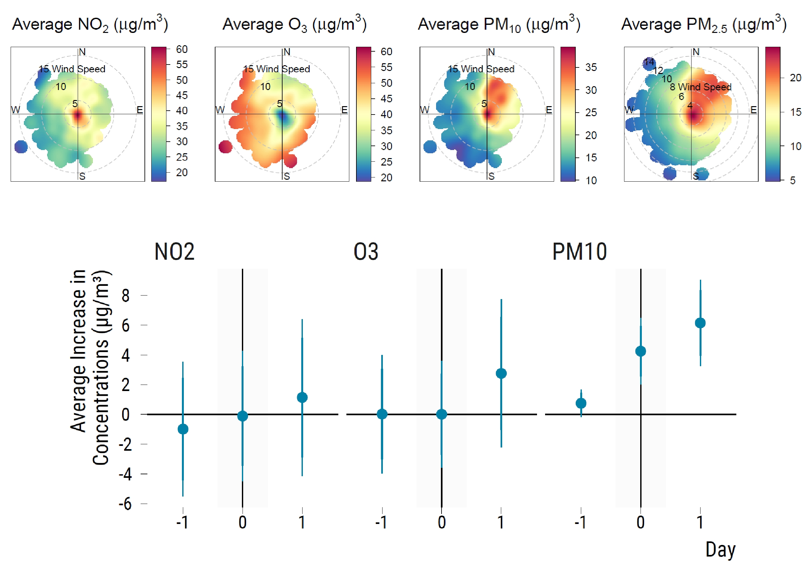

# Improving the Design Stage of Air Pollution Studies Based On Wind Patterns

This repo provides all the necessary R codes to reproduce the analysis of the paper entitled "Improving the Design Stage of Air Pollution Studies Based On Wind Patterns". Should you have any questions or find coding errors, please do not hesitate to reach me at leo.zabrocki[at]psemail.eu.

**The repo is organized as follows:**

* `1.data`: the folder contains the raw datasets, the dataset used for the matching procedure and the matched data. We were not allowed to share the weather data from Météo-France. We therefore added as small amount of noise to the original data. 
* `2.scripts`: contains all Rmarkdown and .html files to reproduce the analysis.
    * `1.data_wrangling` contains the script to clean and merge the raw datasets.
    * `2.eda` contains the script to carry out an exploratory data analysis.
    * `3.matching_analysis` contains the scripts to reproduce the matching procedure, the checking of covariates balance, and the statistical analysis.
* `3.outputs`: contains all the graphs (in PDF format) produced by our analysis.

**Important remark:** all codes are rendered as .html files using the [Distill](https://rstudio.github.io/distill/) package. If you want to see the rendered output, you should first download the raw file and then display it with your web browser.
